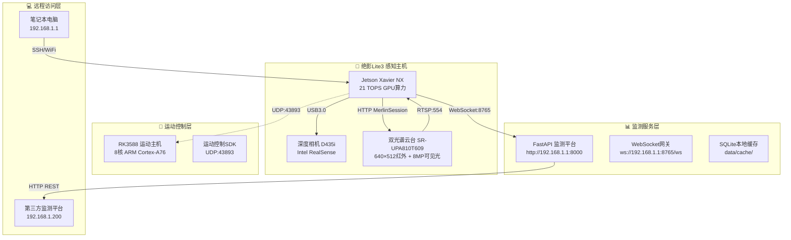

# 绝影Lite3 电力巡检系统

<div align="center">


**广西电力职业技术学院 · 国赛项目**

基于云深处绝影Lite3专业版四足机器人与数尔安防双光谱云台相机的智能电力巡检解决方案

[](#license)
[](https://www.python.org/)
[](https://developer.nvidia.com/tensorrt)
[](CHANGELOG.md)
[](docs/01-技术方案/06-部署运维指南.md)

</div>

---

## 一、项目概述

### 1.1 项目背景

本项目面向全国职业院校技能大赛——机器狗电力巡检赛项，基于云深处科技绝影Lite3专业版四足机器人平台，集成数尔安防SR-UPA810T609双光谱云台相机，实现抽水蓄能电站沙盘模型的自动化电力巡检演示。

### 1.2 核心目标

| 目标类型 | 具体指标 | 完成状态 |
|----------|----------|----------|
| 裂缝检测 | 自动识别 ≥0.1mm 混凝土裂缝，测量误差 <0.02mm | ✅ 已完成 |
| 温度监测 | 双级告警（45℃预警 / 50℃告警），测温精度 ±1℃ | ✅ 已完成 |
| 演示流程 | 完整12分钟标准化演示流程 | ✅ 已完成 |
| 平台对接 | WebSocket实时数据上报，HTTP REST接口 | ✅ 已完成 |
| 环境适配 | 支持模拟/混合/真实三级模式切换 | ✅ 已完成 |

### 1.3 项目定位

本项目为**演示系统**，包含以下核心组件：

- **感知算法层**：裂缝检测（YOLOv8）、温度监测（双级阈值）
- **运动控制层**：UDP协议对接、航点导航、云台联动
- **数据服务层**：FastAPI监测平台、WebSocket数据推送、SQLite本地缓存
- **演示脚本层**：12分钟标准化演示流程（支持模拟/真实模式）

---

## 二、快速部署

### 2.1 系统要求

| 组件 | 最低配置 | 推荐配置 |
|------|----------|----------|
| 计算主机 | Jetson Xavier NX（8GB内存） | Jetson AGX Orin |
| GPU环境 | CUDA 11.4 + cuDNN 8.x | CUDA 12.x + TensorRT 8.x |
| 操作系统 | Ubuntu 20.04 LTS | Ubuntu 22.04 LTS |
| Python版本 | Python 3.8+ | Python 3.10+ |
| 网络连接 | 192.168.1.x 内网 | 独立WiFi热点 |

### 2.2 一键部署（推荐）

```bash
# SSH登录感知主机（Jetson NX）
ssh ysc@192.168.1.103
# 密码: '

# 进入项目目录
cd /home/ysc/lite3-power-inspection

# 运行环境诊断（生成三份报告）
./scripts/run_diagnostic.sh

# 根据诊断结果安装依赖
# 模拟模式（无需GPU）：
pip install -r requirements.txt
# 真实模式（需要GPU）：
pip install -r requirements-gpu.txt

# 运行快速检查
./scripts/check_deployment.sh

# 启动12分钟演示
python3 scripts/demo_12min.py --mode simulation
```

### 2.3 分步部署

#### 步骤一：环境准备

```bash
# 创建虚拟环境
python3 -m venv venv
source venv/bin/activate

# 验证Python版本
python3 --version  # 应输出 Python 3.8+

# 验证GPU环境（仅真实模式）
nvidia-smi  # 应显示 NVIDIA-SMI 470.57.02 或更高
nvcc --version  # 应显示 CUDA 11.4+
```

#### 步骤二：依赖安装

```bash
# 安装核心依赖（必须）
pip install -r requirements.txt

# 安装GPU依赖（可选，仅真实模式需要）
pip install -r requirements-gpu.txt
```

#### 步骤三：服务启动

```bash
# 方式一：启动监测平台（后台运行）
python3 scripts/start_monitor.py &

# 方式二：直接运行演示
python3 scripts/demo_12min.py --mode simulation

# 方式三：快速演示（3分钟精简版）
python3 scripts/demo_12min.py --mode simulation --fast
```

### 2.4 演示模式说明

| 模式 | 参数值 | GPU需求 | 数据来源 | 适用场景 |
|------|--------|---------|----------|----------|
| **模拟模式** | `simulation` | ❌ 不需要 | 程序生成 | 开发测试、赛前准备 |
| **真实模式** | `real` | ✅ 需要 | 传感器采集 | 竞赛正式演示 |
| **混合模式** | `hybrid` | ⚠️ 可选 | 混合输入 | 硬件联调、功能验证 |

---

## 三、系统架构

### 3.1 硬件架构



### 3.2 网络拓扑

| 设备 | IP地址 | 端口 | 协议 | 用途 |
|------|--------|------|------|------|
| 感知主机（Jetson NX） | 192.168.1.103 | — | — | AI推理、系统控制 |
| 运动主机（RK3588） | 192.168.1.103 | 43893 | UDP | 运动控制指令 |
| 云台相机（数尔安防） | 192.168.1.108 | 80 | HTTP | 云台控制 |
| 云台相机（数尔安防） | 192.168.1.108 | 554 | RTSP | 视频流订阅 |
| 监测平台（FastAPI） | 192.168.1.1 | 8000 | HTTP | Web界面访问 |
| WebSocket网关 | 192.168.1.1 | 8765 | WebSocket | 实时数据推送 |
| 快照服务 | 192.168.1.103 | 8080 | HTTP | 检测图片存储 |

---

## 四、核心功能

### 4.1 混凝土裂缝视觉检测

| 技术指标 | 参数值 | 说明 |
|----------|--------|------|
| 检测算法 | YOLOv8-s + U-Net | 两阶段检测：粗检测 → 精细分割 |
| 加速框架 | TensorRT INT8 | GPU推理加速，延迟 <50ms |
| 最小裂缝宽度 | ≥0.1mm | 满足国赛评分标准 |
| 测量精度 | 亚像素级（0.05px） | 宽度测量误差 <0.02mm |
| 定位精度 | <1cm | 基于相机标定和几何关系 |

**工作流程**：
```
广角发现（yaw=45°, pitch=-30°）
    ↓
10倍光学变焦精确定位
    ↓
YOLOv8目标检测
    ↓
U-Net精细分割
    ↓
TensorRT推理加速
    ↓
裂缝宽度/长度测量
    ↓
数据封装上报
```

### 4.2 大体积混凝土温度监测

| 技术指标 | 参数值 | 说明 |
|----------|--------|------|
| 红外分辨率 | 640×512 | 高空间分辨率 |
| 测温范围 | -20℃ ~ 150℃ | 覆盖电力设备温度区间 |
| 测温精度 | ±1℃ | 满足电力巡检需求 |
| 告警阈值 | 45℃（预警）/ 50℃（告警） | 双级告警机制 |
| 防误报机制 | 去抖滤波 + 多帧确认 | 连续N帧超阈值触发 |

**告警联动**：
- 预警（WARN，黄色）：温度突破45℃，发送预警信号
- 告警（CRITICAL，红色）：温度突破50℃，触发沙盘灯带联动

### 4.3 演示流程

系统提供标准化12分钟演示流程，覆盖以下关键环节：

| 阶段 | 时长 | 内容 | 关键技术点 |
|------|------|------|-----------|
| **开场介绍** | 1分30秒 | 机器狗待机亮相、设备自检 | WebSocket连接、RTSP流订阅 |
| **裂缝检测** | 2分钟 | 两阶段检测、缺陷标注 | 云台变焦、YOLOv8推理 |
| **蜂窝麻面** | 1分30秒 | 区域检测、孔隙率统计 | 图像分割、统计分析 |
| **温升监测** | 3分钟 | 温度曲线、双级告警 | 热成像、阈值判断 |
| **轨迹回放** | 1分钟 | 巡检轨迹可视化 | GPS数据记录、地图渲染 |
| **总结致谢** | 1分30秒 | 数据汇总、系统展示 | 统计图表、演示总结 |

---

## 五、硬件配置

### 5.1 绝影Lite3 专业版

| 参数类别 | 参数项 | 规格值 | 项目应用说明 |
|----------|--------|--------|-------------|
| **计算单元** | 感知主机 | Jetson Xavier NX | 运行视觉算法，提供21 TOPS算力 |
| | 运动主机 | RK3588 ARM处理器 | 运行运动控制SDK，处理UDP通信 |
| | 操作系统 | Ubuntu 20.04 / ROS2 | 官方预装系统 |
| **运动性能** | 自由度 | 12 DOF（3-3-3串联每腿） | HipX、HipY、Knee关节 |
| | 最大速度 | 1.0 m/s | 沙盘巡检速度约0.3m/s |
| | 续航时间 | 1.5~2小时（空载） | 满载约1.5小时 |
| | 越障高度 | 15cm | 适应沙盘地形 |
| **传感系统** | IMU | 内置九轴传感器 | 姿态估计、平衡控制 |
| | 深度相机 | Intel RealSense D435i | 自主导航、避障、高度估计 |
| | 通信接口 | UDP(43893)、WiFi 5GHz | 运动控制指令、状态回传 |

### 5.2 数尔安防双光谱云台相机（SR-UPA810T609）

| 类别 | 参数项 | 规格值 | 项目应用说明 |
|------|--------|--------|-------------|
| **热成像模块** | 红外分辨率 | 640×512 | 高分辨率温度场捕获 |
| | 光谱响应范围 | 8~14μm | 中长波红外 |
| | 测温范围 | -20℃~150℃ | 覆盖电力设备区间 |
| | 视场角 | 48.3°(H)×38.6°(V) | 广角温度扫描 |
| **可见光模块** | 传感器类型 | 1/1.8" SONY CMOS | 高灵敏度图像传感器 |
| | 有效像素 | 3840×2160 (800万) | 高清图像采集 |
| | 镜头焦距 | 3.2~32mm (10倍光学变焦) | 远近场景自适应 |
| | 视场角 | 90.3°~20.4° | 广角→ tele转换 |
| **云台性能** | 增稳轴数 | 三轴 (航向/俯仰/横滚) | 运动补偿稳定成像 |
| | 最大角速度 | 60°/s | 快速转向目标 |
| | 定位精度 | ±0.02° | 精准对准检测点 |
| **物理特性** | 重量 | 760±10g | 轻量化设计 |
| | 功耗 | ≤11W | 低功耗运行 |
| | 防护等级 | IP43 | 防雨防尘 |

---

## 六、软件架构

### 6.1 代码结构

```
lite3-power-inspection/
├── config/                          # 配置文件
│   └── inspection_config.yaml       # 主配置文件
├── docs/                            # 技术文档
│   ├── 00-参考资料/                 # 官方资料
│   ├── 01-技术方案/                 # 技术方案（10份）
│   └── 02-项目管理/                 # 项目管理（精简）
├── monitor_platform/                # 监测平台服务
│   └── server.py                    # FastAPI服务实现
├── scripts/                         # 脚本工具
│   ├── demo_12min.py               # 12分钟演示脚本
│   ├── start_monitor.py            # 监测平台启动
│   ├── gather_info.sh              # 环境信息采集
│   ├── check_deployment.sh         # 部署检查
│   └── run_diagnostic.sh           # 一键诊断
├── src/                             # 源代码
│   ├── app/main.py                 # 主程序入口
│   ├── gateway/                    # 通信网关层
│   │   ├── udp_controller.py       # UDP运动控制
│   │   ├── ptz_controller.py       # 云台控制
│   │   └── websocket_client.py     # WebSocket上报
│   ├── perception/                 # 感知算法层
│   │   ├── temperature_monitor.py  # 温度监测
│   │   ├── yolo_detector.py        # 裂缝检测（骨架）
│   │   └── tensorrt_engine.py      # TensorRT引擎（骨架）
│   ├── services/                   # 业务服务层
│   │   ├── simulation_generator.py # 模拟数据生成
│   │   └── snapshot_server.py      # 快照服务
│   └── storage/                    # 数据存储层
│       └── sqlite_cache.py         # SQLite缓存
├── requirements.txt                 # 核心依赖（9包）
├── requirements-gpu.txt             # GPU依赖（可选）
└── CHANGELOG.md                     # 变更日志
```

### 6.2 技术栈

| 层级 | 技术选型 | 版本要求 | 用途说明 |
|------|----------|----------|----------|
| **运行时** | Python | ≥3.8 | 核心编程语言 |
| **推理框架** | TensorRT | ≥8.0 | GPU推理加速（可选） |
| **深度学习** | PyTorch | ≥1.13 | AI模型推理（可选） |
| **视频处理** | OpenCV + PyAV | 最新 | RTSP流订阅、图像处理 |
| **Web框架** | FastAPI | ≥0.100 | 监测平台API服务 |
| **WebSocket** | websockets | ≥12.0 | 实时数据推送 |
| **协议封装** | MerlinSession | — | 云台控制协议封装 |
| **数据存储** | SQLite | — | 本地数据持久化 |
| **配置管理** | PyYAML | ≥6.0 | 配置文件解析 |
| **日志管理** | loguru | ≥0.7 | 结构化日志输出 |

---

## 七、项目范围

### 7.1 包含内容

本项目涵盖以下四个核心模块：

1. **上装系统集成**
   - 双光谱云台相机安装与固定
   - 安装转接支架设计与加工
   - 上装外护罩设计与加工
   - 线缆管理与散热设计
   - 电源适配（Lite3 12V直接供电）

2. **数据采集与处理**
   - 裂缝检测算法（YOLOv8 + U-Net，TensorRT部署）
   - 温度监测算法（双级阈值判断）
   - 灯带图像识别
   - 缺陷定位与标记

3. **通信协议对接**
   - 数尔 WEB2.0 HTTP协议（MerlinSession）
   - WebSocket数据上报
   - HTTP REST接口
   - RTSP视频流订阅

4. **与第三方平台对接**
   - 状态/轨迹/告警实时推送
   - 提供Mock Server供联调
   - 接口文档交付

### 7.2 不包含内容

以下项目由其他团队负责：

- 监测平台开发（第三方负责）
- 沙盘模型制作（现场搭建）
- 机器狗本体硬件改造

---

## 八、通信协议

### 8.1 数据通道定义

| 通道 | 协议类型 | 端口 | 用途 | 优先级 |
|------|----------|------|------|--------|
| 状态/轨迹/告警上行 | WebSocket | 8765 | 全双工、低延迟数据推送 | 主通道 |
| 指令下行 | HTTP REST | 8000 | 简单、易调试的控制指令 | 备用通道 |
| 视频流 | RTSP over TCP | 554 | 标准视频传输协议 | 媒体通道 |
| 告警图片回传 | HTTP POST | 8080 | 大文件传输 | 图片通道 |
| 云台控制 | 数尔 WEB2.0 HTTP | 80 | MerlinSession封装 | 控制通道 |

### 8.2 核心接口定义

#### WebSocket数据上报

```
端点: ws://192.168.1.200:8765/ws
消息格式:
{
    "type": "inspection_result",
    "payload": {
        "device_id": "LITE3-001",
        "waypoint_id": "WP001",
        "timestamp": 1234567890.0,
        "defect_type": "crack",
        "subtype": "longitudinal",
        "measurements": {
            "width_mm": 0.12,
            "length_mm": 45.2
        },
        "confidence": 0.92,
        "temperature": {
            "value": 46.5,
            "status": "WARN"
        }
    }
}
```

#### UDP运动控制指令

```
目的地址: 192.168.1.103:43893
心跳指令: 0x21040001（周期 ≤500ms）
起立指令: 0x21010202
趴下指令: 0x21010203
速度参数: -1.0 ~ 1.0（归一化）
```

#### 云台控制（MerlinSession）

```
认证方式: MerlinSession（18位十六进制注册码）
Session有效期: 30秒（超时自动续期）
接口地址: http://192.168.1.108/merlin/
注册码: [REDACTED_SK_KEY]
```

---

## 九、团队分工

| 成员 | 职责领域 | 具体任务 |
|------|----------|----------|
| 王荣吉 | 现场测试环境搭建 | 沙盘模型调试、环境布置、网络配置 |
| 李章平 | 硬件集成 | 云台安装、线缆管理、供电调试 |
| 陈伟 | 系统演示 | 演示流程执行、系统总控、软件集成 |
| 陈自立 | 算法开发 | 视觉算法优化、缺陷检测、代码实现 |

---

## 十、关键时间节点

| 日期 | 里程碑 | 交付物 |
|------|--------|--------|
| 2026-08-19 | 硬件到货验收 | Lite3 + 双光谱云台相机到货 |
| 2026-08-22 | 开发环境就绪 | 云端开发环境搭建完成 |
| 2026-08-30 | 演示完成 | 完成机器狗电力巡检12分钟演示 |
| 2026-09月 | 项目交付 | 全套方案文档、现场支持 |

---

## 十一、文档索引

### 11.1 官方参考资料

| 编号 | 文档名称 | 版本 | 用途 |
|------|----------|------|------|
| 01 | [绝影Lite3产品手册](docs/00-参考资料/01-绝影Lite3产品手册V2.0.0.md) | V2.0.0 | 硬件规格、接口定义 |
| 02 | [运动主机通讯接口](docs/00-参考资料/03-运动主机通讯接口V1.0.8.md) | V1.0.8 | UDP通信协议参考 |
| 03 | [感知开发手册](docs/00-参考资料/04-感知开发手册V2.2.3.md) | V2.2.3 | 视觉算法开发指南 |
| 04 | [运动开发手册](docs/00-参考资料/05-运动开发手册V2.2.0.md) | V2.2.0 | 运动控制API参考 |

### 11.2 技术方案文档

| 编号 | 文档名称 | 版本 | 说明 |
|------|----------|------|------|
| 01 | [系统架构设计](docs/01-技术方案/01-系统架构设计.md) | V1.6 | 模块划分、数据模型、时序图 |
| 02 | [API接口文档](docs/01-技术方案/02-API接口文档.md) | V1.6 | WebSocket/HTTP/UDP接口定义 |
| 03 | [开发环境搭建指南](docs/01-技术方案/03-开发环境搭建指南.md) | V1.6 | 环境安装步骤 |
| 04 | [快速开始指南](docs/01-技术方案/04-快速开始指南.md) | V1.6 | 首次运行与开发流程 |
| 05 | [项目代码规范](docs/01-技术方案/05-项目代码规范.md) | V1.6 | 编码规范和Git流程 |
| 06 | [部署运维与故障排查指南](docs/01-技术方案/06-部署运维与故障排查指南.md) | V1.6 | 网络架构、部署流程、故障排查 |
| 08 | [环境诊断与故障排查指南](docs/01-技术方案/08-环境诊断与故障排查指南.md) | V1.6 | 一键诊断与故障排查 |
| 09 | [离线部署指南](docs/01-技术方案/09-离线部署指南.md) | V1.6 | 无网络环境部署流程 |
| 10 | [环境配置确认指南](docs/01-技术方案/10-环境配置确认指南.md) | V1.6 | 机器狗环境信息采集与调整 |
| 12 | [硬件配置评估报告](docs/01-技术方案/12-硬件配置评估报告.md) | V1.6 | GPU环境确认与部署条件评估 |

### 11.4 快速导航（推荐文档）

| 场景 | 推荐文档 | 说明 |
|------|----------|------|
| 🚀 **部署系统** | [06-部署运维指南](docs/01-技术方案/06-部署运维指南.md) | 网络配置、SSH访问、应用部署、故障排查 |
| 🔍 **环境诊断** | [08-环境诊断指南](docs/01-技术方案/08-环境诊断与故障排查指南.md) | 一键诊断脚本、问题排查、反馈模板 |
| ⚙️ **配置检查** | [10-环境配置确认](docs/01-技术方案/10-环境配置确认指南.md) | 信息采集流程、结果解读、配置调整 |
| 💻 **硬件评估** | [12-硬件配置评估](docs/01-技术方案/12-硬件配置评估报告.md) | GPU环境确认、部署条件判断、模式选择 |

### 11.3 项目管理文档

| 编号 | 文档名称 | 版本 | 说明 |
|------|----------|------|------|
| 01 | [物料清单](docs/02-项目管理/01-物料清单.md) | V1.6 | 硬件采购与加工跟踪 |
| 02 | [团队分工](docs/02-项目管理/02-团队分工.md) | V1.6 | 成员职责与协作流程 |
| 03 | [项目实施规划书](docs/02-项目管理/03-项目实施规划书.md) | V1.6 | 云端环境、部署流程、时间计划 |

---

## 十二、可执行脚本

### 12.1 核心脚本

| 脚本 | 说明 | 用途 |
|------|------|------|
| `run_demo.py` | 演示启动脚本 | 启动模拟/真实模式演示 |
| `demo_12min.py` | 12分钟演示流程 | 国赛演示专用流程 |
| `start_monitor.py` | 监测平台启动 | 启动FastAPI Web服务 |
| `deploy_oneclick.py` | Python一键部署 | 完整部署流程（推荐） |
| `deploy_oneclick.sh` | Shell一键部署 | 快速部署脚本 |
| `package_offline.py` | 离线包准备 | 生成离线安装包 |
| `run_diagnostic.sh` | 环境诊断脚本 | 系统问题排查 |
| `check_deployment.sh` | 部署就绪检查 | 验证部署状态 |
| `auto_configure.sh` | 自动配置脚本 | 一键配置环境 |
| `gather_system_info.py` | 系统信息采集 | 收集环境信息 |

### 12.2 脚本分类

**部署类脚本**:
- `deploy_oneclick.py` - 一键完整部署（推荐）
- `deploy_oneclick.sh` - Shell版本一键部署
- `auto_configure.sh` - 环境自动配置
- `package_offline.py` - 离线包生成

**演示类脚本**:
- `run_demo.py` - 基础演示启动
- `demo_12min.py` - 12分钟完整演示

**诊断类脚本**:
- `run_diagnostic.sh` - 系统诊断
- `check_deployment.sh` - 部署验证
- `gather_system_info.py` - 信息采集

**运维类脚本**:
- `start_monitor.py` - 监测平台启动

## 十三、相关链接

| 资源 | 链接 |
|------|------|
| 项目详细方案 | [飞书文档](https://gonghanginfo.feishu.cn/docx/ArWjdagoSo4GjQxkUZBcgCSunNg) |
| 云深处科技官网 | https://www.deeprobotics.cn |
| 绝影Lite3 GitHub | https://github.com/cloudsers/joy-ai-kit |
| **本仓库** | https://github.com/CosmicVortex/lite3-power-inspection |
| NVIDIA Jetson Xavier NX规格 | https://www.nvidia.cn/object/jetson-xavier-nx.html |

---

## 十三、许可证

本项目采用 MIT 许可证。详见 [LICENSE](LICENSE) 文件。

---

*项目版本: V1.6 | 编制日期: 2026-08-19 | 编制人: 陈伟*