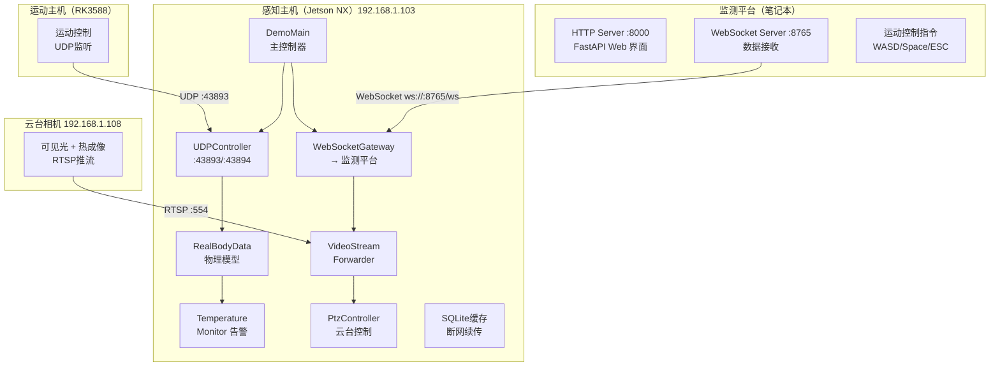
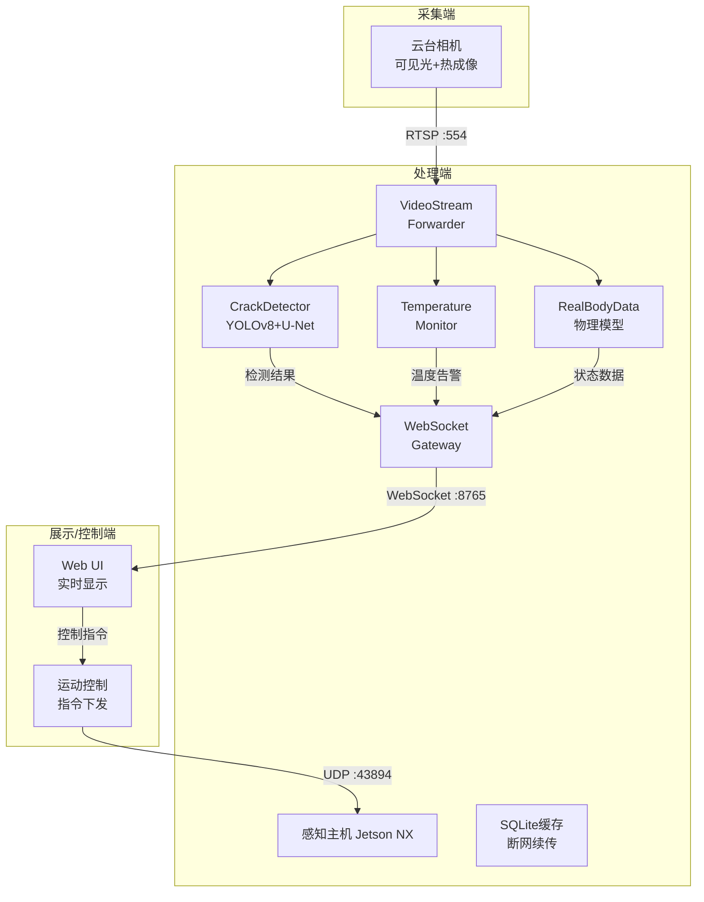
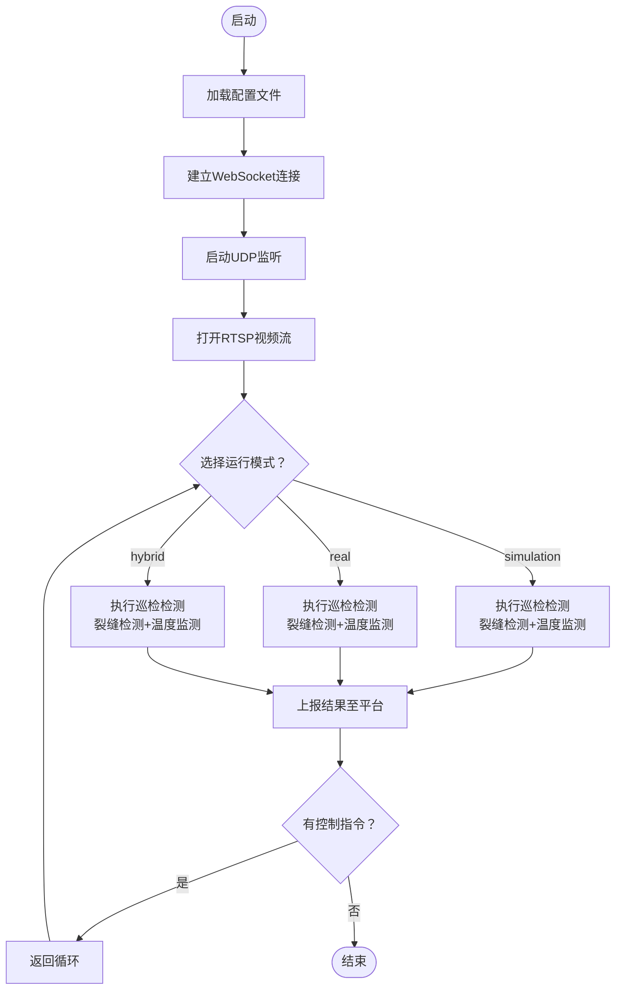

# 绝影Lite3 电力巡检系统

<div align="center">


**广西电力职业技术学院 · 2026年全国职业院校技能大赛项目**

基于云深处绝影Lite3专业版机器狗二次开发的智能电力巡检解决方案

[](LICENSE)
[](https://www.python.org/)
[](https://fastapi.tiangolo.com/)

[GitHub Repository](https://github.com/CosmicVortex/lite3-power-inspection)

</div>

---

## 项目背景

本项目面向2026年全国职业院校技能大赛，基于云深处科技绝影Lite3专业版机器狗二次开发，应用于抽水蓄能电站（沙盘模型）的智能电力巡检演示。系统通过可见光与热成像双模采集、边缘计算分析与远程监控平台的协同，实现变电站设备的智能化巡检与状态监测。

---

## 系统架构



---

## 硬件配置

| 设备 | 型号/参数 | 数量 | 功能说明 |
|------|----------|------|----------|
| 机器狗 | 绝影Lite3专业版 | 1 | 移动巡检平台，承载感知计算 |
| 感知主机 | Jetson NX | 1 | AI推理与数据处理 |
| 运动主机 | RK3588 | 1 | 底层运动控制 |
| 云台相机 | 数尔安防 SR-UPA810T609 | 1 | 可见光+热成像双光谱 |
| 笔记本电脑 | Windows 10/11 | 1 | 监测平台部署 |

---

## 核心功能

### 1. 裂缝检测
- 采用YOLOv8 + U-Net融合算法
- 检测精度：≥0.1mm裂缝识别率≥95%
- 实时标注缺陷位置并记录时间戳

### 2. 温度监测告警
- 双级告警阈值：45℃（预警）、50℃（高温）
- 现场采用灯带颜色模拟：
  - 🟢 白灯：低温正常（<45℃）
  - 🟡 黄灯：温度预警（45-50℃）
  - 🔴 红灯：高温告警（≥50℃）

### 3. 机器狗状态监测
- 电池电量实时显示（带填充效果图标）
- 运行状态指示（正常/告警/故障）
- 姿态数据回传

### 4. 视频流转发
- RTSP视频流转WebSocket
- 延迟：<500ms心跳周期
- 支持多客户端同时观看

### 5. 运动控制
- Web界面键盘控制（WASD/方向键）
- Space/ESC功能键
- UDP协议传输控制指令

---

## 数据流向



---

## 软件流程



---

## 部署运维

### 感知主机部署（Jetson NX）

- [ ] **SSH登录**：`ssh ysc@192.168.1.103`（密码: `'` 英文单引号）
- [ ] **解压部署包**：`unzip -q ~/lite3-power-inspection.zip`
- [ ] **安装依赖**：`./scripts/offline_install.sh sensors`
- [ ] **配置WebSocket**：`sed -i 's|MONITOR_HOST|<笔记本IP>|' config/inspection_config.yaml`
- [ ] **运行演示**：`python3 scripts/run_demo.py --mode simulation`

### 监测平台部署（Windows笔记本）

- [ ] **解压便携包**到任意目录（如 `D:\monitor-platform`）
- [ ] **双击运行**：`start_monitor.bat`
- [ ] **访问界面**：`http://localhost:8000`

### 启动顺序

```
1. 先启动监测平台（笔记本）
   → 双击 start_monitor.bat
   → 等待出现 "Monitor Platform Started Successfully!"

2. 再启动感知主机巡检程序
   → SSH登录感知主机
   → python3 scripts/run_demo.py --mode simulation

3. 验证连接
   → 浏览器打开 http://localhost:8000
   → 确认显示"已连接"和实时数据
```

详见：[部署运维与故障排查文档](docs/01-技术方案/03-部署运维与故障排查.md)

---

## 配置参数

```yaml
# config/inspection_config.yaml
MONITOR_HOST: 192.168.1.200      # 监测平台IP
UDP_PORT: 43893                   # 运动控制端口
WS_PORT: 8765                     # WebSocket端口
RTSP_PORT: 554                    # 视频流端口
TEMP_WARN: 45                     # 温度预警阈值(℃)
TEMP_ALARM: 50                    # 温度告警阈值(℃)
```

---

## 故障排查

| 现象 | 可能原因 | 解决方案 |
|------|---------|----------|
| WebSocket连接失败 | 监测平台未启动 | 确认server.py运行中 |
| 视频流无画面 | RTSP端口不通 | 检查云台相机网络连通性 |
| UDP数据丢失 | 防火墙拦截 | 开放43893/43894端口 |
| 温度读数异常 | 热成像校准问题 | 重新校准云台相机 |

---

## 目录结构

```
lite3-power-inspection/
├── README.md
├── config/inspection_config.yaml
├── src/                    # 源代码
│   ├── app/main.py         # 主程序入口
│   ├── gateway/            # 通信网关
│   ├── perception/         # 感知模块
│   ├── services/           # 服务模块
│   └── storage/            # 存储模块
├── scripts/                # 脚本
│   ├── run_demo.py         # 演示启动
│   └── offline_install.sh  # 离线安装
├── deliverables/           # 部署包
└── docs/                   # 文档
```

## 端口配置

| 端口 | 协议 | 用途 |
|------|------|------|
| 43893 | UDP | 运动控制指令 |
| 43894 | UDP | 状态数据接收 |
| 8765 | WebSocket | 数据通信 |
| 8000 | HTTP | 监测平台Web界面 |
| 8080 | HTTP | 检测图片服务 |
| 554 | RTSP | 视频流 |

## 部署检查清单

### 感知主机
- [ ] SSH可登录 (ysc@192.168.1.103, 密码: `'`)
- [ ] 依赖已安装: `./scripts/offline_install.sh sensors`
- [ ] WebSocket地址已配置
- [ ] 演示可运行: `python3 scripts/run_demo.py --mode simulation`

### 监测平台
- [ ] 已运行 `start_monitor.bat`
- [ ] 可访问 http://localhost:8000
- [ ] WebSocket端口8765未被占用

---

## 技术文档

| 文档 | 说明 |
|------|------|
| [系统架构与代码规范](docs/01-技术方案/01-系统架构与代码规范.md) | 整体架构、模块划分、代码规范 |
| [接口协议与数据规范](docs/01-技术方案/02-接口协议与数据规范.md) | 通信协议、数据格式、接口定义 |
| [部署运维与故障排查](docs/01-技术方案/03-部署运维与故障排查.md) | 部署步骤、运维指南、常见问题 |
| [测试验收标准](docs/01-技术方案/04-测试验收标准.md) | 功能测试、性能指标、验收方法 |

---

## 参考资料

官方资料存放于 `docs/00-参考资料/` 目录：
- 绝影Lite3开发指南、产品手册
- 运动主机通讯接口文档
- 感知开发手册
- 数尔安防云台相机资料

---

## 许可证

本项目采用 MIT 许可证开源。
