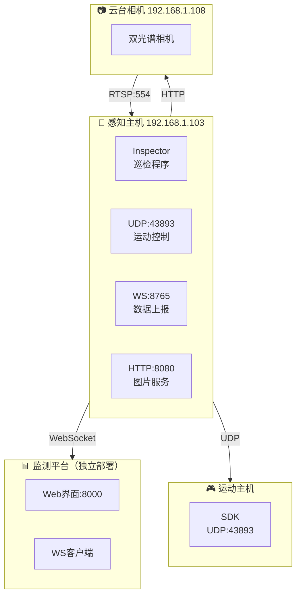

# 绝影Lite3 电力巡检系统

> **版本**: V1.8
> **最后更新**: 2025-09-16
> **编制人**: 陈伟

---

## 📋 项目概述

绝影Lite3电力巡检系统，面向2026年全国职业院校技能大赛设计。系统基于云深处绝影Lite3机器狗，实现混凝土裂缝视觉检测（≥0.1mm精度）和双级温度告警监测（45℃/50℃）。

## 🏗️ 系统架构



### 双部署架构

| 部署位置 | 服务 | 端口 |
|---------|------|------|
| **感知主机** (Jetson NX) | 巡检程序、AI推理 | 43893/8080/8765 |
| **监测平台** (独立笔记本) | Web界面、数据可视化 | 8000/8765 |

## 📁 文档结构

### 技术资料 (8个)

| 编号 | 文档 | 说明 |
|------|------|------|
| DOC-ARCH-001 | 系统架构设计 | 整体架构与通信协议 |
| DOC-APISPEC-002 | API接口文档 | WebSocket消息规范 |
| DOC-CONFIG-010 | 环境配置指南 | 软硬件环境配置 |
| DOC-CODE-003 | 项目代码规范 | 编码规范与目录结构 |
| DOC-DEPLOY-006 | 部署指南 | 双部署方案与运维 |
| DOC-DATA-004 | 数据采集规范 | 巡检数据标准 |
| DOC-DEBUG-005 | 环境诊断与故障排查 | 常见问题解决 |
| DOC-TEST-007 | 测试用例与验收标准 | 质量保障 |

### 参考资料 (8个)

- 绝影Lite3产品手册V2.0.0
- 运动主机通讯接口V1.0.8
- 感知开发手册V2.2.3
- 运动开发手册V2.2.0
- 数尔安防吊舱资料（2份）

### 项目管理 (4个)

- 项目规划书
- 架构评估报告
- 监测平台独立部署评估
- 业界对标分析

## 🚀 快速部署

### 感知主机部署

```bash
ssh ysc@192.168.1.103
# 密码: '（英文单引号）

cd ~ && mkdir -p lite3-power-inspection && cd lite3-power-inspection
unzip -q ~/lite3-power-inspection.zip
./scripts/deploy.sh simulation
```

### 监测平台部署

```cmd
:: Windows: 解压后运行
start_monitor.bat
:: 访问 http://localhost:8000
```

```bash
# Linux/macOS: 解压后运行
chmod +x start_monitor.sh
./start_monitor.sh
# 访问 http://localhost:8000
```

## ⌨️ 键盘手柄控制

| 按键 | 功能 |
|------|------|
| W / ↑ | 前进 |
| S / ↓ | 后退 |
| A / ← | 左移 |
| D / → | 右移 |
| Q / Shift | 左转 |
| E / Ctrl | 右转 |
| Space | 起立/趴下 |
| Esc | 急停 |

## 📊 核心参数

| 参数 | 值 |
|------|-----|
| 感知主机IP | 192.168.1.103 |
| 运动主机IP | 192.168.1.103 (共享) |
| 云台相机IP | 192.168.1.108 |
| UDP端口 | 43893 |
| WebSocket端口 | 8765 |
| RTSP端口 | 554 |
| 温度告警阈值 | 45℃ / 50℃ |
| 裂缝检测精度 | ≥0.1mm |

---

**GitHub**: https://github.com/CosmicVortex/lite3-power-inspection
