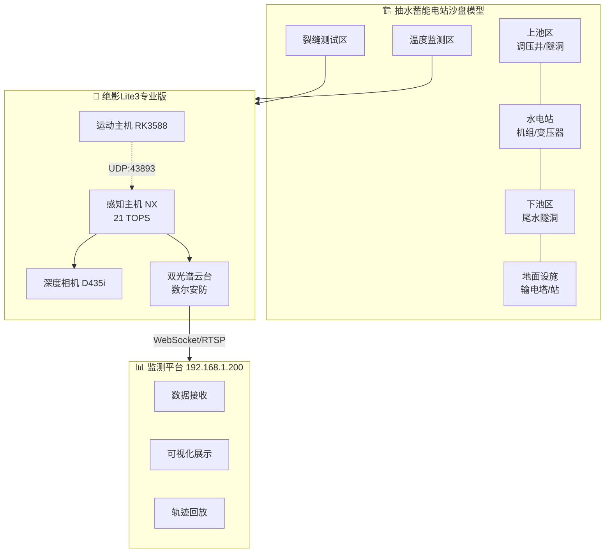
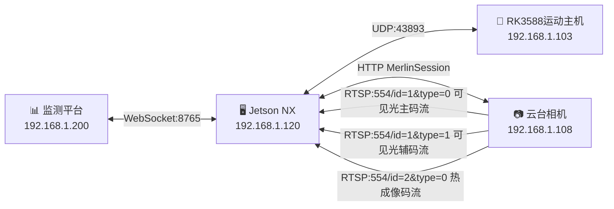

# 绝影Lite3 电力巡检演示方案

**广西电力职院机器狗电力巡检国赛项目**

基于云深处绝影Lite3专业版机器狗的电力巡检演示方案

---

## 📋 项目概况

| 项目 | 内容 |
|------|------|
| **项目名称** | 绝影Lite3电力巡检演示方案 |
| **应用背景** | 广西电力职院机器狗电力巡检国赛 |
| **硬件平台** | 云深处绝影Lite3专业版 + 数尔安防双光谱云台相机 |
| **巡检目标** | 混凝土裂缝检测（≥0.1mm）、温度监测（双级告警） |
| **应用场景** | 抽水蓄能电站沙盘模型演示（约12分钟） |
| **核心文档** | [系统架构设计](docs/01-技术方案/01-系统架构设计.md) |

---

## 🎯 核心能力

### 场景一：混凝土裂缝视觉检测

- **两阶段检测流程**：广角发现 → 10×变焦精细检测
- **算法架构**：YOLOv8-s + U-Net，TensorRT INT8加速
- **检测精度**：亚像素测量精度 0.05px
- **检测范围**：自动识别 ≥0.1mm 裂缝及蜂窝麻面缺陷
- **定位精度**：缺陷定位精度 <1cm，宽度测量误差 <0.02mm

### 场景二：大体积混凝土温度监测

- **红外热成像**：640×512分辨率，测温范围 -20~150℃
- **双级告警**：45℃预警（WARN，黄色）/ 50℃告警（CRITICAL，红色）
- **防误报机制**：去抖滤波，连续多帧确认触发
- **联动演示**：告警信号联动沙盘灯带

---

## 🏟️ 演示场景

### 沙盘模型规格

| 参数 | 数值 |
|------|------|
| 模型长度 | 2000mm |
| 模型宽度 | 500mm |
| 模型高度 | 1200mm |
| 底座尺寸 | 2000mm × 800mm |

### 功能分区

| 模块 | 演示用途 | 云台角度 | 告警类型 |
|------|----------|----------|----------|
| 地下厂房顶部抽拉模块 | 裂缝检测 | yaw=45°, pitch=-30° | CRACK |
| 地面设施混凝土基座 | 蜂窝麻面检测 | yaw=90°, pitch=-25° | HONEYCOMB |
| 大体积混凝土坝段 | 温升监测 | yaw=135°, pitch=-45° | TEMPERATURE |
| 高压输电塔、变电站 | 轨迹展示 | — | — |

### 材质工艺

- **基座**: 优质细木工底座 + 220V供电插座 + 总控开关 + 断路器
- **山体围岩**: 高密度PU发泡塑形 + 石膏硬化 + 灰色仿真岩石喷漆
- **模型主体**: ABS工程塑料 + 进口亚克力
- **管道**: 蓝色仿真输送管道拼接预埋
- **水库区域**: AB仿真水倒模 + 蓝色蓄水层

---

## 🏗️ 系统架构

### 网络拓扑

---

## 📦 硬件配置

### 绝影Lite3 专业版

| 参数类别 | 参数项 | 规格值 | 项目应用说明 |
|----------|--------|--------|-------------|
| 运动控制 | 运动主机 | RK3588 ARM处理器 | 运行运动控制SDK，处理UDP通信 |
| | 感知主机 | Jetson Xavier NX | 运行视觉算法，提供21 TOPS算力 |
| | 自由度 | 12 DOF（3-3-3串联每腿） | 髋侧摆HipX、髋前摆HipY、膝关节Knee |
| | 最大速度 | 1.0 m/s | 沙盘巡检速度约0.3m/s |
| | 续航时间 | 1.5~2小时（空载） | 满载约1.5小时，满足演示需求 |
| 传感系统 | IMU | 内置九轴传感器 | 姿态估计、平衡控制 |
| | 深度相机 | Intel RealSense D435i | 自主导航、避障、高度估计 |
| | 通信接口 | UDP(43893)、WiFi 5GHz | 运动控制指令、状态回传 |

### 双光谱云台相机（数尔安防）

| 类别 | 参数项 | 规格值 |
|------|--------|--------|
| **热成像** | 红外分辨率 | 640×512 |
| | 光谱响应范围 | 8~14μm |
| | 测温范围 | -20℃~150℃ |
| | 视场角 | 48.3°(H)×38.6°(V) |
| **可见光** | 传感器类型 | 1/1.8" SONY CMOS |
| | 有效像素 | 3840×2160 (800万) |
| | 镜头焦距 | 3.2~32mm (10倍光学变焦) |
| | 视场角 | 90.3°~20.4° |
| **云台** | 增稳轴数 | 三轴 (航向/俯仰/横滚) |
| | 最大角速度 | 60°/s |
| | 定位精度 | ±0.02° |
| **其他** | 重量 | 760±10g |
| | 功耗 | ≤11W |
| | 防护等级 | IP43 |

---

## 🔧 项目范围

### ✅ 包含内容

1. **上装系统集成**
   - 双光谱云台相机安装与固定
   - 安装转接支架设计与加工
   - 上装外护罩设计与加工
   - 线缆管理与散热设计
   - 电源适配（Lite3 12V直接供电）

2. **数据采集与处理**
   - 裂缝检测算法（YOLOv8 + U-Net，TensorRT部署）
   - 温度监测算法（双级阈值判断）
   - 灯带图像识别
   - 缺陷定位与标记

3. **通信协议对接**
   - 数尔 WEB2.0 HTTP协议（MerlinSession）
   - WebSocket数据上报
   - HTTP REST接口
   - RTSP视频流订阅

4. **与第三方平台对接**
   - 状态/轨迹/告警实时推送
   - 提供Mock Server供联调
   - 接口文档交付

### ❌ 不包含内容

- 监测平台开发（第三方负责）
- 沙盘模型制作（现场搭建）
- 机器狗本体硬件改造

---

## 📡 通信协议

### 数据上报协议

| 通道 | 协议 | 用途 |
|------|------|------|
| 状态/轨迹/告警上行 | WebSocket（主） | 全双工、低延迟 |
| 指令下行 | HTTP REST（兜底） | 简单、易调试 |
| 视频流 | RTSP over TCP | 标准协议 |
| 告警图片回传 | HTTP POST | 大文件走HTTP |
| 云台控制 | 数尔 WEB2.0 HTTP | MerlinSession封装 |

### 核心API接口

| 接口类型 | 端点 | 协议 | 端口 |
|----------|------|------|------|
| WebSocket上报 | ws://192.168.1.200:8765/ws | WebSocket | 8765 |
| 云台HTTP控制 | http://192.168.1.108/merlin/ | HTTP | 80 |
| 运动UDP控制 | 192.168.1.103:43893 | UDP | 43893 |
| 热成像RTSP | rtsp://192.168.1.108:554/id=2&type=0 | RTSP | 554 |

---

## 👥 团队分工

| 成员 | 职责 |
|------|------|
| 王荣吉 | 现场测试环境搭建 |
| 李章平 | 环境搭建、云台硬件集成 |
| 陈伟 | 机器狗操作、演示、软件集成 |
| 陈自立 | 操作演示、软件集成、算法开发 |

---

## 📅 开发计划（4周交付）

### 里程碑

| 里程碑 | 时间 | 交付物 |
|--------|------|--------|
| **M1 硬件集成 + 算法初版** | W1末 | Lite3+云台机械集成完成、供电调试通过、MerlinSession接通、视觉检测模型mAP≥0.85、温度双级告警逻辑跑通、RTSP三路流可拉取 |
| **M2 接口对接 + 全链路联调** | W2末 | 状态/轨迹/告警全链路打通、与监测平台接口联调完成、Mock Server测试通过、沙盘航点+云台角度标定完成 |
| **M3 测试验证** | W3末 | 单元测试+集成测试通过、沙盘12分钟流程跑通、所有告警正确触发、端到端时延≤2s |
| **M4 现场彩排 + 比赛交付** | W4末 | 模拟赛场环境3次完整彩排、容错预案演练、备件清单、操作手册、现场保障就绪 |

### 关键时间节点

| 日期 | 节点 |
|------|------|
| 8月19日 | 硬件到货（Lite3 + 双光谱云台相机） |
| 8月22日 | 开发环境准备完成 |
| 8月30日 | 完成机器狗电力巡检演示 |
| 9月 | 交付全套方案，按需现场支持 |

---

## 🎬 演示流程（12分钟）

| 时间 | 环节 | 机器狗动作 | 云台动作 | 平台表现 |
|------|------|-----------|----------|----------|
| 0:00-1:30 | 开场介绍 | 待机亮相 | 水平慢转扫描 | 设备在线、电量满 |
| 1:30-2:00 | 设备自检 | 自检姿态 | 俯仰自检、变焦自检 | 状态绿、RTSP画面亮起 |
| 2:00-3:30 | 裂缝检测 | 走到裂缝模块前 | 对准(45°,-30°)，广角→变焦10× | 可见光全屏，标注裂缝0.12mm |
| 3:30-4:00 | 裂缝告警上报 | 停留 | 保持10× | 告警卡片+图像快照 |
| 4:00-5:30 | 蜂窝麻面 | 移动至蜂窝麻面区 | 对准(90°,-25°)，变焦5× | 标注区域、孔隙率 |
| 5:30-6:00 | 蜂窝麻面告警 | 停留 | 保持5× | 告警卡片+区域统计 |
| 6:00-6:30 | 转场 | 走向温升模块 | 切换热成像码流 | 切换红外热力图 |
| 6:30-8:00 | 温升监测 | 对准温升模块 | 对准(135°,-45°)，热成像全屏 | 红外图+温度曲线40→46℃ |
| 8:00-8:30 | WARN预警 | 停留 | 保持热成像 | 温度突破45℃，黄色预警闪烁 |
| 8:30-9:30 | CRITICAL告警 | 停留 | 保持热成像 | 温度突破50℃，红色告警+降温联动 |
| 9:30-10:30 | 轨迹回放 | 走完剩余航点 | 巡航扫描 | 轨迹地图、进度100% |
| 10:30-11:30 | 数据汇总 | 返回起点 | 待机 | 大盘：告警总数、巡检时长 |
| 11:30-12:00 | 总结致谢 | 待机谢幕 | 待机 | 展示项目亮点 |

---

## 🛠️ 技术栈

| 层级 | 技术 | 说明 |
|------|------|------|
| 中间件 | Python 3.8+ | 机器人通信与控制 |
| 推理框架 | TensorRT 8.x (INT8量化) | 视觉检测模型加速 |
| 视频订阅 | OpenCV + PyAV | 拉取云台三路RTSP流 |
| 通信网关 | Python 3.8 + websockets + FastAPI | WebSocket/HTTP接口 |
| 云台控制 | MerlinSession (ptz_client.py) | 数尔WEB2.0协议封装 |
| 配置管理 | YAML + 环境变量 | 配置灵活性 |

---

## 📚 文档导航

### 📖 官方参考资料
> 云深处科技官方开发文档

| 编号 | 文档名称 | 说明 |
|------|----------|------|
| 01 | [绝影Lite3产品手册V2.0.0](docs/00-参考资料/01-绝影Lite3产品手册V2.0.0.pdf) | 硬件规格、接口定义 |
| 02 | [绝影Lite3三折页](docs/00-参考资料/02-绝影Lite3三折页.pdf) | 产品简介速查 |
| 03 | [运动主机通讯接口V1.0.8](docs/00-参考资料/03-运动主机通讯接口V1.0.8.pdf) | UDP通信协议 |
| 04 | [感知开发手册V2.2.3](docs/00-参考资料/04-感知开发手册V2.2.3.pdf) | 视觉算法开发指南 |
| 05 | [运动开发手册V2.2.0](docs/00-参考资料/05-运动开发手册V2.2.0.pdf) | 运动控制API参考 |

### 🔧 技术方案
> 本项目的技术实现方案

| 编号 | 文档名称 | 说明 |
|------|----------|------|
| 01 | [系统架构设计](docs/01-技术方案/01-系统架构设计.md) | 模块划分、数据模型、时序图 |
| 02 | [API接口文档](docs/01-技术方案/02-API接口文档.md) | WebSocket/HTTP/UDP接口定义 |
| 03 | [开发环境搭建指南](docs/01-技术方案/03-开发环境搭建指南.md) | 环境安装步骤 |
| 04 | [快速开始指南](docs/01-技术方案/04-快速开始指南.md) | 首次运行与开发流程 |
| 05 | [项目代码规范](docs/01-技术方案/05-项目代码规范.md) | 编码规范和Git流程 |

### 📊 项目管理
> 项目执行相关文档

| 编号 | 文档名称 | 说明 |
|------|----------|------|
| 01 | [物料清单](docs/03-项目管理/01-物料清单.md) | 硬件采购与加工跟踪 |
| 02 | [团队分工](docs/03-项目管理/02-团队分工.md) | 成员职责与协作流程 |

---

## 🔗 相关链接

| 资源 | 链接 |
|------|------|
| 项目详细方案 | [飞书文档](https://gonghanginfo.feishu.cn/docx/ArWjdagoSo4GjQxkUZBcgCSunNg) |
| 云深处科技官网 | https://www.deeprobotics.cn |
| 绝影Lite3 GitHub | https://github.com/cloudsers/joy-ai-kit |
| **本仓库** | https://github.com/CosmicVortex/lite3-power-inspection |

---

## 📄 License

MIT License

---

*项目版本: V1.0 | 更新日期: 2026-08-18*

