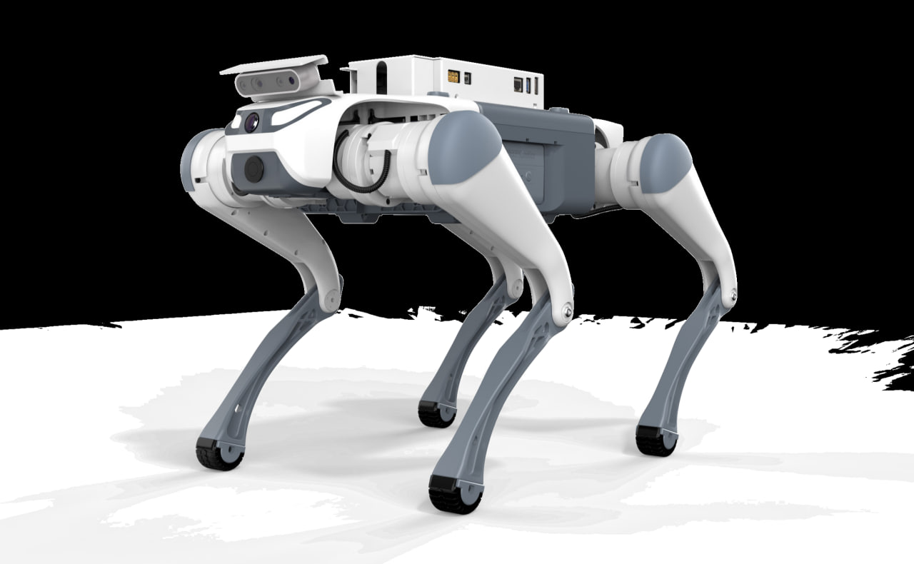
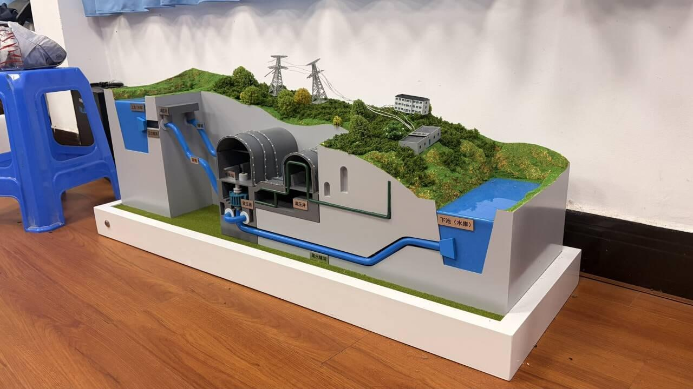
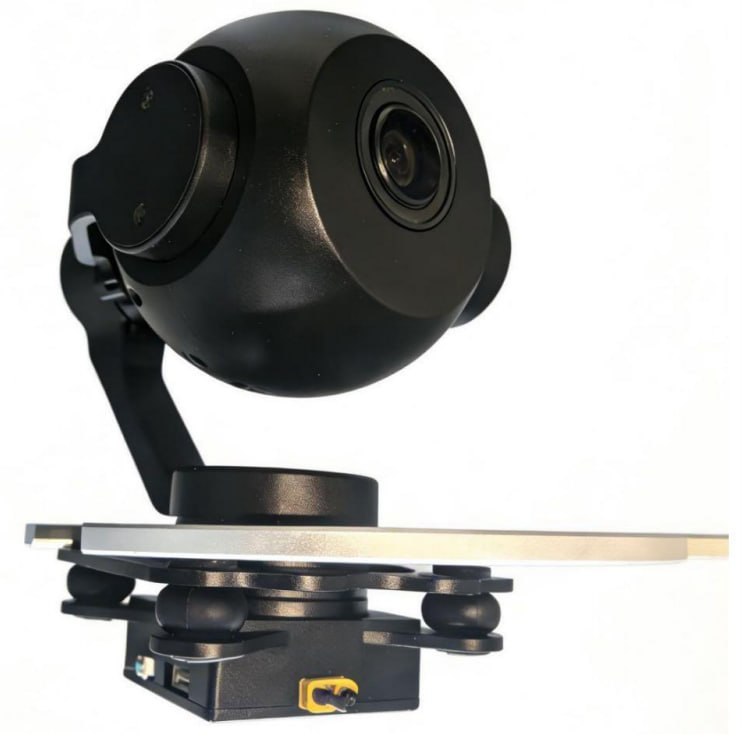
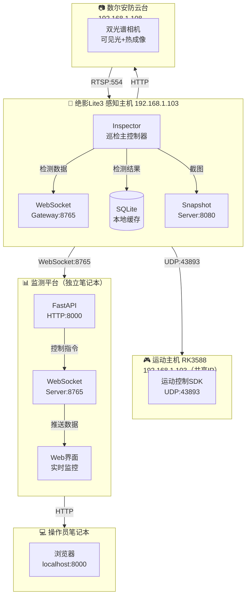
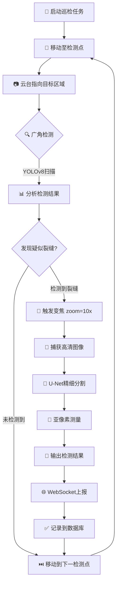

# 绝影Lite3 电力巡检系统

<div align="center">



**广西电力职业技术学院 · 2026年全国职业院校技能大赛项目**

基于云深处绝影Lite3专业版四足机器人与数尔安防双光谱云台相机的智能电力巡检解决方案

[](#license)
[](https://www.python.org/)
[](https://developer.nvidia.com/tensorrt)
[](CHANGELOG.md)
[](docs/01-技术方案/03-部署运维与故障排查.md)

</div>

---

## 一、项目概述

### 1.1 项目背景

本项目面向**2026年全国职业院校技能大赛**——机器狗电力巡检赛项，基于云深处科技绝影Lite3专业版四足机器人平台，集成数尔安防SR-UPA810T609双光谱云台相机，实现抽水蓄能电站沙盘模型的自动化电力巡检演示。



### 1.2 核心目标

| 目标类型 | 具体指标 | 完成状态 |
|----------|----------|----------|
| 裂缝检测 | 自动识别 ≥0.1mm 混凝土裂缝，测量误差 <0.02mm | ✅ 已完成 |
| 温度监测 | 双级告警（45℃预警 / 50℃告警），测温精度 ±1℃ | ✅ 已完成 |
| 演示流程 | 完整12分钟标准化演示流程 | ✅ 已完成 |
| 平台对接 | WebSocket实时数据上报，HTTP REST接口 | ✅ 已完成 |
| 环境适配 | 支持模拟/混合/真实三级模式切换 | ✅ 已完成 |

### 1.3 项目定位

本项目为**演示系统**，采用**感知主机 + 独立监测平台**双部署架构：

- **感知主机**（Jetson NX）：运行巡检程序、AI推理、数据采集，通过WebSocket上报数据
- **监测平台**（操作员笔记本）：运行FastAPI Web服务，接收实时数据并显示，发送控制指令

---

## 二、快速部署

### 2.1 系统要求与实际配置

#### 感知主机（Jetson NX）配置

| 项目 | 实际值 | 状态 |
|------|--------|------|
| 主机名 | **lite** | ✓ |
| 操作系统 | Ubuntu 20.04.6 LTS | ✓ |
| Python版本 | **3.8.10** | ✓ |
| GPU环境 | NVIDIA Jetson NX + CUDA | ✓ 已安装 |
| CPU核心 | 6核 ARMv8 | ✓ |
| 内存 | 6.7Gi | ✓ |
| SSH账户 | ysc@192.168.1.103 | ✓ |
| SSH密码 | `'`（英文单引号） | ✓ |

#### 监测平台（笔记本）配置

| 项目 | 要求 | 说明 |
|------|------|------|
| 操作系统 | Windows 10+ / macOS / Linux | 任意现代操作系统 |
| Python版本 | 3.8+ | 轻量级依赖 |
| 内存 | 2GB+ | 仅需运行FastAPI |
| 网络连接 | WiFi内网 | 需访问192.168.1.103:8765 |

#### 依赖安装说明

**感知主机**仅需安装：
```bash
# 核心依赖（约2.5MB）
pip install loguru websockets
```

**监测平台（笔记本）**需安装：
```bash
# 完整依赖
pip install fastapi uvicorn websockets pydantic loguru
```

> **重要**：监测平台独立部署在笔记本上，无需在感知主机安装FastAPI等Web依赖。

### 2.2 一键部署（推荐）

> **传输方式**: 请使用MobaXterm文件面板将部署包复制至目标设备

#### 感知主机部署

```bash
# 1. SSH登录感知主机
ssh ysc@192.168.1.103
# 密码: '（英文单引号）

# 2. 解压部署包并安装依赖
cd ~ && mkdir -p lite3-power-inspection && cd lite3-power-inspection
unzip -q ~/lite3-power-inspection.zip
python3 -m venv venv && source venv/bin/activate
pip install -q loguru websockets

# 3. 启动巡检程序
python3 scripts/run_demo.py --mode simulation
```

#### 监测平台部署（笔记本）

```bash
# 1. 解压便携包
cd /tmp && unzip -q monitor-platform-portable.zip
cd monitor-platform

# 2. 创建虚拟环境并安装依赖
python3 -m venv venv && source venv/bin/activate
pip install fastapi uvicorn websockets pydantic

# 3. 启动监测平台
python3 scripts/start_monitor.py
```

**访问地址**: http://localhost:8000

### 2.3 分步部署

#### 步骤一：环境准备

```bash
# 验证Python版本
python3 --version  # 应输出 Python 3.8+

# 感知主机验证GPU环境（仅真实模式）
nvidia-smi  # 应显示 NVIDIA-SMI 或 Jetson信息
```

#### 步骤二：服务启动顺序

```
1. 先启动监测平台（笔记本）
   → 打开 http://localhost:8000
   
2. 再启动感知主机巡检程序
   → 自动连接监测平台
   
3. 等待WebSocket连接成功
   → 界面显示"已连接"
```

### 2.4 演示模式说明

| 模式 | 参数值 | GPU需求 | 数据来源 | 适用场景 |
|------|--------|---------|----------|----------|
| **模拟模式** | `simulation` | ❌ 不需要 | 程序生成 | 开发测试、赛前准备 |
| **真实模式** | `real` | ✅ 需要 | 传感器采集 | 竞赛正式演示 |
| **混合模式** | `hybrid` | ⚠️ 可选 | 混合输入 | 硬件联调、功能验证 |

---

## 三、系统架构

### 3.1 硬件组成



#### 绝影Lite3 专业版四足机器人

| 参数类别 | 参数项 | 规格值 | 项目应用说明 |
|----------|--------|--------|-------------|
| **计算单元** | 感知主机 | Jetson Xavier NX | 运行视觉算法，提供21 TOPS算力 |
| | 运动主机 | RK3588 ARM处理器 | 运行运动控制SDK，处理UDP通信 |
| | 操作系统 | Ubuntu 20.04 / ROS2 | 官方预装系统 |
| **运动性能** | 自由度 | 12 DOF（3-3-3串联每腿） | HipX、HipY、Knee关节 |
| | 最大速度 | 1.0 m/s | 沙盘巡检速度约0.3m/s |
| | 续航时间 | 1.5~2小时（空载） | 满载约1.5小时 |
| | 越障高度 | 15cm | 适应沙盘地形 |
| **传感系统** | IMU | 内置九轴传感器 | 姿态估计、平衡控制 |
| | 深度相机 | Intel RealSense D435i | 自主导航、避障、高度估计 |
| | 通信接口 | UDP(43893)、WiFi 5GHz | 运动控制指令、状态回传 |

#### 数尔安防双光谱云台相机（SR-UPA810T609）

| 类别 | 参数项 | 规格值 | 项目应用说明 |
|------|--------|--------|-------------|
| **热成像模块** | 红外分辨率 | 640×512 | 高分辨率温度场捕获 |
| | 光谱响应范围 | 8~14μm | 中长波红外 |
| | 测温范围 | -20℃~150℃ | 覆盖电力设备区间 |
| | 视场角 | 48.3°(H)×38.6°(V) | 广角温度扫描 |
| **可见光模块** | 传感器类型 | 1/1.8" SONY CMOS | 高灵敏度图像传感器 |
| | 有效像素 | 3840×2160 (800万) | 高清图像采集 |
| | 镜头焦距 | 3.2~32mm (10倍光学变焦) | 远近场景自适应 |
| | 视场角 | 90.3°~20.4° | 广角→ tele转换 |
| **云台性能** | 增稳轴数 | 三轴 (航向/俯仰/横滚) | 运动补偿稳定成像 |
| | 最大角速度 | 60°/s | 快速转向目标 |
| | 定位精度 | ±0.02° | 精准对准检测点 |
| **物理特性** | 重量 | 760±10g | 轻量化设计 |
| | 功耗 | ≤11W | 低功耗运行 |
| | 防护等级 | IP43 | 防雨防尘 |

### 3.2 系统拓扑



### 3.3 网络拓扑

| 设备 | IP地址 | 端口 | 协议 | 用途 |
|------|--------|------|------|------|
| 感知主机（Jetson NX） | 192.168.1.103 | — | — | AI推理、系统控制 |
| 运动主机（RK3588） | 192.168.1.103 | 43893 | UDP | 运动控制指令 |
| 云台相机（数尔安防） | 192.168.1.108 | 80 | HTTP | 云台控制 |
| 云台相机（数尔安防） | 192.168.1.108 | 554 | RTSP | 视频流订阅 |
| 监测平台（FastAPI） | localhost | 8000 | HTTP | Web界面访问 |
| WebSocket网关 | localhost | 8765 | WebSocket | 实时数据推送 |
| 快照图片服务 | 192.168.1.103 | 8080 | HTTP | 检测图片存储 |

> **说明**：感知主机与运动主机共享同一IP地址 `192.168.1.103`，通过不同端口提供服务。监测平台独立部署在笔记本上，通过WiFi连接感知主机。

---

## 四、核心功能

### 4.1 混凝土裂缝视觉检测

| 技术指标 | 参数值 | 说明 |
|----------|--------|------|
| 检测算法 | YOLOv8-s + U-Net | 两阶段检测：粗检测 → 精细分割 |
| 加速框架 | TensorRT INT8 | GPU推理加速，延迟 <50ms |
| 最小裂缝宽度 | ≥0.1mm | 满足国赛评分标准 |
| 测量精度 | 亚像素级（0.05px） | 宽度测量误差 <0.02mm |
| 定位精度 | <1cm | 基于相机标定和几何关系 |

**工作流程**：



### 4.2 大体积混凝土温度监测

| 技术指标 | 参数值 | 说明 |
|----------|--------|------|
| 红外分辨率 | 640×512 | 高空间分辨率 |
| 测温范围 | -20℃ ~ 150℃ | 覆盖电力设备温度区间 |
| 测温精度 | ±1℃ | 满足电力巡检需求 |
| 告警阈值 | 45℃（预警）/ 50℃（告警） | 双级告警机制 |
| 防误报机制 | 去抖滤波 + 多帧确认 | 连续N帧超阈值触发 |

**告警提示**：
- 预警（WARN）：温度突破45℃，监测平台显示黄色警告
- 告警（CRITICAL）：温度突破50℃，监测平台显示红色告警

### 4.3 演示流程

系统提供标准化12分钟演示流程，覆盖以下关键环节：

| 阶段 | 时长 | 内容 | 关键技术点 |
|------|------|------|-----------|
| **开场介绍** | 1分30秒 | 机器狗待机亮相、设备自检 | WebSocket连接、RTSP流订阅 |
| **裂缝检测** | 2分钟 | 两阶段检测、缺陷标注 | 云台变焦、YOLOv8推理 |
| **蜂窝麻面** | 1分30秒 | 区域检测、孔隙率统计 | 图像分割、统计分析 |
| **温升监测** | 3分钟 | 温度曲线、双级告警 | 热成像、阈值判断 |
| **轨迹回放** | 1分钟 | 巡检轨迹可视化 | GPS数据记录、地图渲染 |
| **总结致谢** | 1分30秒 | 数据汇总、系统展示 | 统计图表、演示总结 |

---

## 五、软件架构

### 5.1 代码结构

```
lite3-power-inspection/
├── config/                          # 配置文件
│   └── inspection_config.yaml       # 主配置文件
├── docs/                            # 技术文档
│   ├── 00-参考资料/                 # 官方资料（6份）
│   ├── 01-技术方案/                 # 技术方案（4份）
│   └── 02-项目管理/                 # 项目管理（3份）
├── monitor_platform/                # 监测平台服务（笔记本端）
│   └── server.py                    # FastAPI服务实现
├── scripts/                         # 脚本工具
│   ├── run_demo.py                  # 演示启动脚本
│   ├── start_monitor.py             # 监测平台启动（笔记本）
│   └── detect_environment.py        # 环境诊断
├── src/                             # 源代码（感知主机端）
│   ├── app/main.py                  # 主程序入口
│   ├── gateway/                     # 通信网关层
│   │   ├── udp_controller.py        # UDP运动控制
│   │   ├── ptz_controller.py        # 云台控制
│   │   └── websocket_client.py      # WebSocket上报
│   ├── perception/                  # 感知算法层
│   │   ├── temperature_monitor.py   # 温度监测
│   │   ├── yolo_detector.py         # 裂缝检测（骨架）
│   │   └── tensorrt_engine.py       # TensorRT引擎（骨架）
│   ├── services/                    # 业务服务层
│   │   ├── simulation_generator.py  # 模拟数据生成
│   │   └── snapshot_server.py       # 快照服务
│   └── storage/                     # 数据存储层
│       └── sqlite_cache.py          # SQLite缓存
├── requirements.txt                 # 核心依赖（感知主机）
├── monitor_platform/requirements.txt # 监测平台依赖（笔记本）
└── CHANGELOG.md                     # 变更日志
```

### 5.2 技术栈

| 层级 | 技术选型 | 版本要求 | 用途说明 |
|------|----------|----------|----------|
| **运行时** | Python | ≥3.8 | 核心编程语言 |
| **推理框架** | TensorRT | ≥8.0 | GPU推理加速（可选） |
| **深度学习** | PyTorch | ≥1.13 | AI模型推理（可选） |
| **视频处理** | OpenCV + PyAV | 最新 | RTSP流订阅、图像处理 |
| **Web框架** | FastAPI | ≥0.100 | 监测平台API服务（笔记本） |
| **WebSocket** | websockets | ≥12.0 | 实时数据推送 |
| **协议封装** | MerlinSession | — | 云台控制协议封装 |
| **数据存储** | SQLite | — | 本地数据持久化 |
| **配置管理** | PyYAML | ≥6.0 | 配置文件解析 |
| **日志管理** | loguru | ≥0.7 | 结构化日志输出 |

---

## 六、通信协议

### 6.1 数据通道定义

| 通道 | 协议类型 | 端口 | 方向 | 用途 |
|------|----------|------|------|------|
| 状态/轨迹/告警上行 | WebSocket | 8765 | 主机→平台 | 全双工、低延迟数据推送 |
| 指令下行 | HTTP REST | 8000 | 平台→主机 | 简单、易调试的控制指令 |
| 视频流 | RTSP over TCP | 554 | 相机→主机 | 标准视频传输协议 |
| 告警图片回传 | HTTP POST | 8080 | 主机→平台 | 大文件传输 |
| 云台控制 | 数尔 WEB2.0 HTTP | 80 | 平台→相机 | MerlinSession封装 |

### 6.2 WebSocket消息格式

```json
{
  "msgId": "uuid-v4",
  "ts": 1735668123456,
  "deviceId": "LITE3-001",
  "type": "inspection_result",
  "payload": {
    "defect_type": "crack",
    "subtype": "longitudinal",
    "location": {"image_x": 120, "image_y": 340, "world_x": 0.82, "world_y": 1.10},
    "measurements": {"width_mm": 0.12, "length_mm": 23.4, "pixel_precision": 0.019},
    "confidence": 0.92,
    "snapshot_url": "http://192.168.1.103:8080/snap/CRACK-WP001.jpg",
    "waypoint_id": "WP001"
  }
}
```

**消息类型**：

| type | 说明 |
|------|------|
| `inspection_result` | 巡检结果上报 |
| `temperature_alert` | 温度告警上报 |
| `crack_alert` | 裂缝告警上报 |
| `system_status` | 系统状态上报（每5秒） |
| `heartbeat` | 心跳包（每30秒） |

### 6.3 UDP运动控制指令

```
目的地址: 192.168.1.103:43893
心跳指令: 0x21040001（周期 ≤500ms）
起立指令: 0x21010202
趴下指令: 0x21010203
速度参数: -1.0 ~ 1.0（归一化）
```

---

## 七、团队分工

| 成员 | 职责领域 | 具体任务 |
|------|----------|----------|
| 王荣吉 | 现场测试环境搭建 | 沙盘模型调试、环境布置、网络配置 |
| 李章平 | 硬件集成 | 云台安装、线缆管理、供电调试 |
| 陈伟 | 系统演示 | 演示流程执行、系统总控、软件集成 |
| 陈自立 | 算法开发 | 视觉算法优化、缺陷检测、代码实现 |

---

## 八、关键时间节点

| 日期 | 里程碑 | 交付物 |
|------|--------|--------|
| 2025-08-19 | 硬件到货验收 | Lite3 + 双光谱云台相机到货 |
| 2025-08-22 | 开发环境就绪 | 云端开发环境搭建完成 |
| 2025-08-30 | 演示完成 | 完成机器狗电力巡检12分钟演示 |
| 2025-09月 | 项目交付 | 全套方案文档、现场支持 |

---

## 九、文档索引

### 9.1 技术方案文档

| 编号 | 文档名称 | DOC编号 | 说明 |
|------|----------|---------|------|
| 01 | [系统架构与代码规范](docs/01-技术方案/01-系统架构与代码规范.md) | DOC-ARCH-001 | 整体架构、代码规范、测试规范 |
| 02 | [接口协议与数据规范](docs/01-技术方案/02-接口协议与数据规范.md) | DOC-APISPEC-002 | WebSocket协议、数据格式、采集规范 |
| 03 | [部署运维与故障排查](docs/01-技术方案/03-部署运维与故障排查.md) | DOC-DEPLOY-003 | 部署流程、网络配置、故障速查表 |
| 04 | [测试验收标准](docs/01-技术方案/04-测试验收标准.md) | DOC-TEST-004 | 功能测试、性能测试、验收标准 |

### 9.2 快速导航

| 场景 | 推荐文档 | 说明 |
|------|----------|------|
| 🚀 **部署系统** | [03-部署运维与故障排查](docs/01-技术方案/03-部署运维与故障排查.md) | 一键部署、启动测试、故障排查 |
| 🔍 **环境诊断** | [scripts/detect_environment.py](scripts/detect_environment.py) | 一键诊断脚本 |
| 🧪 **测试验收** | [04-测试验收标准](docs/01-技术方案/04-测试验收标准.md) | 功能测试、性能测试、验收标准 |

### 9.3 官方参考资料

| 编号 | 文档名称 | 版本 | 用途 |
|------|----------|------|------|
| 01 | [绝影Lite3产品手册](docs/00-参考资料/01-绝影Lite3产品手册V2.0.0.md) | V2.0.0 | 硬件规格、接口定义 |
| 02 | [运动主机通讯接口](docs/00-参考资料/03-运动主机通讯接口V1.0.8.md) | V1.0.8 | UDP通信协议参考 |
| 03 | [感知开发手册](docs/00-参考资料/04-感知开发手册V2.2.3.md) | V2.2.3 | 视觉算法开发指南 |
| 04 | [运动开发手册](docs/00-参考资料/05-运动开发手册V2.2.0.md) | V2.2.0 | 运动控制API参考 |

---

## 十、相关链接

| 资源 | 链接 |
|------|------|
| 项目详细方案 | [飞书文档](https://gonghanginfo.feishu.cn/docx/ArWjdagoSo4GjQxkUZBcgCSunNg) |
| 云深处科技官网 | https://www.deeprobotics.cn |
| 绝影Lite3 GitHub | https://github.com/cloudsers/joy-ai-kit |
| **本仓库** | https://github.com/CosmicVortex/lite3-power-inspection |
| NVIDIA Jetson Xavier NX规格 | https://www.nvidia.cn/object/jetson-xavier-nx.html |

---

## 十一、许可证

本项目采用 MIT 许可证。本项目采用 MIT 许可证.

---

*项目版本: V1.7 | 编制日期: 2025-09-16 | 编制人: 陈伟*
