# 数尔安防吊舱_快速操作手册V2
---

## 第1页

杭州数尔安防科技股份有限公司
设备使用前，请仔细阅读本手册并妥善保存以备日后参考！
快速操作手册2.0 

**页面图片:**

---

## 第2页

光电吊舱快速操作手册-v2.0 
用户须知 
设备使用前，请认真阅读此操作手册，避免造成危险和财产损失。
请注意所有的注意事项后再继续操作： 
1.设备安装需专业人员安装，避免误操作。
2.设备运行前，请检查设备供电电压和电源输出电压是否匹配。
3.避免设备摔落地下或受强烈敲击。
4.避免直接触碰图像传感器光学元件，当设备不使用时，请做好防尘
措施，避免图像传感器受灰尘等脏污。 
5.避免置于潮湿，多尘，极热，极冷等场所。
6.请注意安装环境与周边电磁敏感设备保证足够的距离，避免产生电
磁干扰。 
7.避免热量累积，温度过高对摄像机造成损坏，保持通风顺畅。
8.如设备需要运输时，建议使用出厂包装或护运送。
9.不要使水和其他液体流入设备内部。
维修 
请不要尝试自行拆卸产品，可能会遭到电击或其他危险，有需要请联
系厂家售后。 
版权 
本手册版权属于受到法律保护并保留所有的权利，任何部分的文档包
含电子文档未经书面许可不得复制，转印或者发表。 

---

## 第3页

光电吊舱快速操作手册-v2.0 
商标 
所有的商标，硬件或者软件的使用手册所有权都归属于各自注册的公
司。 
义务 
所有的注意点都在本说明内告知，如果您发现任何错误或者其他情况， 
请和公司或者当地经销商联系， 我们保留对本手册由于印刷或者技
术差错进行修改的权利，届时恕不另行通知。 

---

## 第4页

光电吊舱快速操作手册-v2.0 
目录 
第一章 产品简介 ............................................................................................................................... 1 
1.1. 
产品说明 ........................................................................................................................ 1 
1.2. 
产品样图 ........................................................................................................................ 2 
第二章 操作须知 ............................................................................................................................... 3 
2.1. 
设备链接 ........................................................................................................................ 3 
2.1.1. 
设备使用网线直连 ........................................................................................... 3 
2.1.2. 
设备通过交换机（或路由器）连接 .............................................................. 3 
2.1.3. 
设备通过S.BUS（或串口）连接 .................................................................... 4 
2.2. 
网络配置 ........................................................................................................................ 5 
第三章 基本功能操作....................................................................................................................... 7 
3.1. 
AF 功能简介 .................................................................................................................. 7 
3.2. 
设备浏览器访问 ........................................................................................................... 9 
3.2.1. 
浏览器安全级别 ............................................................................................... 9 
3.2.2. 
IP 访问 ............................................................................................................. 10 
3.2.3. 
下载控件 ......................................................................................................... 10 
3.2.4. 
设备登录 ......................................................................................................... 12 
3.2.5. 
修改密码 ......................................................................................................... 13 
3.3. 
实时视频 ...................................................................................................................... 13 
3.3.1. 
云台控制功能 ................................................................................................. 14 
3.4. 
如何修改吊舱系统时间 ............................................................................................. 14 
3.5. 
如何修改吊舱IP 地址 ................................................................................................ 15 
3.6. 
如何通过RTSP 协议访问吊舱视频 ........................................................................... 15 
3.7. 
如何进行吊舱视频码流配置 ..................................................................................... 16 
3.8. 
如何调整图像参数 ..................................................................................................... 16 
3.9. 
如何进行图像翻转 ..................................................................................................... 17 
3.10. 
如何配置变倍倍数 ..................................................................................................... 17 

---

## 第5页

光电吊舱快速操作手册-v2.0 
 
1
第一章 产品简介 
1.1. 产品说明 
光电吊舱（以下简称吊舱）是集成了三轴增稳云台、视音频采集
变倍、智能编码压缩及网络传输等多种功能的视觉感知产品。采用嵌
入式操作系统和高性能硬件处理平台，具有极高稳定性和可靠性，满
足多样化行业需求。吊舱可基于以太网、串口、S.bus 及PWM 控制，
可实现图像压缩并通过网络传输给不同用户；可实现数据的本地存储
及调用。您可通过浏览器或上位机软件控制吊舱，并通过浏览器设置
吊舱参数、音视频参数、图像参数等，具体功能参数请以实际设备为
准。 
➢ 先进的三轴增稳云台，由高速处理器控制电机精准的运转 
➢ 支持图像的快速变倍及自动聚焦 
➢   支持图像的光学变倍及数字变倍，看的更远更清晰 
➢   支持图像参数的灵活配置，适应不同场景的需求 
➢   先进的265 编码算法，编码压缩效率更高 
➢ 码流套餐能力，满足不同带宽及帧率的实时流、存储流需求 
➢   支持Onvif、GB28181 等多种接入方式 
➢   支持IP 过滤，有效屏蔽非法IP 地址访问 
➢   支持视频水印，防止数据被篡改 
➢   可兼容各种机械平台，多种外设连接方案使用不受任何约束 

**页面图片:**

---

## 第6页

**页面图片:**

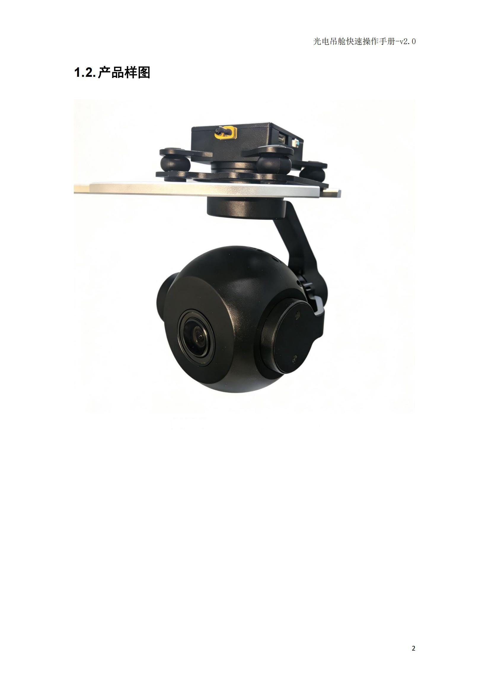

---

## 第7页

光电吊舱快速操作手册-v2.0 
 
3
第二章 操作须知 
2.1. 设备链接 
2.1.1. 设备使用网线直连 
 
图2.1.1 设备使用网线直连 
2.1.2. 设备通过交换机（或路由器）连接 
 
图2.1.2 设备通过交换机(或路由器)连接 
 

**页面图片:**

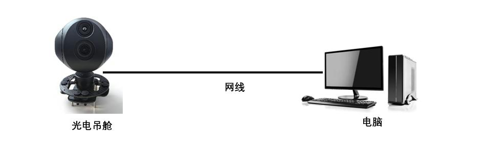

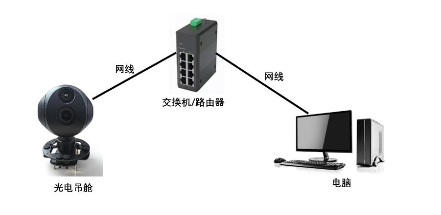

---

## 第8页

光电吊舱快速操作手册-v2.0 
 
4
2.1.3. 设备通过S.BUS（或串口）连接 
图2.1.3 设备通过S.BUS/串口连接示意图 
2.1.4. 设备对外接口定义说明 
 

**页面图片:**

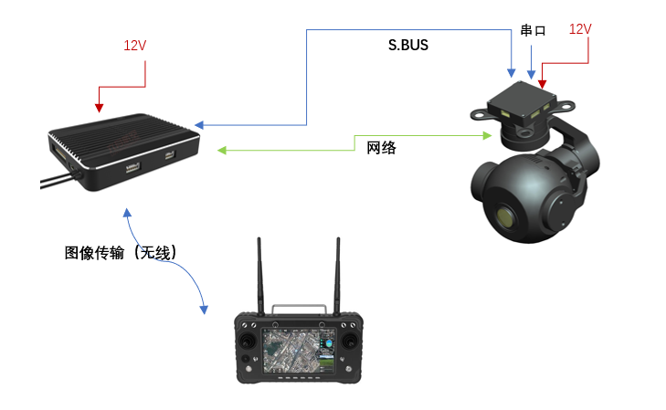

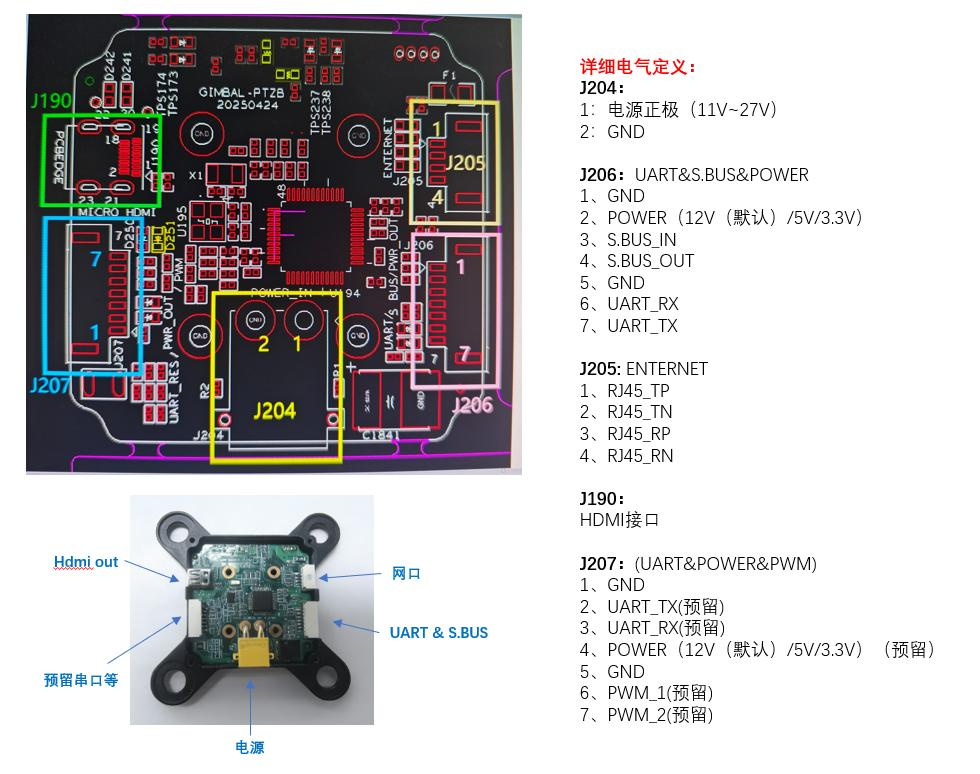

---

## 第9页

光电吊舱快速操作手册-v2.0 
 
5
2.2. 网络配置 
在通过网络访问设备之前，先需要知晓设备的 IP 地址，设备出
产默认，IP：192.168.1.108，用户名：admin，密码：123456。 
1）、首次登录，请在浏览器（建议使用夸克或Microsoft Edge 浏览器）中
输入IP 地址：192.168.1.108，如下图： 
 
2）、输入用户名、密码，点击“登录”，出现提示“检测到中间
件未启动”（PS：意思是需要安装一个中间件播放器）： 
 

**页面图片:**

---

## 第10页

光电吊舱快速操作手册-v2.0 
 
6
3）、继续点击“启动并登录”，然后根据提示：点击“打开TODO:<
文件说明>”按钮，播放控件安装完毕，出现吊舱的视频画面。 
 
 
注意：也可以在登录网页之前，先下载播放控件，并按提示安装好控件，然后在通过
浏览器登录网页，就可以正常使用吊舱了。下载按钮如下图： 

**页面图片:**

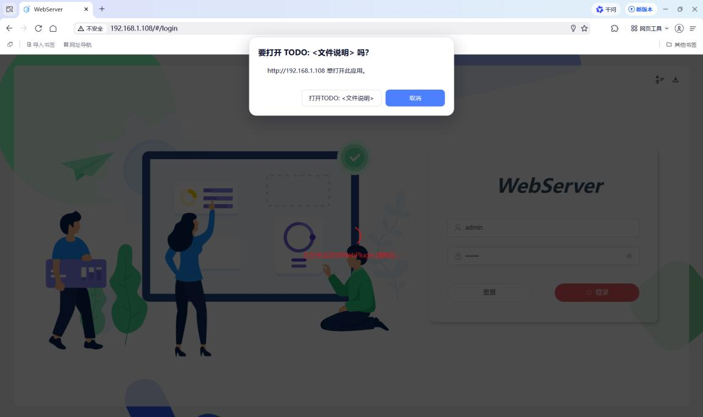

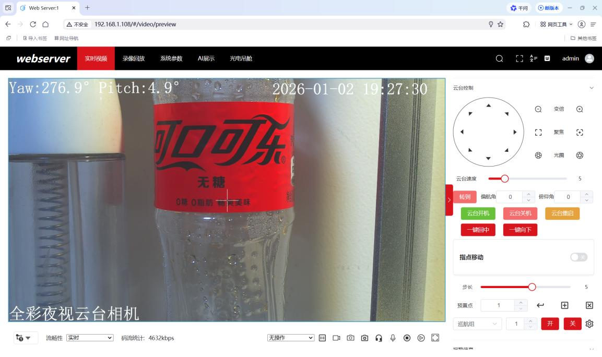

---

## 第11页

光电吊舱快速操作手册-v2.0 
 
7
 
第三章 基本功能操作 
3.1. AF 功能简介 
自动调焦（AF， Auto Focus），支持吊舱自动进行精确调焦，从
而精确地实现聚焦。这就解决了传统摄像机在取下IR 滤光片后图像
会变模糊的问题。 
当镜头模糊时，可以通过自动聚焦功能让设备变清楚。 
聚焦方法： 
1) 在设备web 端的图像设置-图像参数-聚焦参数中-聚焦模式（半自
动）-点击“一次聚焦”。 

**页面图片:**

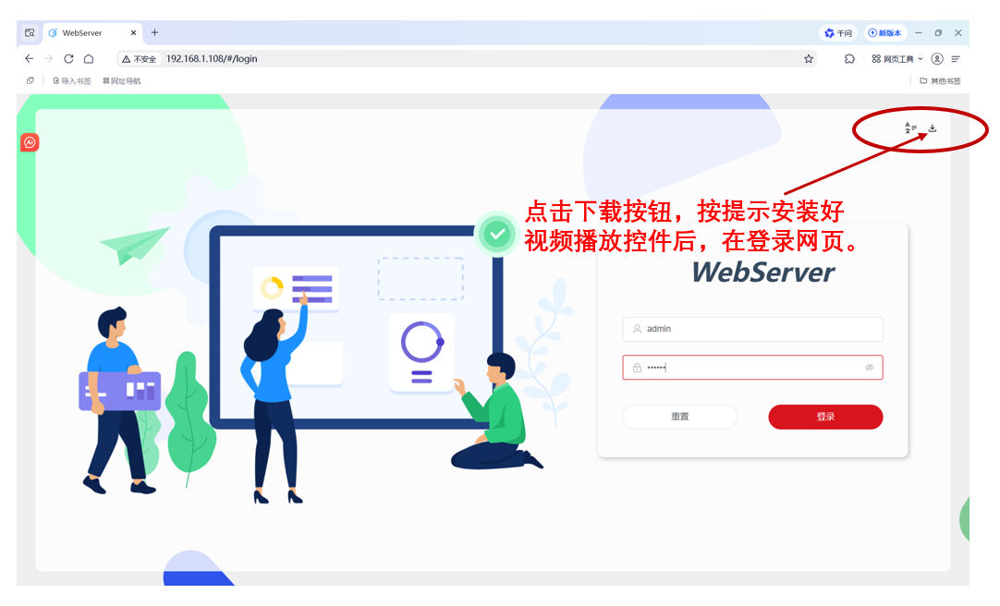

---

## 第12页

光电吊舱快速操作手册-v2.0 
 
8
 
图3.1.1 聚焦参数-一次聚焦 
 
 
2) 在设备web 端的图像设置-图像参数-聚焦参数中-聚焦模式（自
动）。 
 
图3.1.2 聚焦参数-聚焦模式自动 
 
注意 

**页面图片:**

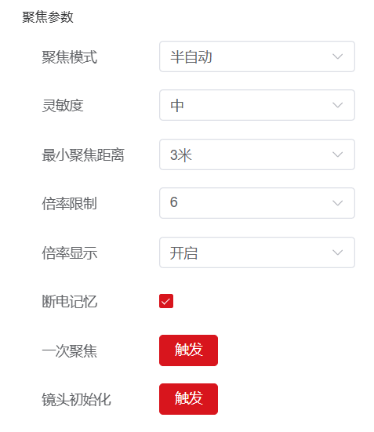

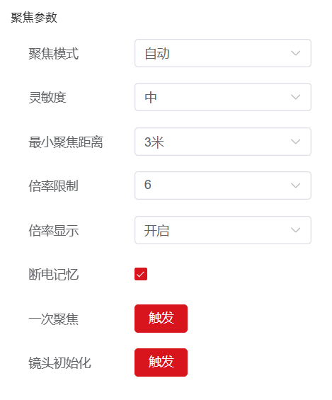

---

## 第13页

光电吊舱快速操作手册-v2.0 
9
使用自动聚焦功能后，设备不会立即变清楚，会在10-20 秒之内
变清楚。 
3.2. 设备浏览器访问 
设备支持多种系统浏览器访问，以 Windows 10 系统 Microsoft 
Edge 浏览器为例，基本访问操作和功能配置如下： 
3.2.1. 浏览器安全级别 
通过Microsoft Edge 浏览器访问感知模块图像时，需要设置浏览
器的安全等级，从而方便安装控件。打开浏览器，进入菜单【工具
/Internet 选项/安全/自定义级别】在 设置中“ActiveX 控件和插件”
都改成“启动”和“提示”，安全级别设置为“安全级别-低”。 
为了安全，在预览到感知模块图像后，请把IE 游览器的安全设置
恢复为“默认级别”。 
图3.2.1.1 Edge 安全级别设置 

**页面图片:**

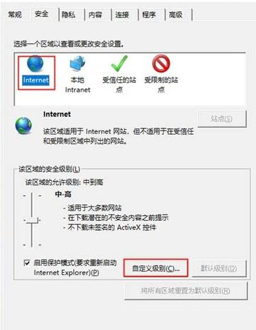

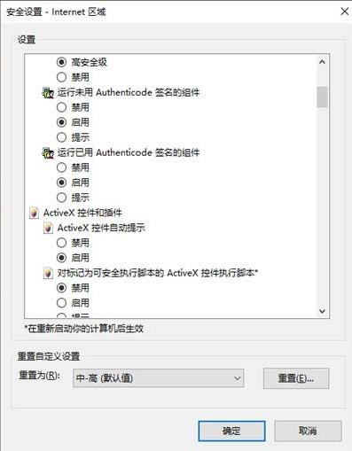

---

## 第14页

光电吊舱快速操作手册-v2.0 
1
3.2.2. IP 访问 
在Microsoft Edge 浏览器地址栏中输入设备的 IP 地址（默认： 
192.168.1.108），点击回车，会弹出如下登录界面。 
图3.2.2.1 登录界面 
3.2.3. 下载控件 
首次登录需安装控件，否则（登录）无法进行正常预览与回放。 
1) 在登录界面点击（下载控件）。
图3.2.3.1 登录界面 
2) 在弹出窗口中点击（运行），根据需求也可将控件使用（另存为）
进行保存。

**页面图片:**

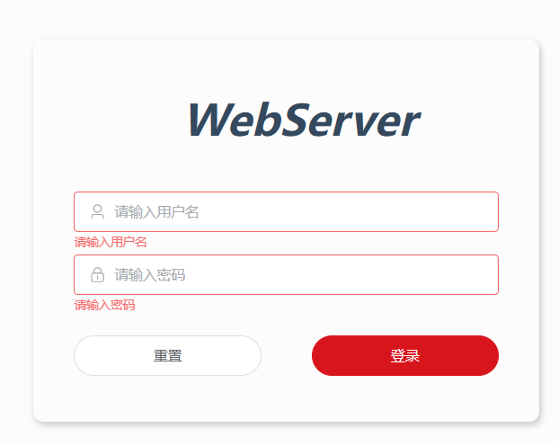

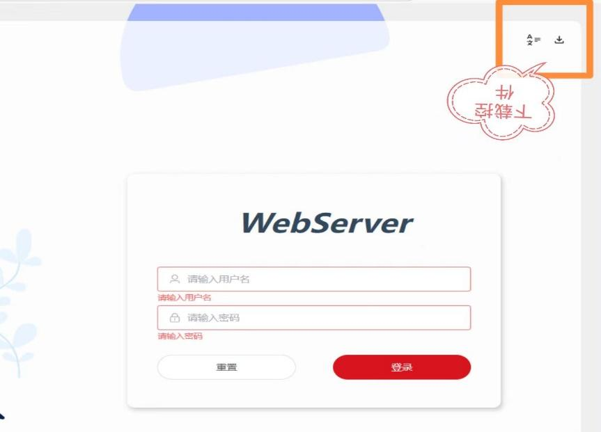

---

## 第15页

光电吊舱快速操作手册-v2.0 
 
1
 
图3.2.3.2 控件下载 
某些情况下，点击运行会提示“Setup.msi 不是常见的下载内容，
可能会危 害你的计算机。”，此时可点击操作，然后点击更多操作
来运行该控件。 
图3.2.3.3 安全提示 
3) 在弹出窗口中需要多次点击（下一步），最后提示安装完成后点
击（关闭）。 
 
 
图3.2.3.4 控件安装 
 

**页面图片:**

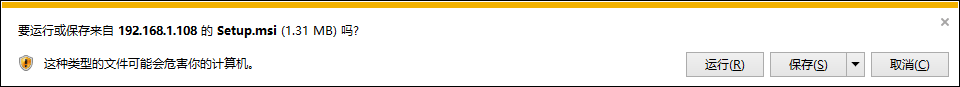

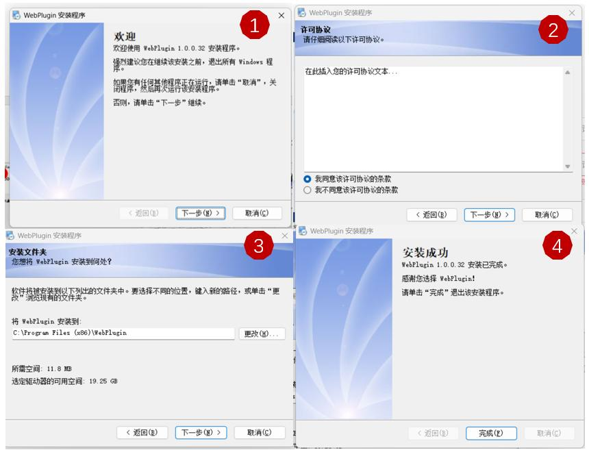

---

## 第16页

光电吊舱快速操作手册-v2.0 
 
1
3.2.4. 设备登录 
控件安装完成后需刷新浏览器，使页面能够加载控件。 
点击允许按钮让页面加载控件。 
图3.2.4.1 控件加载 
在登录界面中输入设备的“用户名”（默认：admin）、“密码”（默
认： 123456），在点击登录，进入设备主界面。 
 
 
 
 
图3.2.4.2 登录页面 
注意 
设备出厂时，预置了 2 个用户“admin”、“guest”，（默认密码： 
123456） 。 
用户“admin ”权限为 超级用户权限，用户 “guest”权限为预览和回
放。 
用户“admin”和“guest”可修改密码，但不能改权限。 为了保证设
备的系统安全，请登录后及时修改密码。 
 

**页面图片:**

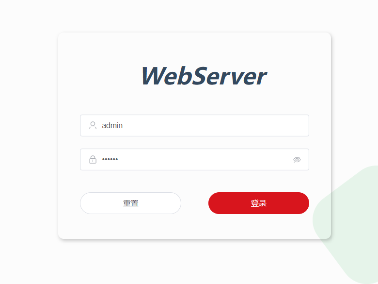

---

## 第17页

光电吊舱快速操作手册-v2.0 
1
3.2.5. 修改密码 
在默认用户名和密码登录情况下，页面会提示进行密码修改操作。 
图3.2.5.1 修改密码 
如不需要修改密码，可点击取消来继续进行登录操作。 
如需修改密码，键入所需设置的密码，点击确定进行密码修改操
作，修改完成后，使用新密码来进行登录操作。 
3.3. 实时视频 
控件安装完成后需刷新浏览器，使页面能够加载控件。点击允许
按钮让页面加载控件。 
图3.3.1 预览界面 

**页面图片:**

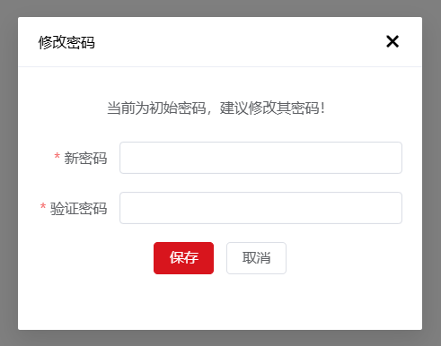

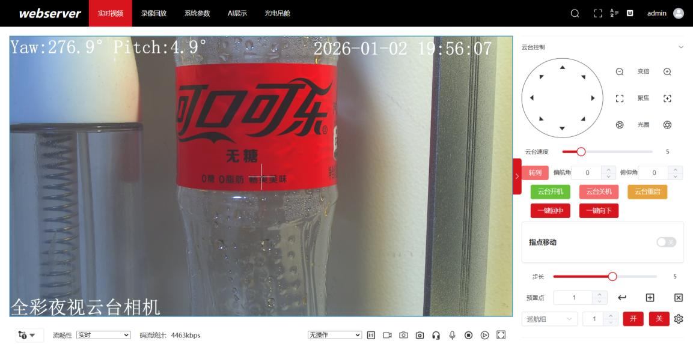

---

## 第18页

光电吊舱快速操作手册-v2.0 
1
3.3.1. 云台控制功能 
控制吊舱的上下左右转动，及吊舱的变倍、聚焦操作。转动的速
度，可以通过修改“云台速度”来实现，操作界面如下图： 
3.4. 如何修改吊舱系统时间 
点击进入【系统参数】->【系统设置】->【普通设置】界面： 

**页面图片:**

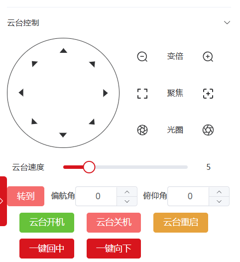

---

## 第19页

光电吊舱快速操作手册-v2.0 
1
3.5. 如何修改吊舱IP 地址 
点击进入【系统参数】->【网络设置】->【基本配置】界面： 
3.6. 如何通过RTSP 协议访问吊舱视频 
以默认IP：192.168.1.108 为例，以VLC 软件为例，取流命令如下： 
1）、可见光主码流： 命令是：rtsp://192.168.1.108:554/id=1&type=0 
2）、可见光辅码流： 命令是：rtsp://192.168.1.108:554/id=1&type=1 

**页面图片:**

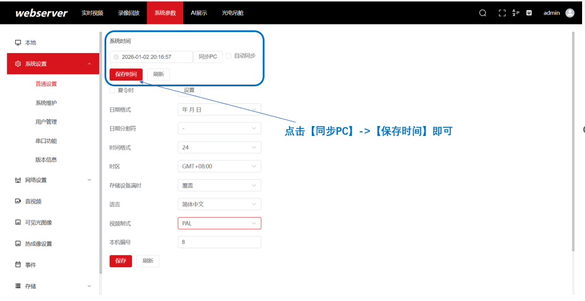

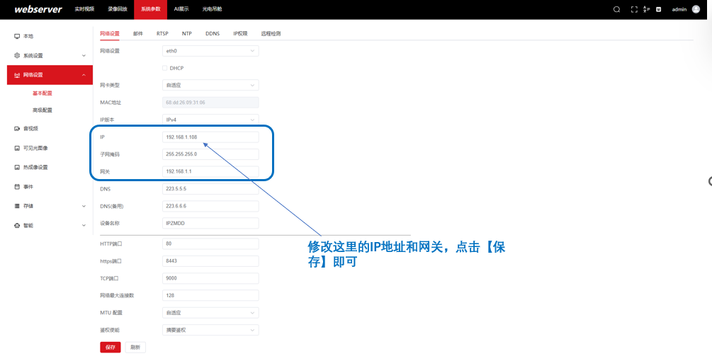

---

## 第20页

光电吊舱快速操作手册-v2.0 
1
3）、热成像码流： 命令是：rtsp://192.168.1.108:554/id=2&type=0 
注意 如出现vlc 视频延迟偏大，可联系技术支持，通过配置vlc 参数可解决。
3.7. 如何进行吊舱视频码流配置 
点击进入【系统参数】->【音视频】界面： 
3.8. 如何调整图像参数 
点击进入【系统参数】->【可见光图像】->【图像参数】界面： 

**页面图片:**

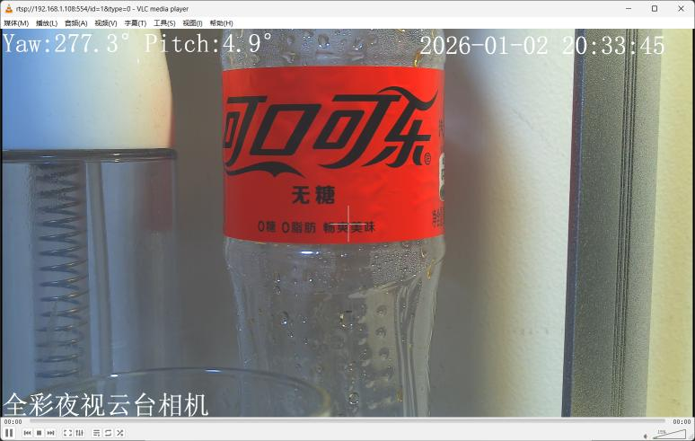

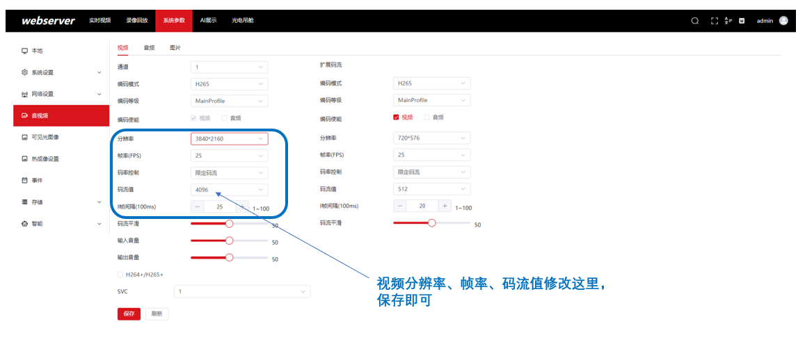

---

## 第21页

光电吊舱快速操作手册-v2.0 
1
3.9. 如何进行图像翻转 
点击进入【系统参数】->【可见光图像】->【图像参数】界面： 
3.10. 如何配置变倍倍数 
 
点击进入【系统参数】->【可见光图像】->
默认是10 倍光学变倍，混合变倍最大可支持80 倍，参数配置
如下：
【图像参数】界面： 

**页面图片:**

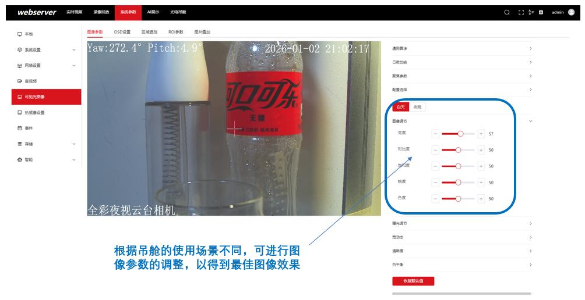

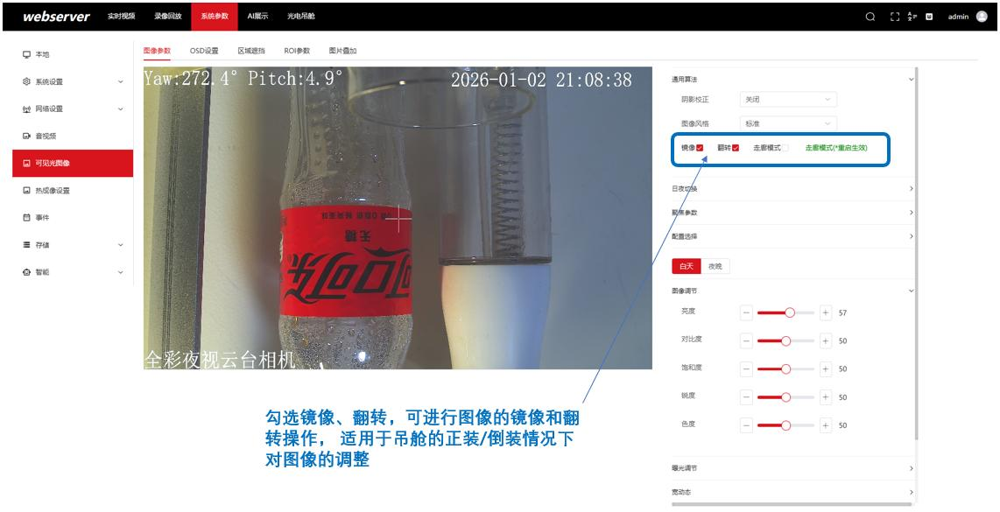

---

## 第22页

光电吊舱快速操作手册-v2.0 
1

**页面图片:**

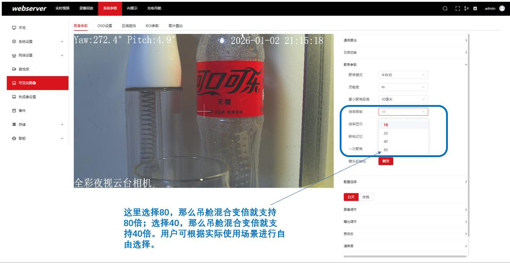

---

## 第23页

杭州数尔安防科技股份有限公司  

**页面图片:**

