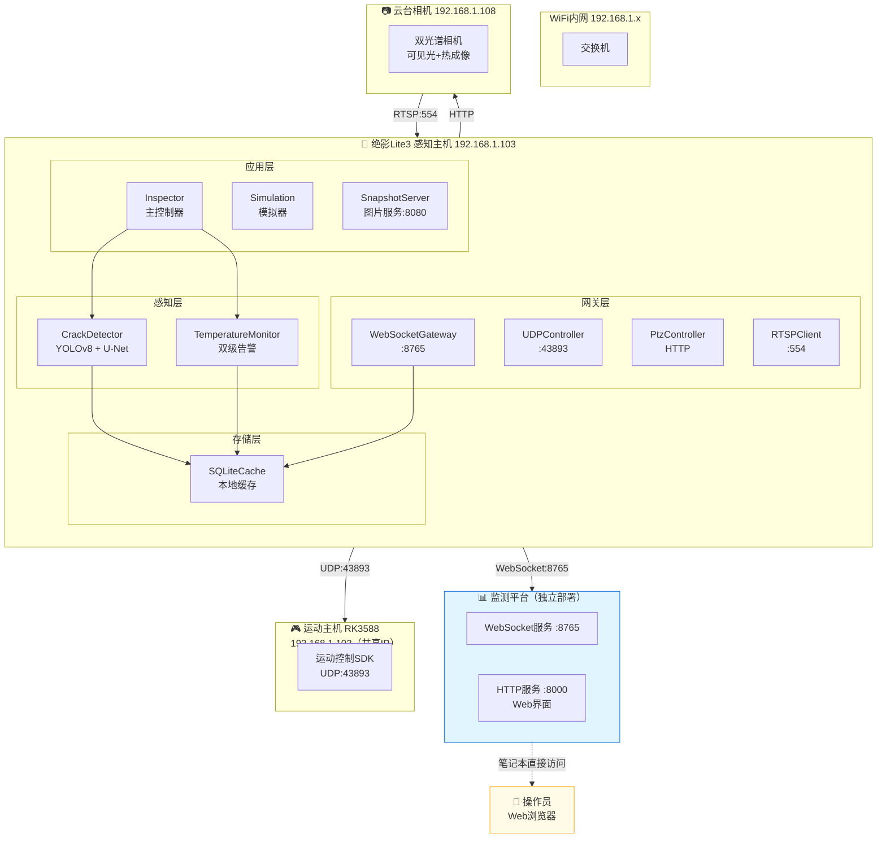
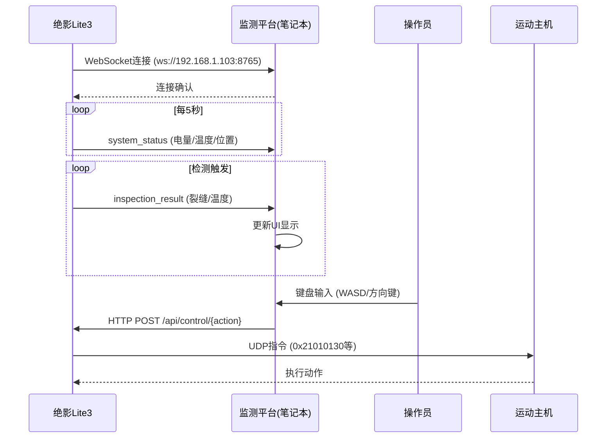
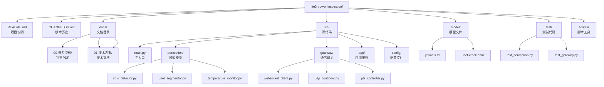
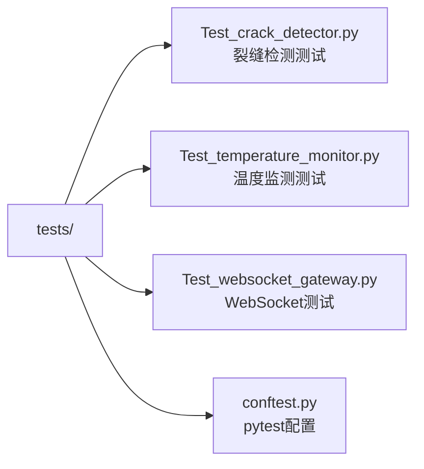

# 绝影Lite3 系统架构设计

> **文档编号**: DOC-ARCH-001
> **版本**: V1.7
> **编制日期**: 2025-09-16
> **编制人**: 陈伟
> **适用范围**: 绝影Lite3电力巡检系统架构设计与代码规范

---

## 一、架构概述

### 1.1 设计目标

实现绝影Lite3机器狗在电力巡检场景下的自动化检测能力，包括：
- 混凝土裂缝视觉检测（≥0.1mm精度）
- 大体积混凝土温度监测（双级告警）
- 实时数据上报至独立监测平台

### 1.2 系统拓扑



### 1.3 双部署架构

| 部署位置 | 服务 | IP地址 | 端口 | 说明 |
|---------|------|--------|------|------|
| **感知主机** | 巡检程序 | 192.168.1.103 | 8765 | WebSocket服务端 |
| **感知主机** | 图片服务 | 192.168.1.103 | 8080 | 快照图片 |
| **感知主机** | UDP控制 | 192.168.1.103 | 43893 | 运动指令 |
| **笔记本** | 监测平台 | localhost | 8000/8765 | Web界面+数据接收 |

> **重要说明**：监测平台独立部署在操作员笔记本上，通过WebSocket自动连接感知主机（192.168.1.103:8765），无需固定服务器IP。

### 1.4 核心参数

| 参数 | 值 | 说明 |
|------|-----|------|
| 感知主机IP | 192.168.1.103 | Jetson Xavier NX |
| 运动主机IP | 192.168.1.103 | RK3588（共享IP） |
| 云台相机IP | 192.168.1.108 | 静态配置 |
| UDP端口 | 43893 | 运动控制指令 |
| WebSocket端口 | 8765 | 数据上报 |
| RTSP端口 | 554 | 视频流 |
| 心跳间隔 | 0.4秒 | UDP心跳 |
| 告警阈值 | 45℃/50℃ | 预警/告警 |

---

## 二、模块设计

### 2.1 模块结构

```
src/
├── app/                    # 应用层
│   ├── main.py            # 程序入口
│   └── inspector.py       # 巡检主控制器
├── gateway/               # 网关层
│   ├── udp_controller.py  # UDP运动控制
│   ├── ptz_controller.py  # 云台控制
│   ├── websocket_client.py # WebSocket客户端
│   └── rtsp_client.py     # RTSP视频流
├── perception/            # 感知层
│   ├── yolo_detector.py   # 裂缝检测（YOLO）
│   ├── unet_segmentor.py  # 裂缝分割（U-Net）
│   └── temperature_monitor.py # 温度监测
├── services/              # 服务层
│   └── simulation_generator.py # 模拟数据生成
└── storage/               # 存储层
    └── sqlite_cache.py    # SQLite缓存
```

### 2.2 监测平台结构

```
monitor_platform/
├── server.py              # FastAPI主服务（含WebSocket）
├── requirements.txt       # 依赖清单（4个核心包）
└── __init__.py

scripts/
├── start_monitor.py       # Python启动脚本
└── test_monitor.py        # 测试脚本
```

---

## 三、通信协议

### 3.1 WebSocket消息格式

```json
{
  "msgId": "uuid",
  "ts": 1735668123456,
  "deviceId": "LITE3-001",
  "type": "inspection_result",
  "payload": {
    "defect_type": "crack",
    "confidence": 0.92,
    "measurements": {"width_mm": 0.12, "length_mm": 23.4},
    "temperature": {"value": 46.5, "status": "WARN"},
    "waypoint": "WP001"
  }
}
```

### 3.2 UDP运动控制指令

| 指令码 | 功能 | 参数范围 |
|--------|------|---------|
| `0x21010130` | 前后平移 | [-6553, 6553] |
| `0x21010131` | 左右平移 | [-12553, 12553] |
| `0x21010135` | 左右转弯 | [-9553, 9553] |
| `0x21010202` | 起立/趴下 | - |
| `0x21020C0E` | 软急停 | - |

---

## 四、数据流设计



---

## 五、代码规范

### 5.1 Python代码风格

遵循 [PEP 8](https://peps.python.org/pep-0008/) 规范，使用工具自动格式化：

```bash
# 安装格式化工具
pip install black isort flake8

# 格式化代码
black src/**/*.py
isort src/**/*.py

# 代码检查
flake8 src/ --max-line-length=100
```

**命名规范**：

| 类型 | 规范 | 示例 | 反例 |
|------|------|------|------|
| 模块名 | 小写+下划线 | `crack_detector.py` | `CrackDetector.py` |
| 类名 | CamelCase | `CrackDetector` | `crack_detector` |
| 函数名 | 小写+下划线 | `detect_crack()` | `detectCrack()` |
| 常量 | 大写+下划线 | `MAX_CONFIDENCE = 0.9` | `maxConfidence` |
| 私有属性 | 单下划线前缀 | `_model_path` | `modelPath` |
| 私有方法 | 单下划线前缀 | `_preprocess()` | `preProcess()` |

**文档字符串规范**：

```python
class CrackDetector:
    """裂缝检测器类
    
    实现YOLOv8-s + U-Net两阶段裂缝检测算法。
    支持广角粗检和变焦精检两种模式。
    
    Attributes:
        confidence_threshold: 检测置信度阈值，默认0.5
        min_width_mm: 最小检测裂缝宽度，默认0.1mm
    """
    
    def __init__(self, model_path: str, confidence_threshold: float = 0.5):
        """初始化检测器
        
        Args:
            model_path: TensorRT引擎文件路径
            confidence_threshold: 置信度阈值，范围[0.0, 1.0]
            
        Raises:
            FileNotFoundError: 模型文件不存在
            RuntimeError: 引擎加载失败
        """
        pass
```

### 5.2 Git提交规范

遵循 [Conventional Commits](https://www.conventionalcommits.org/) 规范：

```
<type>(<scope>): <subject>

<body>

<footer>
```

**Type类型**：

| Type | 说明 | 示例 |
|------|------|------|
| feat | 新功能 | `feat(perception): 添加U-Net分割算法` |
| fix | 修复bug | `fix(gateway): 修复WebSocket断连问题` |
| docs | 文档变更 | `docs: 重构文档体系` |
| style | 代码格式 | `style: 格式化Python代码` |
| refactor | 重构 | `refactor(detection): 重构裂缝检测模块` |
| test | 测试相关 | `test: 添加单元测试` |
| chore | 构建/工具 | `chore: 更新依赖版本` |

**提交示例**：

```bash
# ✅ 正确示例
git commit -m "feat(perception): 添加YOLOv8裂缝检测算法

- 实现TensorRT模型加载
- 添加预处理和后处理逻辑
- 置信度阈值可配置

Closes #12"

# ❌ 避免的写法
git commit -m "fix bug"
git commit -m "updated"
```

---

## 六、目录结构规范



---

## 七、配置管理规范

### 7.1 YAML配置规范

```yaml
# 使用驼峰或下划线保持一致
detection:
  crack:
    yolo_model: "models/yolov8s.trt"
    confidence_threshold: 0.5
    min_width_mm: 0.1
  temperature:
    warn_threshold: 45.0
    critical_threshold: 50.0

communication:
  websocket:
    server_url: "ws://192.168.1.103:8765/ws"
    reconnect_interval: 5.0
```

### 7.2 环境变量

```bash
# 开发环境
export ROBOT_MOTION_IP=192.168.1.103
export PTZ_BASE_URL=http://192.168.1.108
export WEBSOCKET_SERVER=ws://192.168.1.103:8765/ws

# 生产环境（默认值）
export ROBOT_MOTION_IP=${ROBOT_MOTION_IP:-192.168.1.103}
```

---

## 八、异常处理规范

### 8.1 异常类定义

```python
class InspectionError(Exception):
    """巡检基础异常"""
    pass

class DetectionError(InspectionError):
    """检测异常"""
    pass

class CommunicationError(InspectionError):
    """通信异常"""
    pass

class HardwareError(InspectionError):
    """硬件异常"""
    pass
```

### 8.2 异常处理模式

```python
import logging

logger = logging.getLogger(__name__)

async def detect_crack(image: np.ndarray) -> List[Dict]:
    try:
        results = await self._run_inference(image)
        return results
    except ModelLoadError as e:
        logger.error(f"模型加载失败: {e}")
        raise DetectionError("无法执行检测") from e
    except Exception as e:
        logger.exception(f"未知错误: {e}")
        raise DetectionError(f"检测失败: {e}") from e
```

---

## 九、测试规范

### 9.1 测试文件命名



### 9.2 测试代码示例

```python
import pytest
import numpy as np

class TestCrackDetector:
    
    @pytest.fixture
    def detector(self):
        return CrackDetector(model_path="models/yolov8s.trt")
    
    def test_detect_empty_image(self, detector):
        """测试空图像处理"""
        image = np.zeros((100, 100, 3), dtype=np.uint8)
        results = detector.detect(image)
        assert results == []
    
    def test_detect_with_crack(self, detector, sample_image):
        """测试裂缝检测"""
        results = detector.detect(sample_image)
        assert len(results) > 0
        assert all(r["confidence"] >= 0.5 for r in results)
```

---

## 十、监控指标

### 10.1 系统健康指标

| 指标 | 正常范围 | 告警阈值 |
|------|---------|---------|
| 电池电量 | >50% | <20% |
| CPU温度 | <50℃ | >60℃ |
| GPU负载 | <80% | >90% |
| 内存使用 | <70% | >85% |
| 网络连接 | 稳定 | 断连>5秒 |

### 10.2 巡检质量指标

| 指标 | 目标值 |
|------|-------|
| 裂缝检测精度 | ≥0.1mm |
| 温度监测精度 | ±0.5℃ |
| 数据上报成功率 | ≥95% |
| 系统可用性 | ≥99% |

---

## 十一、代码审查清单

提交代码前自查：

- [ ] 代码遵循PEP 8规范
- [ ] 函数有文档字符串（docstring）
- [ ] 异常处理合理，不吞掉异常
- [ ] 关键路径有日志记录
- [ ] 测试覆盖率≥80%
- [ ] 配置文件无硬编码
- [ ] Git提交信息符合Conventional Commits规范
- [ ] 无敏感信息泄露（密码、密钥等）

---

## 十二、扩展性设计

### 12.1 多设备支持

系统支持通过配置切换不同设备ID，实现多机协同巡检。

### 12.2 第三方平台对接

WebSocket接口遵循标准协议，可对接任意第三方监测平台。

### 12.3 算法插件化

感知算法通过Plugin接口接入，支持动态加载和切换。

---

**版本历史**:
- V1.7: 监测平台改为独立部署，更新架构图
- V1.7: 统一文档规范，补充电机控制协议
- V1.7: 合并代码规范至架构设计文档
