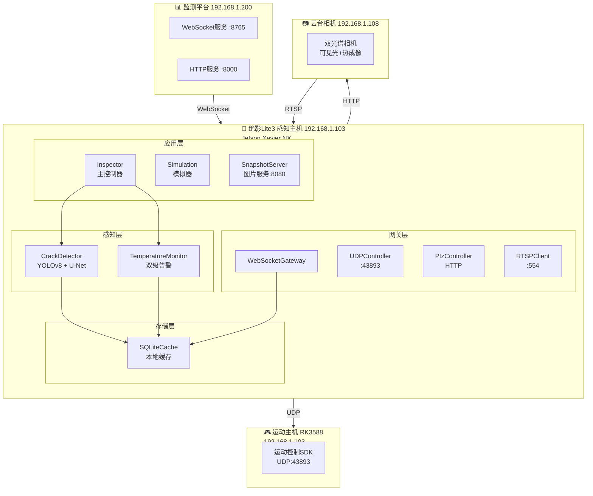
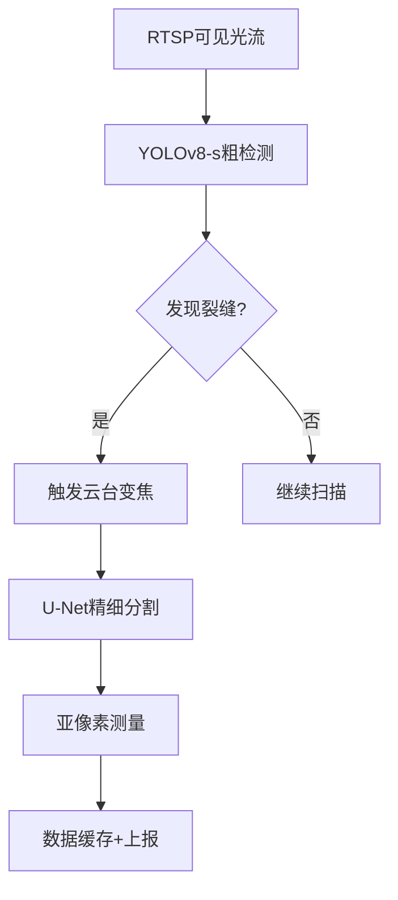
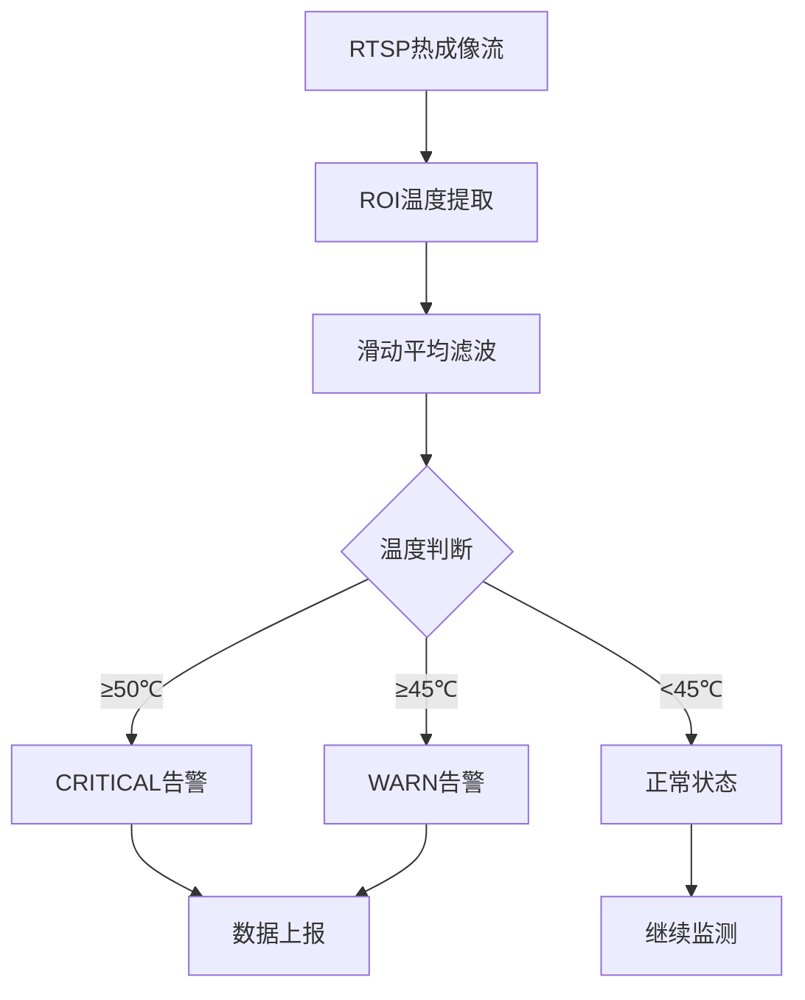
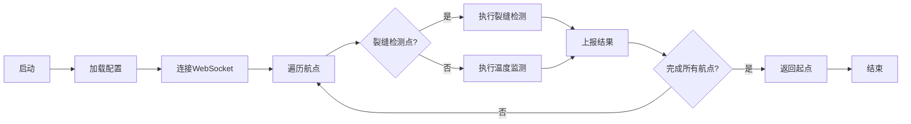

# 系统架构设计

> **文档编号**: ARCH-001
> **版本**: V1.7
> **编制日期**: 2025-09-16
> **编制人**: 陈伟

---

## 一、架构概述

### 1.1 设计目标

实现绝影Lite3机器狗在电力巡检场景下的自动化检测能力，包括：
- 混凝土裂缝视觉检测（≥0.1mm精度）
- 大体积混凝土温度监测（双级告警）
- 实时数据上报至第三方监测平台

### 1.2 系统拓扑



### 1.3 核心参数

| 参数 | 值 | 说明 |
|------|-----|------|
| 感知主机IP | 192.168.1.103 | Jetson Xavier NX |
| 运动主机IP | 192.168.1.103 | RK3588（共享IP） |
| 云台相机IP | 192.168.1.108 | 静态配置 |
| UDP端口 | 43893 | 运动控制指令 |
| WebSocket端口 | 8765 | 数据上报 |
| RTSP端口 | 554 | 视频流 |
| HTTP端口 | 8000/8080 | 监测平台/图片服务 |
| 心跳间隔 | 0.4秒 | UDP心跳 |
| 告警阈值 | 45℃/50℃ | 预警/告警 |

---

## 二、模块设计

### 2.1 模块结构

```
src/
├── app/                    # 应用层
│   ├── main.py            # 程序入口
│   └── inspector.py       # 巡检主控制器
├── gateway/               # 网关层
│   ├── udp_controller.py  # UDP运动控制
│   ├── ptz_controller.py  # 云台控制
│   ├── websocket_client.py # 数据上报
│   └── rtsp_client.py     # 视频流拉取
├── perception/            # 感知层
│   ├── yolo_detector.py   # 裂缝检测(YOLOv8)
│   ├── unet_segmentor.py  # 裂缝分割(U-Net)
│   └── temperature_monitor.py # 温度监测
├── services/              # 服务层
│   ├── simulation_generator.py # 模拟数据生成
│   └── snapshot_server.py   # 图片HTTP服务
└── storage/               # 存储层
    └── sqlite_cache.py    # SQLite缓存
```

### 2.2 核心类

| 类名 | 位置 | 职责 |
|------|------|------|
| Inspector | app/inspector.py | 巡检任务编排 |
| YOLODetector | perception/yolo_detector.py | 裂缝粗检测 |
| UNetSegmentor | perception/unet_segmentor.py | 裂缝精细分割 |
| TemperatureMonitor | perception/temperature_monitor.py | 温度监测与告警 |
| UDPMotionController | gateway/udp_controller.py | UDP运动控制 |
| PtzController | gateway/ptz_controller.py | 云台角度控制 |
| WebSocketGateway | gateway/websocket_client.py | 数据上报 |
| SQLiteCache | storage/sqlite_cache.py | 本地数据缓存 |

---

## 三、数据流设计

### 3.1 裂缝检测流程



### 3.2 温度监测流程



### 3.3 完整巡检流程



---

## 四、数据模型

### 4.1 检测结果

```python
@dataclass
class CrackResult:
    defect_type: str           # crack
    confidence: float          # 0.0-1.0
    width_mm: float           # 裂缝宽度
    length_mm: float          # 裂缝长度
    pixel_precision: float    # mm/px
    bbox: Tuple[int, int, int, int]
    snapshot_url: str         # 图片URL
```

### 4.2 温度告警

```python
@dataclass
class TemperatureAlert:
    alert_level: str          # NORMAL/WARN/CRITICAL
    temperature: float        # 最高温度℃
    roi: Tuple[int, int, int, int]
    alert_id: str             # ALT-{timestamp}-{seq}
```

### 4.3 系统状态

```python
@dataclass
class SystemStatus:
    battery: int             # 电量%
    cpu_temp: float          # CPU温度℃
    gpu_load: int           # GPU负载%
    memory_usage: int       # 内存使用率%
    status: str             # idle/inspecting/moving
```

---

## 五、通信协议

### 5.1 UDP运动控制

| 指令码 | 功能 | 参数 |
|--------|------|------|
| 0x21040001 | 心跳包 | 无 |
| 0x21010202 | 起立 | 无 |
| 0x21010203 | 趴下 | 无 |
| 0x0103 | 速度控制 | vx, vy, vw |
| 0x21020C0E | 软急停 | 无 |

### 5.2 WebSocket数据上报

```json
{
  "msgId": "uuid-v4",
  "ts": 1735668123456,
  "deviceId": "LITE3-001",
  "type": "inspection_result",
  "payload": {}
}
```

详细协议见 [API接口文档](02-API接口文档.md)

### 5.3 云台控制（HTTP）

- 认证方式：MerlinSession（18位注册码）
- Session有效期：30秒
- 控制接口：HTTP POST /merlin/

---

## 六、配置管理

### 6.1 配置文件

```yaml
# config/inspection_config.yaml
robot:
  motion_host_ip: "192.168.1.103"
  motion_host_port: 43893
  heartbeat_interval: 0.4

ptz:
  base_url: "http://192.168.1.108"
  username: "admin"
  password: "123456"

detection:
  crack:
    confidence_threshold: 0.5
    min_width_mm: 0.1
  temperature:
    warn_threshold: 45.0
    critical_threshold: 50.0

communication:
  websocket:
    server_url: "ws://192.168.1.200:8765/ws"
```

### 6.2 航点配置

```yaml
waypoints:
  - id: WP001
    x: 0.5
    y: 0.3
    theta: 0.0
    type: crack_inspection
    ptz_yaw: 0
    ptz_pitch: -30
    zoom: 10
```

---

## 七、依赖关系

### 7.1 硬件依赖

| 组件 | 型号 | 数量 | 用途 |
|------|------|------|------|
| 绝影Lite3专业版 | 含Jetson NX+RK3588 | 1 | 主平台 |
| 双光谱云台相机 | SR-UPA810T609 | 1 | 视频采集 |

### 7.2 软件依赖

| 类别 | 依赖项 | 版本 | 用途 |
|------|--------|------|------|
| 核心 | numpy, opencv-python | - | 基础运算 |
| AI推理 | PyTorch, TensorRT | - | GPU加速 |
| 通信 | websockets, requests | - | 网络通信 |
| Web | fastapi, uvicorn, pydantic | - | 监测平台 |

完整依赖见 [requirements.txt](../../requirements.txt)

---

## 八、部署模式

| 模式 | 参数 | GPU需求 | 数据来源 |
|------|------|---------|----------|
| 模拟模式 | simulation | ❌ 不需要 | 程序生成 |
| 真实模式 | real | ✅ 需要 | 传感器采集 |
| 混合模式 | hybrid | ⚠️ 可选 | 混合输入 |

---

*文档版本: V1.7 | 编制日期: 2025-09-16 | 编制人: 陈伟*
