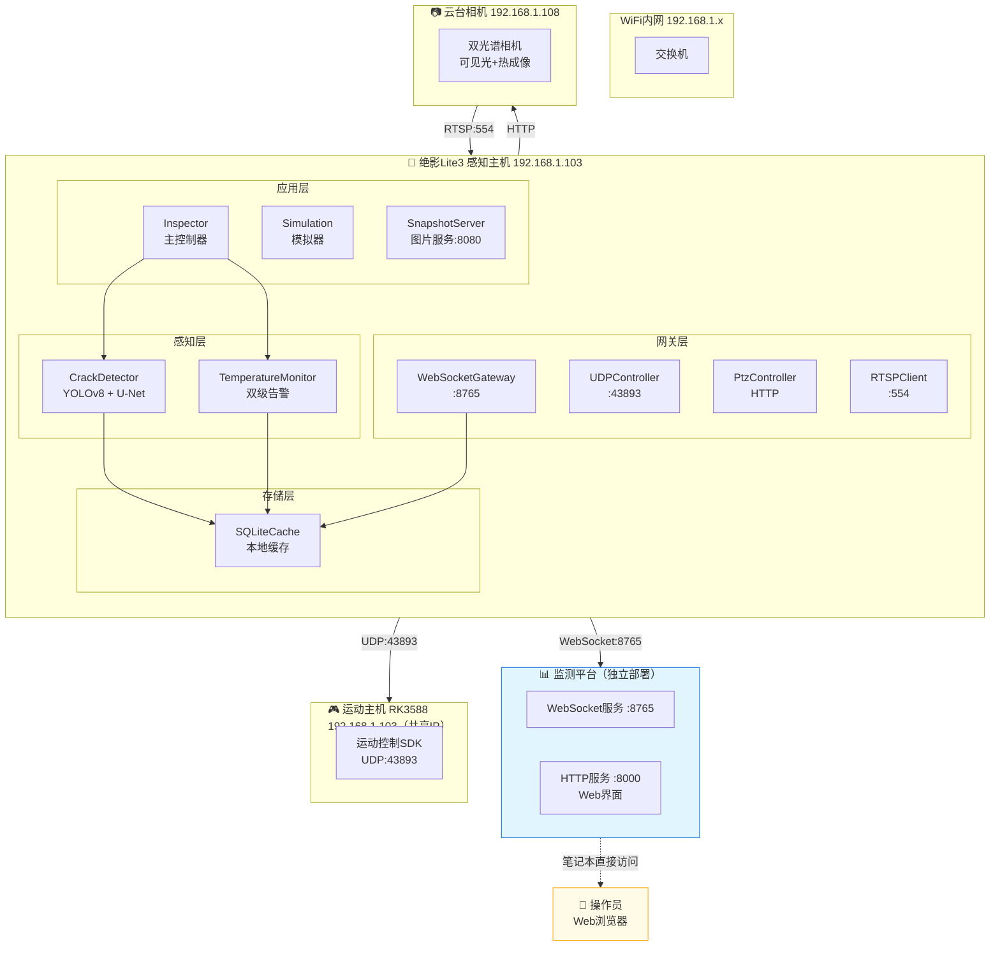
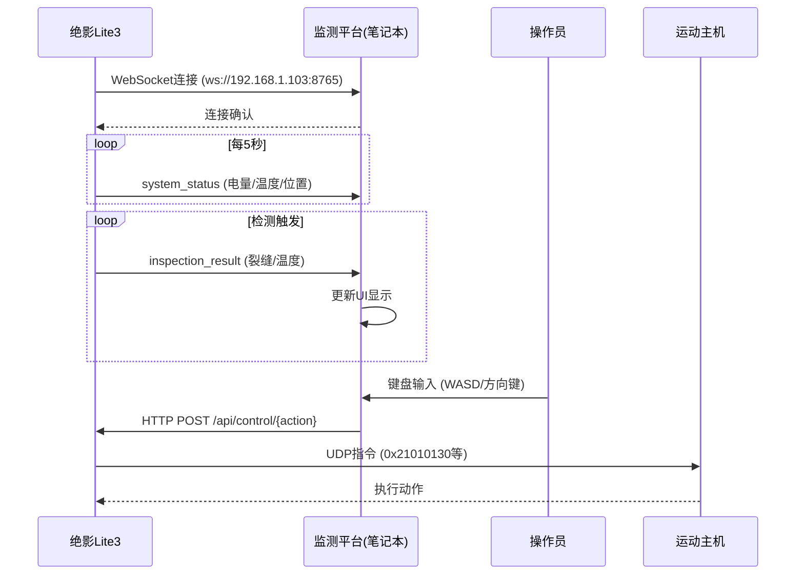

# 绝影Lite3 系统架构设计

> **文档编号**: DOC-ARCH-001
> **版本**: V1.8
> **编制日期**: 2025-09-16
> **编制人**: 陈伟

---

## 一、架构概述

### 1.1 设计目标

实现绝影Lite3机器狗在电力巡检场景下的自动化检测能力，包括：
- 混凝土裂缝视觉检测（≥0.1mm精度）
- 大体积混凝土温度监测（双级告警）
- 实时数据上报至独立监测平台

### 1.2 系统拓扑



### 1.3 双部署架构

| 部署位置 | 服务 | IP地址 | 端口 | 说明 |
|---------|------|--------|------|------|
| **感知主机** | 巡检程序 | 192.168.1.103 | 8765 | WebSocket服务端 |
| **感知主机** | 图片服务 | 192.168.1.103 | 8080 | 快照图片 |
| **感知主机** | UDP控制 | 192.168.1.103 | 43893 | 运动指令 |
| **笔记本** | 监测平台 | localhost | 8000/8765 | Web界面+数据接收 |

> **重要说明**：监测平台独立部署在操作员笔记本上，通过WebSocket自动连接感知主机（192.168.1.103:8765），无需固定服务器IP。

### 1.4 核心参数

| 参数 | 值 | 说明 |
|------|-----|------|
| 感知主机IP | 192.168.1.103 | Jetson Xavier NX |
| 运动主机IP | 192.168.1.103 | RK3588（共享IP） |
| 云台相机IP | 192.168.1.108 | 静态配置 |
| UDP端口 | 43893 | 运动控制指令 |
| WebSocket端口 | 8765 | 数据上报 |
| RTSP端口 | 554 | 视频流 |
| 心跳间隔 | 0.4秒 | UDP心跳 |
| 告警阈值 | 45℃/50℃ | 预警/告警 |

---

## 二、模块设计

### 2.1 模块结构

```
src/
├── app/                    # 应用层
│   ├── main.py            # 程序入口
│   └── inspector.py       # 巡检主控制器
├── gateway/               # 网关层
│   ├── udp_controller.py  # UDP运动控制
│   ├── ptz_controller.py  # 云台控制
│   ├── websocket_client.py # WebSocket客户端
│   └── rtsp_client.py     # RTSP视频流
├── perception/            # 感知层
│   ├── crack_detector.py  # 裂缝检测
│   └── temp_monitor.py    # 温度监测
├── services/              # 服务层
│   └── simulation_generator.py # 模拟数据生成
└── storage/               # 存储层
    └── sqlite_cache.py    # SQLite缓存
```

### 2.2 监测平台结构

```
monitor_platform/
├── server.py              # FastAPI主服务（含WebSocket）
├── requirements.txt       # 依赖清单（4个核心包）
└── __init__.py

scripts/
├── start_monitor.py       # Python启动脚本
├── start_monitor.sh       # Linux/macOS启动脚本
└── start_monitor.bat      # Windows启动脚本
```

---

## 三、通信协议

### 3.1 WebSocket消息格式

```json
{
  "msgId": "uuid",
  "ts": 1735668123456,
  "deviceId": "LITE3-001",
  "type": "inspection_result",
  "payload": {
    "defect_type": "crack",
    "confidence": 0.92,
    "measurements": {"width_mm": 0.12, "length_mm": 23.4},
    "temperature": {"value": 46.5, "status": "WARN"},
    "waypoint": "WP001"
  }
}
```

### 3.2 UDP运动控制指令

| 指令码 | 功能 | 参数范围 |
|--------|------|---------|
| `0x21010130` | 前后平移 | [-6553, 6553] |
| `0x21010131` | 左右平移 | [-12553, 12553] |
| `0x21010135` | 左右转弯 | [-9553, 9553] |
| `0x21010202` | 起立/趴下 | - |
| `0x21020C0E` | 软急停 | - |

---

## 四、数据流设计



---

## 五、监控指标

### 5.1 系统健康指标

| 指标 | 正常范围 | 告警阈值 |
|------|---------|---------|
| 电池电量 | >50% | <20% |
| CPU温度 | <50℃ | >60℃ |
| GPU负载 | <80% | >90% |
| 内存使用 | <70% | >85% |
| 网络连接 | 稳定 | 断连>5秒 |

### 5.2 巡检质量指标

| 指标 | 目标值 |
|------|-------|
| 裂缝检测精度 | ≥0.1mm |
| 温度监测精度 | ±0.5℃ |
| 数据上报成功率 | ≥95% |
| 系统可用性 | ≥99% |

---

## 六、扩展性设计

### 6.1 多设备支持

系统支持通过配置切换不同设备ID，实现多机协同巡检。

### 6.2 第三方平台对接

WebSocket接口遵循标准协议，可对接任意第三方监测平台。

### 6.3 算法插件化

感知算法通过Plugin接口接入，支持动态加载和切换。

---

**版本历史**:
- V1.8: 监测平台改为独立部署，更新架构图
- V1.7: 统一文档规范，补充电机控制协议
