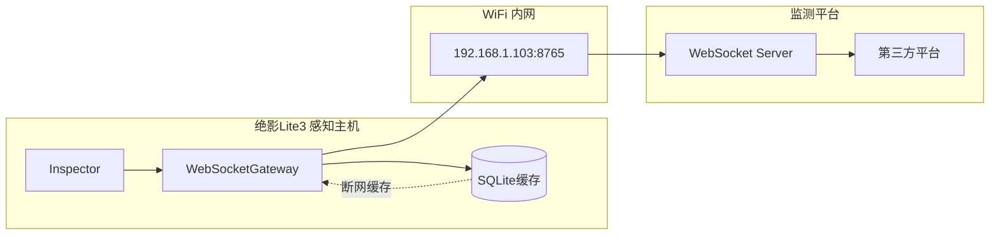

# 绝影Lite3 接口协议规范

> **文档编号**: API-PROTOCOL-001  
> **版本**: V1.7
> **编制日期**: 2025-09-16
> **编制人**: 陈伟
> **适用范围**: 机器狗 → 第三方监测平台数据上报

---

## 一、协议概述

### 1.1 设计目标

本协议规范定义绝影Lite3电力巡检系统与第三方监测平台之间的数据通信标准，实现：

1. **双向兼容**: 同时支持内部测试平台与第三方竞赛平台
2. **标准化**: 统一消息格式、字段定义、错误处理
3. **可扩展**: 预留扩展字段，支持未来功能升级
4. **可靠性**: 断网缓存、自动重连、数据补传

### 1.2 通信架构



### 1.3 连接信息

| 配置项 | 值 | 说明 |
|--------|-----|------|
| 服务端地址 | `ws://192.168.1.200:8765/ws` | 默认配置，可通过配置文件修改 |
| 本地地址 | `0.0.0.0:8765` | 机器狗本地监听 |
| 协议版本 | WebSocket RFC 6455 | 标准WebSocket协议 |
| 编码格式 | UTF-8 JSON | 所有消息为JSON格式 |
| 心跳间隔 | 30秒 | 客户端主动发送心跳 |
| 超时设置 | 60秒无响应视为断连 | 自动重连机制 |

---

## 二、消息格式规范

### 2.1 公共字段

所有消息必须包含以下公共字段：

```json
{
  "msgId": "string",        // 消息唯一标识（UUID v4）
  "ts": 1735668123456,      // 时间戳（毫秒）
  "deviceId": "string",     // 设备ID（默认 LITE3-001）
  "type": "string",         // 消息类型
  "payload": {}             // 消息数据体
}
```

| 字段 | 类型 | 必填 | 说明 |
|------|------|------|------|
| `msgId` | string | ✅ | UUID v4格式，用于消息去重和追踪 |
| `ts` | integer | ✅ | 消息生成时的时间戳（毫秒级） |
| `deviceId` | string | ✅ | 设备唯一标识，默认 `LITE3-001` |
| `type` | string | ✅ | 消息类型，见2.2节 |
| `payload` | object | ✅ | 消息具体内容，类型相关字段 |

### 2.2 消息类型定义

| 消息类型 | 说明 | 触发条件 |
|----------|------|----------|
| `inspection_result` | 巡检结果上报 | 检测到裂缝或异常时 |
| `temperature_alert` | 温度告警上报 | 温度超过阈值时 |
| `crack_alert` | 裂缝告警上报 | 检测到≥0.1mm裂缝时 |
| `system_status` | 系统状态上报 | 定时上报（每5秒） |
| `heartbeat` | 心跳包 | 每30秒发送一次 |

---

## 三、消息类型详解

### 3.1 巡检结果上报 (inspection_result)

**触发时机**: 完成一个检测点巡检后上报

```json
{
  "msgId": "a1b2c3d4-e5f6-7890-abcd-ef1234567890",
  "ts": 1735668123456,
  "deviceId": "LITE3-001",
  "type": "inspection_result",
  "payload": {
    "defect_type": "crack",
    "subtype": "longitudinal",
    "location": {
      "image_x": 120,
      "image_y": 340,
      "world_x": 0.82,
      "world_y": 1.10,
      "world_theta": 0.52
    },
    "measurements": {
      "width_mm": 0.12,
      "length_mm": 23.4,
      "pixel_precision": 0.019,
      "zoom_level": 10
    },
    "confidence": 0.92,
    "snapshot_url": "http://192.168.1.103:8080/snap/CRACK-WP001-1735668123456.jpg",
    "waypoint_id": "WP001",
    "ptz_state": {
      "yaw": 45.0,
      "pitch": -30.0,
      "zoom": 10
    }
  }
}
```

**payload字段说明**:

| 字段 | 类型 | 必填 | 说明 |
|------|------|------|------|
| `defect_type` | string | ✅ | 缺陷类型: `crack`(裂缝), `honeycomb`(蜂窝麻面) |
| `subtype` | string | ✅ | 缺陷子类型: `longitudinal`(纵向), `transverse`(横向), `network`(网状) |
| `location` | object | ✅ | 位置信息 |
| `location.image_x` | integer | ✅ | 图像X坐标(像素) |
| `location.image_y` | integer | ✅ | 图像Y坐标(像素) |
| `location.world_x` | float | ✅ | 世界坐标X(米) |
| `location.world_y` | float | ✅ | 世界坐标Y(米) |
| `location.world_theta` | float | ✅ | 朝向角(弧度) |
| `measurements` | object | ✅ | 测量结果 |
| `measurements.width_mm` | float | ✅ | 裂缝宽度(mm) |
| `measurements.length_mm` | float | ✅ | 裂缝长度(mm) |
| `measurements.pixel_precision` | float | ✅ | 像素精度(mm/px)，默认0.019 |
| `measurements.zoom_level` | integer | ✅ | 变焦倍数，默认10 |
| `confidence` | float | ✅ | 检测置信度(0-1) |
| `snapshot_url` | string | ✅ | 检测图片URL |
| `waypoint_id` | string | ✅ | 航点ID |
| `ptz_state` | object | ✅ | 云台状态 |
| `ptz_state.yaw` | float | ✅ | 偏航角(度) |
| `ptz_state.pitch` | float | ✅ | 俯仰角(度) |
| `ptz_state.zoom` | integer | ✅ | 变焦倍数 |

### 3.2 温度告警上报 (temperature_alert)

**触发时机**: 温度超过预警或告警阈值时

```json
{
  "msgId": "b2c3d4e5-f6a7-8901-bcde-f12345678901",
  "ts": 1735668180000,
  "deviceId": "LITE3-001",
  "type": "temperature_alert",
  "payload": {
    "alert_level": "CRITICAL",
    "alert_id": "ALT-20250916-001",
    "temperature": {
      "max_c": 52.3,
      "avg_c": 38.2,
      "min_c": 25.1
    },
    "roi": {
      "image_x": 100,
      "image_y": 200,
      "width": 50,
      "height": 50
    },
    "thresholds": {
      "warn": 45.0,
      "critical": 50.0
    },
    "hotspot_ratio": 0.12,
    "temperature_rate": 3.2,
    "thermal_snapshot_url": "http://192.168.1.103:8080/thermal/ALT-20250916-001.jpg",
    "waypoint_id": "WP004",
    "ptz_state": {
      "yaw": 135.0,
      "pitch": -45.0,
      "zoom": 5
    }
  }
}
```

**payload字段说明**:

| 字段 | 类型 | 必填 | 说明 |
|------|------|------|------|
| `alert_level` | string | ✅ | 告警等级: `NORMAL`, `WARN`, `CRITICAL` |
| `alert_id` | string | ✅ | 告警唯一标识 |
| `temperature` | object | ✅ | 温度数据 |
| `temperature.max_c` | float | ✅ | 最高温度(℃) |
| `temperature.avg_c` | float | ✅ | 平均温度(℃) |
| `temperature.min_c` | float | ✅ | 最低温度(℃) |
| `roi` | object | ✅ | 感兴趣区域 |
| `roi.image_x` | integer | ✅ | ROI左上角X坐标 |
| `roi.image_y` | integer | ✅ | ROI左上角Y坐标 |
| `roi.width` | integer | ✅ | ROI宽度(像素) |
| `roi.height` | integer | ✅ | ROI高度(像素) |
| `thresholds` | object | ✅ | 告警阈值 |
| `thresholds.warn` | float | ✅ | 预警阈值(℃)，默认45.0 |
| `thresholds.critical` | float | ✅ | 告警阈值(℃)，默认50.0 |
| `hotspot_ratio` | float | ✅ | 热点区域占比(0-1) |
| `temperature_rate` | float | ✅ | 升温速率(℃/min) |
| `thermal_snapshot_url` | string | ✅ | 热成像截图URL |
| `waypoint_id` | string | ✅ | 航点ID |
| `ptz_state` | object | ✅ | 云台状态(同3.1节) |

### 3.3 裂缝告警上报 (crack_alert)

**触发时机**: 检测到≥0.1mm裂缝时（区别于inspection_result，专用于告警）

```json
{
  "msgId": "c3d4e5f6-a7b8-9012-cdef-123456789012",
  "ts": 1735668240000,
  "deviceId": "LITE3-001",
  "type": "crack_alert",
  "payload": {
    "alert_id": "CRACK-WP002-INS001",
    "waypoint_id": "WP002",
    "width_mm": 0.15,
    "length_mm": 45.2,
    "confidence": 0.87,
    "snapshot_url": "http://192.168.1.103:8080/snap/CRACK-WP002-1735668240000.jpg",
    "ptz_state": {
      "yaw": 90.0,
      "pitch": -25.0,
      "zoom": 10
    }
  }
}
```

**payload字段说明**:

| 字段 | 类型 | 必填 | 说明 |
|------|------|------|------|
| `alert_id` | string | ✅ | 告警唯一标识 |
| `waypoint_id` | string | ✅ | 航点ID |
| `width_mm` | float | ✅ | 裂缝宽度(mm)，≥0.1mm触发 |
| `length_mm` | float | ✅ | 裂缝长度(mm) |
| `confidence` | float | ✅ | 检测置信度 |
| `snapshot_url` | string | ✅ | 检测图片URL |
| `ptz_state` | object | ✅ | 云台状态(同3.1节) |

### 3.4 系统状态上报 (system_status)

**触发时机**: 每5秒定时上报

```json
{
  "msgId": "d4e5f6a7-b8c9-0123-defa-234567890123",
  "ts": 1735668300000,
  "deviceId": "LITE3-001",
  "type": "system_status",
  "payload": {
    "battery": 85,
    "cpu_temp": 52.3,
    "gpu_load": 45,
    "memory_usage": 62,
    "fps": 15,
    "network_latency": 3,
    "status": "inspecting",
    "current_waypoint": "WP003",
    "total_waypoints": 5,
    "completed_waypoints": 2,
    "uptime_seconds": 3600
  }
}
```

**payload字段说明**:

| 字段 | 类型 | 必填 | 说明 |
|------|------|------|------|
| `battery` | integer | ✅ | 电池电量(%) |
| `cpu_temp` | float | ✅ | CPU温度(℃) |
| `gpu_load` | integer | ✅ | GPU负载(%) |
| `memory_usage` | integer | ✅ | 内存使用率(%) |
| `fps` | integer | ✅ | 当前处理帧率 |
| `network_latency` | integer | ✅ | 网络延迟(ms) |
| `status` | string | ✅ | 系统状态: `idle`, `inspecting`, `moving`, `charging` |
| `current_waypoint` | string | ✅ | 当前航点ID |
| `total_waypoints` | integer | ✅ | 总航点数 |
| `completed_waypoints` | integer | ✅ | 已完成航点数 |
| `uptime_seconds` | integer | ✅ | 系统运行时长(秒) |

### 3.5 心跳包 (heartbeat)

**触发时机**: 每30秒发送一次，维持连接

```json
{
  "msgId": "e5f6a7b8-c9d0-1234-efab-345678901234",
  "ts": 1735668360000,
  "deviceId": "LITE3-001",
  "type": "heartbeat",
  "payload": {}
}
```

---

## 四、错误处理

### 4.1 错误响应格式

```json
{
  "type": "error",
  "error_code": 1001,
  "error_msg": "连接超时",
  "ts": 1735668123456
}
```

### 4.2 错误码定义

| 错误码 | 含义 | 处理建议 | 责任方 |
|--------|------|----------|--------|
| 0 | 成功 | - | - |
| 1001 | 连接超时 | 检查网络连通性 | 网络运维 |
| 1002 | Session过期 | 重新建立连接 | 应用开发 |
| 1003 | 消息格式错误 | 检查JSON格式和必填字段 | 应用开发 |
| 1004 | 未知消息类型 | 检查type字段值 | 应用开发 |
| 1005 | 字段缺失 | 补充必填字段 | 应用开发 |
| 2001 | 设备离线 | 检查设备状态和网络 | 硬件运维 |
| 2002 | 存储空间不足 | 清理历史数据 | 系统运维 |
| 3001 | 消息队列满 | 降低上报频率 | 应用开发 |

---

## 五、兼容性说明

### 5.1 字段兼容性

服务端同时兼容以下两种字段命名风格：

| 推荐字段 | 兼容字段 | 说明 |
|----------|----------|------|
| `payload` | `data` | 消息数据体 |
| `deviceId` | `device_id` | 设备ID |
| `msgId` | `msg_id` | 消息ID |

**建议**: 统一使用驼峰命名（`payload`, `deviceId`, `msgId`）

### 5.2 平台配置

系统支持通过配置文件切换目标平台：

```yaml
# config/inspection_config.yaml
communication:
  websocket:
    # 内部测试平台
    server_url: "ws://192.168.1.103:8765/ws"
    # 第三方竞赛平台（默认）
    # server_url: "ws://192.168.1.200:8765/ws"
```

---

## 六、使用示例

### 6.1 机器狗端发送代码

```python
from src.gateway.websocket_client import WebSocketGateway

# 初始化网关
gateway = WebSocketGateway(
    server_url="ws://192.168.1.200:8765/ws",
    device_id="LITE3-001"
)

# 连接服务端
await gateway.connect()

# 发送巡检结果
await gateway.send_inspection_result({
    "defect_type": "crack",
    "subtype": "longitudinal",
    "location": {"image_x": 120, "image_y": 340, "world_x": 0.82, "world_y": 1.10, "world_theta": 0.52},
    "measurements": {"width_mm": 0.12, "length_mm": 23.4, "pixel_precision": 0.019, "zoom_level": 10},
    "confidence": 0.92,
    "snapshot_url": "http://192.168.1.103:8080/snap/CRACK-WP001.jpg",
    "waypoint_id": "WP001",
    "ptz_state": {"yaw": 45.0, "pitch": -30.0, "zoom": 10}
})

# 发送温度告警
await gateway.send_temperature_alert({
    "alert_level": "CRITICAL",
    "alert_id": "ALT-20250916-001",
    "temperature": {"max_c": 52.3, "avg_c": 38.2, "min_c": 25.1},
    "roi": {"image_x": 100, "image_y": 200, "width": 50, "height": 50},
    "thresholds": {"warn": 45.0, "critical": 50.0},
    "hotspot_ratio": 0.12,
    "temperature_rate": 3.2,
    "thermal_snapshot_url": "http://192.168.1.103:8080/thermal/ALT-001.jpg",
    "waypoint_id": "WP004",
    "ptz_state": {"yaw": 135.0, "pitch": -45.0, "zoom": 5}
})

# 断开连接
await gateway.disconnect()
```

### 6.2 监测平台接收代码（Node.js）

```javascript
const WebSocket = require('ws');

const ws = new WebSocket('ws://192.168.1.103:8765');

ws.on('message', (data) => {
    const msg = JSON.parse(data);
    
    switch(msg.type) {
        case 'inspection_result':
            console.log('巡检结果:', msg.payload);
            break;
        case 'temperature_alert':
            console.log('温度告警:', msg.payload.alert_level, msg.payload.temperature.max_c + '℃');
            break;
        case 'system_status':
            console.log('系统状态:', msg.payload.status);
            break;
        case 'heartbeat':
            // 心跳，无需处理
            break;
    }
});
```

---

## 七、版本历史

| 版本 | 日期 | 更新内容 |
|------|------|----------|
| V1.7 | 2025-09-16 | 初版规范 |
| V1.7 | 2025-09-16 | 增加crack_alert类型，完善字段定义 |
| V1.7 | 2025-09-16 | 统一命名规范，增加双平台兼容说明 |

---

*文档版本: V1.7 | 最后更新: 2025-09-16 | 编制人: 陈伟*
