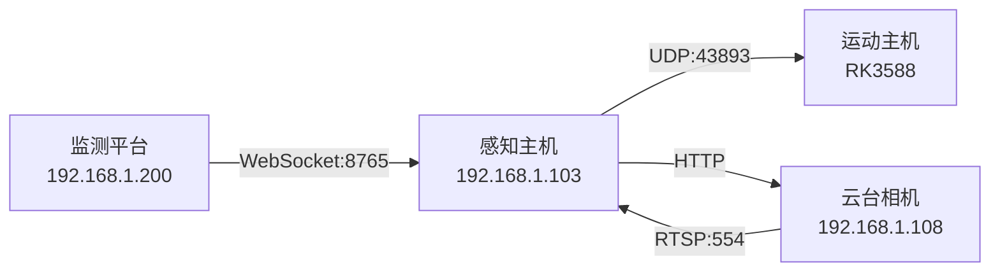

# 环境配置说明

> **文档编号**: DOC-ENV-003
> **版本**: V1.7
> **编制日期**: 2025-09-16
> **编制人**: 陈伟
> **适用范围**: 绝影Lite3电力巡检系统环境配置快速参考

---

## 一、主机配置速查

### 感知主机（Jetson NX）

| 项目 | 值 | 状态 |
|------|-----|------|
| 主机名 | `lite` | ✅ |
| IP地址 | 192.168.1.103 | ✅ 静态 |
| 操作系统 | Ubuntu 20.04.6 LTS | ✅ |
| Python | 3.8.10 | ✅ |
| GPU | Jetson Xavier NX + CUDA | ✅ |
| SSH账户 | ysc | ✅ |
| SSH密码 | `'`（英文单引号） | ✅ |

> **详细说明**：见 [10-环境配置指南](10-环境配置指南.md)

### 外部设备

| 设备 | IP地址 | 端口 | 协议 |
|------|--------|------|------|
| 云台相机 | 192.168.1.108 | 554 | RTSP |
| 监测平台 | 192.168.1.200 | 8765 | WebSocket |

---

## 二、网络拓扑



---

## 三、一键部署命令

```bash
# SSH登录
ssh ysc@192.168.1.103
# 密码: '

# 解压部署并运行
cd ~ && mkdir -p lite3-power-inspection && cd lite3-power-inspection
unzip -q ../lite3-power-inspection.zip
./scripts/deploy.sh simulation
```

> **完整流程**：见 [06-部署指南](06-部署指南.md)

---

## 四、依赖检查

```bash
# 验证核心依赖
python3 -c "import loguru, websockets, fastapi, uvicorn, pydantic; print('✅ 已安装')"
```

| 依赖 | 版本要求 | 用途 |
|------|----------|------|
| loguru | >=0.6.0 | 日志 |
| websockets | >=12.0 | WebSocket |
| fastapi | >=0.104.0 | Web框架 |
| uvicorn | >=0.24.0 | ASGI服务器 |
| pydantic | >=2.0.0 | 数据验证 |

> **详细说明**：见 [10-环境配置指南](10-环境配置指南.md)

---

*文档版本: V1.7 | 编制日期: 2025-09-16 | 编制人: 陈伟*
