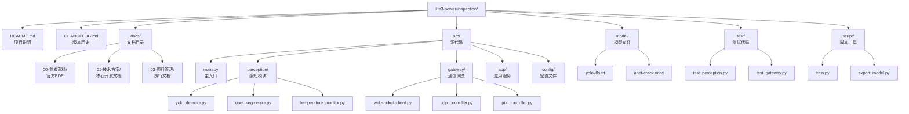
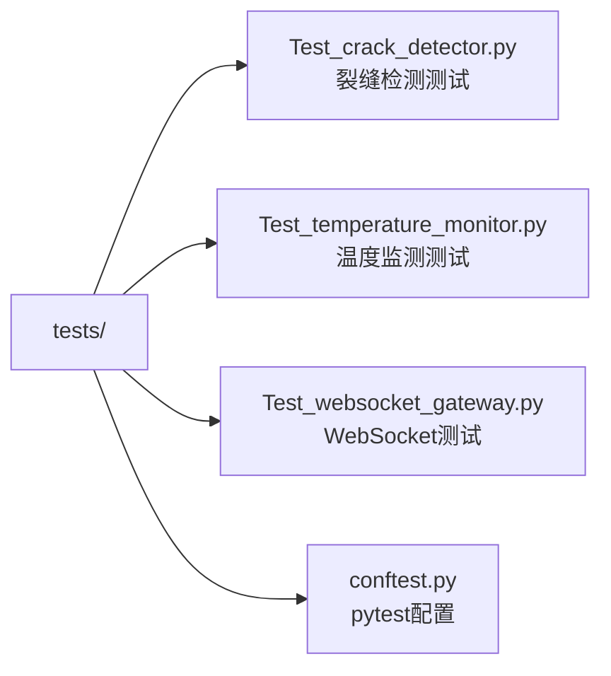

# 项目代码规范

> **文档编号**: 项目代码规范  
> **版本**: V1.1  
> **更新日期**: 2026-08-18

---

## 一、代码风格规范

### 1.1 Python代码风格

遵循 [PEP 8](https://peps.python.org/pep-0008/) 规范，使用工具自动格式化：

```bash
# 安装格式化工具
pip install black isort flake8

# 格式化代码
black src/**/*.py
isort src/**/*.py

# 代码检查
flake8 src/ --max-line-length=100
```

**命名规范**：

| 类型 | 规范 | 示例 | 反例 |
|------|------|------|------|
| 模块名 | 小写+下划线 | `crack_detector.py` | `CrackDetector.py` |
| 类名 | CamelCase | `CrackDetector` | `crack_detector` |
| 函数名 | 小写+下划线 | `detect_crack()` | `detectCrack()` |
| 常量 | 大写+下划线 | `MAX_CONFIDENCE = 0.9` | `maxConfidence` |
| 私有属性 | 单下划线前缀 | `_model_path` | `modelPath` |
| 私有方法 | 单下划线前缀 | `_preprocess()` | `preProcess()` |

**文档字符串规范**：

```python
class CrackDetector:
    """裂缝检测器类
    
    实现YOLOv8-s + U-Net两阶段裂缝检测算法。
    支持广角粗检和变焦精检两种模式。
    
    Attributes:
        confidence_threshold: 检测置信度阈值，默认0.5
        min_width_mm: 最小检测裂缝宽度，默认0.1mm
    """
    
    def __init__(self, model_path: str, confidence_threshold: float = 0.5):
        """初始化检测器
        
        Args:
            model_path: TensorRT引擎文件路径
            confidence_threshold: 置信度阈值，范围[0.0, 1.0]
            
        Raises:
            FileNotFoundError: 模型文件不存在
            RuntimeError: 引擎加载失败
        """
        pass
```

### 1.2 Git提交规范

遵循 [Conventional Commits](https://www.conventionalcommits.org/) 规范：

```
<type>(<scope>): <subject>

<body>

<footer>
```

**Type类型**：

| Type | 说明 | 示例 |
|------|------|------|
| feat | 新功能 | `feat(perception): 添加U-Net分割算法` |
| fix | 修复bug | `fix(gateway): 修复WebSocket断连问题` |
| docs | 文档变更 | `docs: 更新技术实施方案V3.1` |
| style | 代码格式 | `style: 格式化Python代码` |
| refactor | 重构 | `refactor(detection): 重构裂缝检测模块` |
| test | 测试相关 | `test: 添加单元测试` |
| chore | 构建/工具 | `chore: 更新依赖版本` |

**提交示例**：

```bash
# ✅ 正确示例
git commit -m "feat(perception): 添加YOLOv8裂缝检测算法

- 实现TensorRT模型加载
- 添加预处理和后处理逻辑
- 置信度阈值可配置

Closes #12"

# ❌ 避免的写法
git commit -m "fix bug"
git commit -m "updated"
```

---

## 二、目录结构规范



---

## 三、配置管理规范

### 3.1 YAML配置规范

```yaml
# 使用驼峰或下划线保持一致
detection:
  crack:
    yolo_model: "models/yolov8s.trt"
    confidence_threshold: 0.5
    min_width_mm: 0.1
  temperature:
    warn_threshold: 45.0
    critical_threshold: 50.0

communication:
  websocket:
    server_url: "ws://192.168.1.200:8765/ws"
    reconnect_interval: 5.0
```

### 3.2 环境变量

```bash
# 开发环境
export ROBOT_MOTION_IP=192.168.1.103
export PTZ_BASE_URL=http://192.168.1.108
export WEBSOCKET_SERVER=ws://192.168.1.200:8765/ws

# 生产环境（默认值）
export ROBOT_MOTION_IP=${ROBOT_MOTION_IP:-192.168.1.103}
```

---

## 四、异常处理规范

### 4.1 异常类定义

```python
class InspectionError(Exception):
    """巡检基础异常"""
    pass

class DetectionError(InspectionError):
    """检测异常"""
    pass

class CommunicationError(InspectionError):
    """通信异常"""
    pass

class HardwareError(InspectionError):
    """硬件异常"""
    pass
```

### 4.2 异常处理模式

```python
import logging

logger = logging.getLogger(__name__)

async def detect_crack(image: np.ndarray) -> List[Dict]:
    try:
        results = await self._run_inference(image)
        return results
    except ModelLoadError as e:
        logger.error(f"模型加载失败: {e}")
        raise DetectionError("无法执行检测") from e
    except Exception as e:
        logger.exception(f"未知错误: {e}")
        raise DetectionError(f"检测失败: {e}") from e
```

---

## 五、测试规范

### 5.1 测试文件命名



### 5.2 测试代码示例

```python
import pytest
import numpy as np

class TestCrackDetector:
    
    @pytest.fixture
    def detector(self):
        return CrackDetector(model_path="models/yolov8s.trt")
    
    def test_detect_empty_image(self, detector):
        """测试空图像处理"""
        image = np.zeros((100, 100, 3), dtype=np.uint8)
        results = detector.detect(image)
        assert results == []
    
    def test_detect_with_crack(self, detector, sample_image):
        """测试裂缝检测"""
        results = detector.detect(sample_image)
        assert len(results) > 0
        assert all(r["confidence"] >= 0.5 for r in results)
```

---

## 六、代码审查清单

提交代码前自查：

- [ ] 代码遵循PEP 8规范
- [ ] 函数有文档字符串（docstring）
- [ ] 异常处理合理，不吞掉异常
- [ ] 关键路径有日志记录
- [ ] 测试覆盖率≥80%
- [ ] 配置文件无硬编码
- [ ] Git提交信息符合Conventional Commits规范
- [ ] 无敏感信息泄露（密码、密钥等）

---

*文档版本: V1.0 | 更新日期: 2026-08-18 | 编制人: 陈伟*