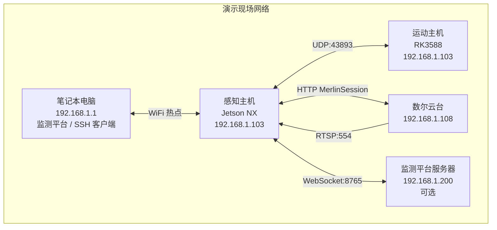
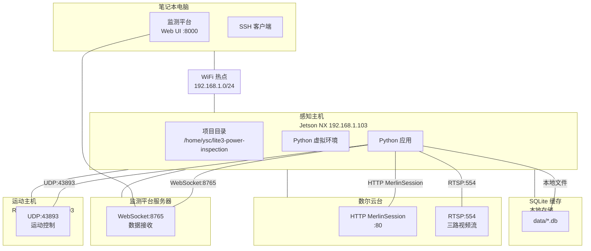

# 部署运维与故障排查指南

> **文档编号**: DOC-DEPLOY-001
> **版本**: V1.3
> **编制日期**: 2026-08-20
> **编制人**: 陈伟

---

## 一、网络拓扑与 IP 规划

### 1.1 离线网络架构

赛场环境为独立内网，采用本地 WiFi 热点模式实现远程访问：



### 1.2 IP 地址分配表

| 设备 | IP 地址 | 备注 |
|------|---------|------|
| 笔记本电脑（热点） | 192.168.1.1 | 监测平台宿主 |
| 感知主机（Jetson NX） | 192.168.1.103 | 视觉算法 / 数据上报 |
| 运动主机（RK3588） | 192.168.1.103 | 运动控制（与感知主机共用） |
| 数尔云台相机 | 192.168.1.108 | 视频采集 / 云台控制 |
| 监测平台服务器 | 192.168.1.200 | 数据接收（可选，第三方提供） |

> **注意**：感知主机与运动主机共享 IP `192.168.1.103`，通过不同端口区分服务（UDP 43893 / WebSocket 8765 / RTSP 554）。硬件到货后请现场确认实际 IP。

---

## 二、远程访问

### 2.1 SSH 远程登录（推荐）

#### 账户信息

| 参数 | 值 | 来源 |
|------|-----|------|
| 用户名 | `ysc` | 《感知开发手册 V2.2.3》 |
| 密码 | `'`（英文单引号） | 《感知开发手册 V2.2.3》 |
| 连接地址 | `192.168.1.103` | 《感知开发手册 V2.2.3》 |

#### 步骤一：笔记本电脑配置 WiFi 热点

```bash
# Ubuntu 系统创建热点
sudo nmcli device wifi hotspot ifname wlan0 ssid "Lite3-Deploy" password "deploy123"

# 查看本机 IP
ip addr show
# 记录 wlan0 的 IP，例如 192.168.1.1
```

#### 步骤二：感知主机网络配置

```bash
# 编辑网络配置
sudo nano /etc/netplan/01-netcfg.yaml

# 配置静态 IP
network:
  version: 2
  ethernets:
    eth0:
      dhcp4: no
      addresses: [192.168.1.103/24]
      nameservers:
        addresses: [8.8.8.8, 1.1.1.1]
      routes:
        - to: default
          via: 192.168.1.1

# 应用配置
sudo netplan apply
```

#### 步骤三：SSH 登录

```bash
# 从笔记本电脑 SSH 登录
ssh ysc@192.168.1.103
# 密码输入英文单引号：'
# 若提示密码错误，先按 Shift 切换英文输入法再输入

# 首次登录建议配置密钥认证
ssh-copy-id ysc@192.168.1.103
```

### 2.2 NoMachine 远程桌面

#### 步骤一：下载安装

下载地址：https://www.nomachine.com/download

#### 步骤二：新建连接

1. 打开 NoMachine，点击 **New** 新建连接
2. 配置参数：
   - **Protocol**: NX
   - **Host**: 192.168.1.103
   - **Authentication**: Use password authentication
   - **Proxy**: 不勾选
3. 保存连接

#### 步骤三：远程登录

1. 点击创建的连接图标
2. 用户名：`ysc`，密码：`'`（英文单引号）

> **注意**：操作过程中如遇锁屏或密码提示，密码均为 `'`（英文单引号）。

#### 故障排查

| 现象 | 原因 | 解决方案 |
|------|------|----------|
| 密码错误 | 输入法为中文 | 按 Shift 切换英文输入法 |
| 远程桌面白屏 | NoMachine 版本过旧 | Settings → Server Preferences → Updates → Check now |
| session negotiation failed | 残留进程冲突 | 参见下方清除命令 |

```bash
# 清除 NoMachine 残留进程
ssh ysc@192.168.1.103           # 密码是单引号
sudo su
cd /usr/NX/var/db/limits/
ls
rm xxxxx xxxxxx xxxxxx           # 删除所有文件
sudo reboot                       # 重启
```

### 2.3 备用方案

#### USB 网络共享

```bash
# Jetson NX 端启用 USB 网络
sudo modprobe g_ether
sudo ifconfig usb0 192.168.1.103 netmask 255.255.255.0

# 笔记本电脑端配置
sudo ifconfig enp0s20 192.168.1.1 netmask 255.255.255.0
```

#### HDMI 直连

绝影 Lite3 支持通过背部 HDMI 口直连显示器：

1. 使用 HDMI 线连接感知主机与显示器，开机
2. 出现 `[ OK ] Started Session 1 of user ysc.` 后即为开机成功
3. 按 `Ctrl+Alt+F3` 进入 tty3 终端
4. 用户名 `ysc`，密码 `'`
5. 执行以下命令启用图形界面：

```bash
cd /usr/share/X11/xorg.conf.d/
sudo mv xorg.conf ..
# 输入密码：'
```

恢复 tty3 自启动：

```bash
cd /usr/share/X11/
sudo mv xorg.conf xorg.conf.d/
# 输入密码：'
```

---

## 三、应用程序部署

### 3.1 自动化部署脚本

部署脚本位于 `scripts/deploy.sh`，支持一键同步代码、安装依赖并验证模块加载：

```bash
#!/bin/bash
# 绝影Lite3电力巡检系统部署脚本

set -e

REMOTE_HOST="ysc@192.168.1.103"
PROJECT_DIR="/home/ysc/lite3-power-inspection"
PYTHON_VENV="$PROJECT_DIR/venv"

echo "=========================================="
echo "绝影Lite3电力巡检系统部署"
echo "=========================================="

# 1. 检查网络连接
echo "[1/6] 检查网络连接..."
ping -c 2 $REMOTE_HOST > /dev/null 2>&1 || {
    echo "无法连接到 $REMOTE_HOST，请确认："
    echo "  1. 机器狗主机已开机"
    echo "  2. WiFi 网络连接正常"
    echo "  3. IP 地址 192.168.1.103 正确"
    exit 1
}
echo "网络连接正常"

# 2. 创建项目目录
echo "[2/6] 创建项目目录..."
ssh $REMOTE_HOST "mkdir -p $PROJECT_DIR"

# 3. 同步代码文件
echo "[3/6] 同步代码文件..."
rsync -avz --progress \
    --exclude='__pycache__' \
    --exclude='*.pyc' \
    --exclude='.git' \
    --exclude='venv' \
    --exclude='data/' \
    ./ $REMOTE_HOST:$PROJECT_DIR/
echo "代码同步完成"

# 4. 安装 Python 依赖
echo "[4/6] 安装 Python 依赖..."
ssh $REMOTE_HOST "cd $PROJECT_DIR && python3 -m venv $PYTHON_VENV && \
    source $PYTHON_VENV/bin/activate && \
    pip install -r requirements.txt --quiet && \
    pip install -r monitor_platform/requirements.txt --quiet"
echo "依赖安装完成"

# 5. 创建数据目录
echo "[5/6] 创建数据目录..."
ssh $REMOTE_HOST "mkdir -p $PROJECT_DIR/{data,logs,models,config}"
echo "数据目录创建完成"

# 6. 验证部署
echo "[6/6] 验证部署..."
ssh $REMOTE_HOST "cd $PROJECT_DIR && source $PYTHON_VENV/bin/activate && \
    python3 -c 'from src.perception.temperature_monitor import TemperatureMonitor; m = TemperatureMonitor(); print(\"温度监测模块加载成功\")'"
ssh $REMOTE_HOST "cd $PROJECT_DIR && source $PYTHON_VENV/bin/activate && \
    python3 -c 'from src.gateway.udp_controller import UDPMotionController; print(\"UDP 控制器加载成功\")'"
ssh $REMOTE_HOST "cd $PROJECT_DIR && source $PYTHON_VENV/bin/activate && \
    python3 -c 'from src.gateway.ptz_controller import PtzController; print(\"云台控制器加载成功\")'"
ssh $REMOTE_HOST "cd $PROJECT_DIR && source $PYTHON_VENV/bin/activate && \
    python3 -c 'from src.storage.sqlite_cache import SQLiteCache; c = SQLiteCache(); print(\"SQLite 缓存加载成功\")'"

echo ""
echo "=========================================="
echo "部署完成！"
echo "=========================================="
echo ""
echo "SSH 登录: ssh ysc@192.168.1.103"
echo "项目目录: $PROJECT_DIR"
echo "Python 环境: $PYTHON_VENV/bin/python3"
echo ""
echo "启动监测平台:"
echo "  cd $PROJECT_DIR && source $PYTHON_VENV/bin/activate && python3 scripts/start_monitor.py"
echo ""
echo "访问地址: http://192.168.1.1:8000"
```

### 3.2 执行部署

```bash
chmod +x scripts/deploy.sh
./scripts/deploy.sh
```

---

## 四、基础功能独立测试

以下测试可在未加载视觉模型的环境下独立完成：

| 功能模块 | 测试内容 | 运行方式 |
|----------|----------|----------|
| 温度监测 | 双级告警逻辑 | `python3 -m src.perception.temperature_monitor` |
| UDP 通信 | 心跳 / 指令发送 | `python3 -m src.gateway.udp_controller` |
| 云台控制 | 角度 / 变焦控制 | `python3 -m src.gateway.ptz_controller` |
| WebSocket | 数据上报 | `python3 -m src.gateway.websocket_client` |
| RTSP 流 | 视频拉取 | `python3 -m src.gateway.rtsp_client` |
| SQLite 存储 | 数据持久化 | `python3 -m src.storage.sqlite_cache` |

### 4.1 完整测试脚本

```bash
#!/bin/bash
# 完整测试流程脚本

set -e

PROJECT_DIR="/home/ysc/lite3-power-inspection"
VENV="$PROJECT_DIR/venv/bin/activate"

echo "=========================================="
echo "绝影Lite3电力巡检系统 - 完整测试"
echo "=========================================="

echo ""
echo "[测试 1/6] 温度监测模块..."
cd $PROJECT_DIR && source $VENV && python3 -m src.perception.temperature_monitor

echo ""
echo "[测试 2/6] UDP 运动控制..."
cd $PROJECT_DIR && source $VENV && python3 -m src.gateway.udp_controller

echo ""
echo "[测试 3/6] 云台控制..."
cd $PROJECT_DIR && source $VENV && python3 -m src.gateway.ptz_controller

echo ""
echo "[测试 4/6] WebSocket 数据上报..."
cd $PROJECT_DIR && source $VENV && python3 -m src.gateway.websocket_client

echo ""
echo "[测试 5/6] SQLite 本地缓存..."
cd $PROJECT_DIR && source $VENV && python3 -m src.storage.sqlite_cache

echo ""
echo "[测试 6/6] 模拟模式演示..."
cd $PROJECT_DIR && source $VENV && python3 scripts/run_demo.py --mode simulation
```

---

## 五、监测平台部署

### 5.1 平台功能

| 功能模块 | 说明 |
|----------|------|
| 数据概览 | 实时显示检测统计、系统状态 |
| 趋势图表 | 温度变化趋势、裂缝尺寸分布 |
| 告警管理 | 实时告警列表、历史记录查询 |
| 数据可视化 | 检测结果表格、告警分布饼图 |
| 模拟测试 | 生成测试数据验证系统 |
| 日志监控 | 实时系统日志输出 |

### 5.2 启动监测平台

**方式一：在感知主机上运行**

```bash
cd /home/ysc/lite3-power-inspection
source venv/bin/activate
python3 scripts/start_monitor.py
# 访问: http://192.168.1.103:8000
```

**方式二：在笔记本电脑上运行（推荐）**

```bash
# 确保代码已同步至本地
cd ~/lite3-power-inspection
source venv/bin/activate
python3 scripts/start_monitor.py
# 访问: http://192.168.1.1:8000
```

### 5.3 HTTP 接口说明

| 接口 | 方法 | 说明 |
|------|------|------|
| `/` | GET | 监测平台主页 |
| `/api/status` | GET | 获取系统状态 |
| `/api/inspections` | GET | 获取巡检记录 |
| `/api/alerts` | GET | 获取告警列表 |
| `/api/alert/ack` | POST | 确认告警 |
| `/api/demo/send` | POST | 发送演示数据 |
| `/ws` | WebSocket | 实时数据推送 |

---

## 六、系统状态与监控

### 6.1 心跳与健康检查

| 服务 | 心跳方式 | 超时阈值 |
|------|----------|----------|
| UDP 运动控制 | 2.5Hz（400ms 周期） | 1.5s |
| WebSocket 上报 | 30s 客户端心跳 | 60s |
| 云台 Session | 10s HTTP 心跳 | 35s 自动重连 |

### 6.2 日志位置

| 日志类型 | 路径 |
|----------|------|
| 应用日志 | `data/logs/app_YYYY-MM-DD.log` |
| 监测平台日志 | 控制台 / `data/logs/monitor.log` |
| 演示日志 | `data/logs/demo_YYYY-MM-DD.log` |

---

## 七、故障排查

### 7.1 网络连接问题

| 现象 | 可能原因 | 解决方案 |
|------|----------|----------|
| SSH 连接超时 | 防火墙拦截 | `sudo ufw allow 22/tcp` |
| IP 地址冲突 | DHCP 分配重复 | 使用静态 IP 配置 |
| DNS 解析失败 | 无外网 DNS | 配置本地 hosts 或使用 IP 地址 |
| UDP 心跳无响应 | 运动主机未启动 | 检查运动主机电源和网络 |

### 7.2 服务启动失败

| 现象 | 可能原因 | 解决方案 |
|------|----------|----------|
| Flask 端口被占用 | 5000/8000 端口被占用 | 修改端口或杀死占用进程 |
| SQLite 权限不足 | 数据目录权限问题 | `chmod 755 data/` |
| Python 模块导入失败 | 依赖未安装 | 重新执行 `pip install -r requirements.txt` |
| WebSocket 连接失败 | 端口 8765 被占用 | 检查端口占用 `netstat -tlnp \| grep 8765` |

### 7.3 硬件连接问题

| 现象 | 可能原因 | 解决方案 |
|------|----------|----------|
| 云台登录失败 | 密码错误 | 确认默认账号 admin/123456 |
| RTSP 流无法拉取 | 端口被占用 | 检查 554 端口和相机配置 |
| 快照图片无法访问 | 快照服务未启动 | 检查 8080 端口 `curl http://192.168.1.103:8080/snap/TEST` |

---

## 八、部署流程图



---

## 九、部署阶段建议

### 第一阶段：基础功能测试（离线）

- [ ] 温度监测算法（模拟数据）
- [ ] SQLite 数据缓存
- [ ] 模拟数据生成器

### 第二阶段：硬件联调

- [ ] UDP 心跳与运动控制
- [ ] 云台角度与变焦控制
- [ ] RTSP 视频流拉取
- [ ] WebSocket 数据上报

### 第三阶段：系统集成

- [ ] 监测平台启动与数据接收
- [ ] 快照 HTTP 服务
- [ ] 完整 12 分钟流程演练

---

*文档版本: V1.3 | 编制日期: 2026-08-20 | 编制人: 陈伟*
