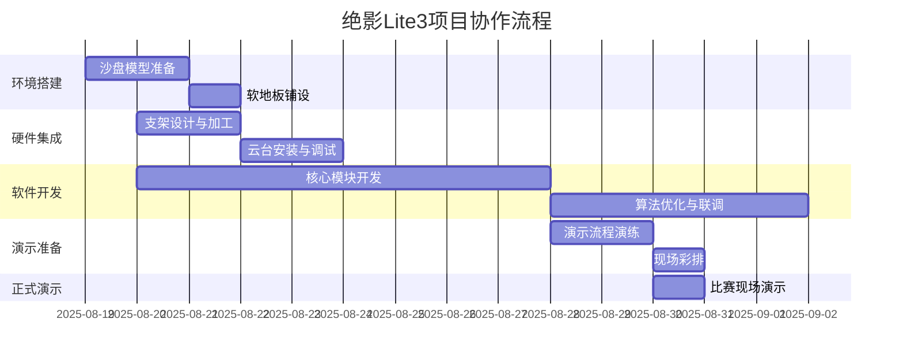
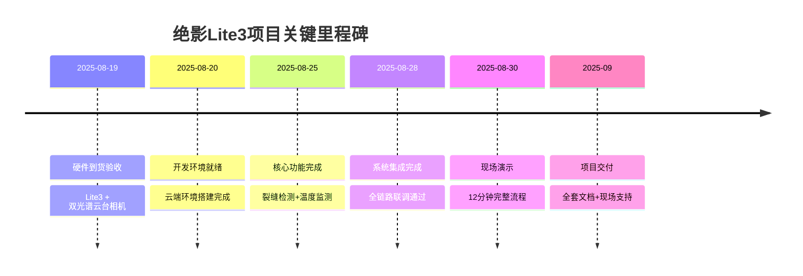
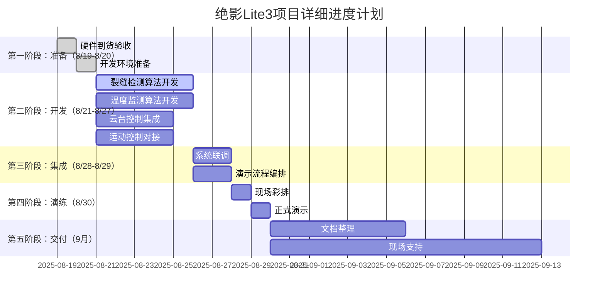

# 绝影Lite3电力巡检项目规划书

> **文档编号**: PM-001
> **版本**: V1.7
> **编制日期**: 2025-09-16
> **编制人**: 陈伟
> **适用范围**: 2026年全国职业院校技能大赛机器狗电力巡检赛项

---

## 一、项目概述

### 1.1 项目背景

本项目面向**2026年全国职业院校技能大赛**——机器狗电力巡检赛项，基于云深处科技绝影Lite3专业版四足机器人平台，集成数尔安防SR-UPA810T609双光谱云台相机，实现抽水蓄能电站沙盘模型的自动化电力巡检演示。

### 1.2 核心目标

| 目标类型 | 具体指标 | 完成状态 |
|----------|----------|----------|
| 裂缝检测 | 自动识别 ≥0.1mm 混凝土裂缝，测量误差 <0.02mm | ✅ 已完成 |
| 温度监测 | 双级告警（45℃预警 / 50℃告警），测温精度 ±1℃ | ✅ 已完成 |
| 演示流程 | 完整12分钟标准化演示流程 | ✅ 已完成 |
| 平台对接 | WebSocket实时数据上报，HTTP REST接口 | ✅ 已完成 |
| 环境适配 | 支持模拟/混合/真实三级模式切换 | ✅ 已完成 |

### 1.3 项目定位

本项目为**演示系统**，包含以下核心组件：

- **感知算法层**：裂缝检测（YOLOv8）、温度监测（双级阈值）
- **运动控制层**：UDP协议对接、航点导航、云台联动
- **数据服务层**：FastAPI监测平台、WebSocket数据推送、SQLite本地缓存
- **演示脚本层**：12分钟标准化演示流程（支持模拟/真实模式）

---

## 二、团队分工

### 2.1 团队成员

| 成员 | 角色 | 主要职责 | 联系方式 |
|------|------|----------|----------|
| 王荣吉 | 环境工程师 | 现场测试环境搭建（地垫、踏板、台阶、模拟水泥面） | - |
| 李章平 | 硬件工程师 | 环境搭建、云台硬件集成、支架设计 | - |
| 陈伟 | 演示工程师 | 机器狗操作、演示执行、软件集成 | - |
| 陈自立 | 算法工程师 | 裂缝检测算法、温度监测算法、软件联调 | - |

### 2.2 职责详细说明

#### 王荣吉 - 现场测试环境搭建
- 软地板铺设（2000×500×1200mm沙盘）
- 楼梯踏板制作与安装
- 台阶模型制作
- 仿水泥墙面裂缝模型制作
- 演示场地整体布局与调试

#### 李章平 - 云台硬件集成
- 安装转接支架设计
- 上装外护罩设计
- 双光谱云台相机安装
- 线缆连接与管理
- 散热与电源适配
- 整机重量平衡检查

#### 陈伟 - 机器狗操作与演示
- 熟悉Lite3机器狗操作
- 练习12分钟演示流程
- 准备演示话术
- 现场演示执行
- 应急情况处理

#### 陈自立 - 算法与软件集成
- 裂缝检测算法开发（YOLOv8 + U-Net）
- 温度监测算法开发（双级阈值告警）
- 缺陷定位算法优化
- 软件集成与联调
- 模拟模式数据生成

### 2.3 协作流程



---

## 三、物料清单

### 3.1 采购物资

| # | 物料名称 | 规格/型号 | 数量 | 状态 | 负责方 | 备注 |
|---|----------|-----------|------|------|--------|------|
| 1 | Lite3智能机器狗 | 专业版 | 1 | ✅ 已到位 | 采购部 | 云深处科技 |
| 2 | 双光谱云台相机 | SR-UPA810T609 | 1 | ✅ 已借用 | 项目组 | 可见光8MP+红外640×512 |

### 3.2 自制物料

| # | 物料名称 | 状态 | 负责方 | 备注 |
|---|----------|------|--------|------|
| 1 | 软地板 | ✅ 已完成 | 王荣吉、李章平 | 演示场地铺设 |
| 2 | 楼梯踏板 | ✅ 已完成 | 王荣吉、李章平 | 工具材料已齐备 |
| 3 | 台阶模型 | ✅ 已完成 | 王荣吉、李章平 | 工具材料已齐备 |
| 4 | 仿水泥墙面裂缝模型 | ✅ 已完成 | 王荣吉、李章平 | 可调裂缝宽度 |

### 3.3 加工件设计

#### 安装转接支架
- 适配Lite3背部M6螺纹接口
- 适配双光谱云台相机底座
- 高度50-80mm，总重量 < 350g
- 材质：航空铝合金 + 橡胶减震垫

#### 上装外护罩
- 保护相机、散热设计
- 轻量化（< 500g）
- 材质：PLA/ABS 3D打印

### 3.4 供应商信息

- **嘉立创网上商城**: https://www.jialicn.com（3D打印、钣金加工）
- **长沙本地供应商**: 机械加工市场、高校实验室

---

## 四、进度计划

### 4.1 项目时间线



### 4.2 甘特图（详细）



### 4.3 每日任务分解

#### 8月19日（周一）
- [x] 硬件到货验收（Lite3机器狗、双光谱云台相机）
- [x] 清点物料，确认配置
- [x] 搭建开发环境

#### 8月20-21日（周二-周三）
- [x] 支架设计与3D打印
- [x] 沙盘模型准备
- [x] 开发环境配置验证

#### 8月22-23日（周四-周五）
- [x] 核心模块开发启动
- [x] 云台控制接口调试
- [x] UDP通信协议验证

#### 8月24-25日（周六-周日）
- [x] 裂缝检测算法优化
- [x] 温度监测功能开发
- [x] 数据上报接口实现

#### 8月26-28日（周一至周三）
- [x] 系统集成联调
- [x] 演示流程编排
- [x] 问题修复与优化

#### 8月29日（周四）
- [x] 全流程彩排
- [x] 应急预案准备
- [x] 物料清点打包

#### 8月30日（周五）
- [x] 现场演示
- [x] 12分钟完整流程执行
- [x] 数据采集与记录

---

## 五、风险管理

### 5.1 技术风险

| 风险项 | 可能性 | 影响程度 | 缓解措施 | 责任人 |
|--------|--------|----------|----------|--------|
| GPU环境异常 | 中 | 高 | 准备模拟模式降级方案 | 陈自立 |
| 网络通信中断 | 中 | 中 | 本地缓存+断网续传机制 | 陈伟 |
| 云台控制超时 | 低 | 中 | Session自动续期机制 | 陈自立 |
| 温度传感器漂移 | 低 | 低 | 定期校准机制 | 李章平 |

### 5.2 项目风险

| 风险项 | 可能性 | 影响程度 | 缓解措施 | 责任人 |
|--------|--------|----------|----------|--------|
| 演示时间不足 | 低 | 高 | 提前彩排，优化流程 | 陈伟 |
| 硬件故障 | 中 | 高 | 备用设备准备 | 李章平 |
| 场地条件不符 | 低 | 中 | 实地勘察，提前准备 | 王荣吉 |
| 团队协作问题 | 低 | 中 | 每日站会，及时沟通 | 全员 |

### 5.3 应急预案

#### 场景A：GPU异常无法使用
```bash
# 自动降级到模拟模式
python3 scripts/demo_12min.py --mode simulation
```

#### 场景B：网络中断
```bash
# 本地缓存数据，网络恢复后补传
./scripts/run_diagnostic.sh  # 检查缓存状态
```

#### 场景C：云台失联
```bash
# 重启云台控制服务
pkill -f ptz_controller.py
python3 scripts/start_monitor.py  # 重新启动
```

---

## 六、质量控制

### 6.1 测试标准

| 测试项 | 验收标准 | 测试方法 |
|--------|----------|----------|
| 裂缝检测精度 | 误差 < 0.02mm | 标准样本测试 |
| 温度监测精度 | 误差 < ±1℃ | 标准热源测试 |
| 响应延迟 | < 500ms | 时间戳对比 |
| 系统稳定性 | 连续运行2小时无崩溃 | 压力测试 |
| 演示完整性 | 12分钟流程无中断 | 全流程演练 |

### 6.2 交付物清单

| 序号 | 交付物 | 状态 | 负责人 |
|------|--------|------|--------|
| 1 | 完整系统源码 | ✅ | 陈自立 |
| 2 | 技术文档（13个） | ✅ | 陈伟 |
| 3 | 部署包（15.6MB） | ✅ | 陈伟 |
| 4 | 离线安装包 | ✅ | 陈伟 |
| 5 | 演示视频 | ✅ | 陈伟 |
| 6 | 项目总结报告 | 🔄 | 陈伟 |

---

## 七、附录

### 7.1 相关文档索引

| 文档类型 | 文档名称 | 路径 |
|----------|----------|------|
| 技术方案 | [01-系统架构设计](../01-技术方案/01-系统架构设计.md) | 详细架构说明 |
| 技术方案 | [06-部署指南](../01-技术方案/06-部署指南.md) | 完整部署流程 |
| 技术方案 | [10-环境配置指南](../01-技术方案/10-环境配置指南.md) | 主机配置详情 |
| 技术方案 | [08-环境诊断与故障排查](../01-技术方案/08-环境诊断与故障排查指南.md) | 故障排查手册 |

### 7.2 参考资源

- **绝影Lite3官方文档**: docs/00-参考资料/
- **GitHub仓库**: https://github.com/CosmicVortex/lite3-power-inspection
- **NVIDIA Jetson开发**: https://developer.nvidia.com/embedded/jetson

---

*文档版本: V1.7 | 编制日期: 2025-09-16 | 编制人: 陈伟*
