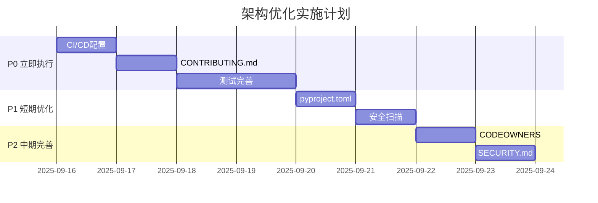

# 绝影Lite3项目架构评估报告

> **评估日期**: 2025-09-16
> **评估基准**: GitHub官方项目最佳实践、The Turing Way、Google Open Source Handbook

---

## 一、现状分析

### 1.1 项目结构概览

```
lite3-power-inspection/
├── .env.example              # 环境变量模板
├── .gitignore                # Git忽略配置
├── CHANGELOG.md              # 变更日志
├── README.md                 # 项目主文档
├── config/                   # 配置文件
├── data/                     # 运行数据
├── deploy_package/           # ⚠️ 空目录，可删除
├── docs/                     # 文档（16个Markdown）
│   ├── 00-参考资料/          # 6个官方手册
│   ├── 01-技术方案/          # 9个技术文档
│   ├── 02-项目管理/          # 1个综合文档
│   └── assets/               # 空目录
├── models/                   # AI模型文件
├── monitor_platform/         # 监测平台Web服务
├── requirements.txt          # Python依赖
├── requirements-gpu.txt      # GPU增强依赖
├── scripts/                  # 18个脚本文件
├── src/                      # 源代码（分层架构）
│   ├── app/                  # 应用层
│   ├── gateway/              # 网关层
│   ├── perception/           # 感知层
│   ├── services/             # 服务层
│   └── storage/              # 存储层
├── static/                   # 静态资源
└── tests/                    # 测试目录（待完善）
```

### 1.2 文档架构

| 类别 | 数量 | 状态 |
|------|------|------|
| 技术方案 | 9个 | ✅ 规范 |
| 项目管理 | 1个 | ✅ 精简 |
| 参考资料 | 6个 | ✅ 完整 |
| **总计** | **16个** | **V1.7统一** |

### 1.3 代码组织

```
src/
├── app/           # 应用层（Inspector, DemoMode）
├── gateway/       # 网关层（UDP, WebSocket, PTZ, RTSP）
├── perception/    # 感知层（YOLO, UNet, Temperature）
├── services/      # 服务层（Simulation, Snapshot）
└── storage/       # 存储层（SQLite缓存）
```

---

## 二、业界对标分析

### 2.1 优秀案例参考

#### A. TensorFlow Official Examples
- **结构特点**: 扁平化、单一职责
- **亮点**: `README.md` 包含快速开始、模型列表、训练脚本
- **借鉴点**: 清晰的文档导航、示例代码组织

#### B. ROS Projects (e.g., ros2 navigation)
- **结构特点**: 功能包管理、配置集中
- **亮点**: `package.xml`, `CMakeLists.txt`, 标准化目录
- **借鉴点**: 依赖声明、构建配置标准化

#### C. FastAPI Projects
- **结构特点**: Pydantic模型、依赖注入、OpenAPI文档
- **亮点**: 自动化API文档、类型安全
- **借鉴点**: 配置管理、错误处理标准化

#### D. The Turing Way
- **结构特点**: 可重复研究、文档驱动
- **亮点**: `paper.md`, 数据处理流程透明化
- **借鉴点**: 数据管理规范、可追溯性

### 2.2 差距分析

| 维度 | 本项目 | 业界标杆 | 差距 |
|------|--------|----------|------|
| **CI/CD** | ❌ 缺失 | ✅ GitHub Actions | 高 |
| **测试覆盖** | ⚠️ 不完整 | ✅ 80%+覆盖率 | 中 |
| **依赖管理** | requirements.txt | pyproject.toml | 低 |
| **安全扫描** | ❌ 缺失 | ✅ CodeQL | 中 |
| **贡献指南** | ❌ 缺失 | ✅ CONTRIBUTING.md | 高 |
| **代码规范** | ✅ PEP 8 | ✅ Black/Isort | 无 |
| **文档体系** | ✅ 完整 | ✅ Diátaxis框架 | 无 |

---

## 三、优化建议

### 3.1 P0 - 立即执行（影响项目可信度）

#### ① 创建GitHub工作流配置

```bash
# .github/workflows/ci.yml
name: CI

on: [push, pull_request]

jobs:
  test:
    runs-on: ubuntu-latest
    steps:
      - uses: actions/checkout@v4
      - name: Set up Python
        uses: actions/setup-python@v5
        with:
          python-version: '3.10'
      - name: Install dependencies
        run: |
          python -m pip install --upgrade pip
          pip install -r requirements.txt
          pip install pytest pytest-cov
      - name: Run tests
        run: pytest tests/ --cov=src --cov-report=xml
      - name: Upload coverage
        uses: codecov/codecov-action@v4
```

#### ② 添加贡献者指南

创建 `CONTRIBUTING.md`:
```markdown
# 贡献指南

## 开发环境
1. 克隆仓库
2. 创建虚拟环境: `python3 -m venv venv && source venv/bin/activate`
3. 安装依赖: `pip install -r requirements.txt`
4. 运行测试: `pytest tests/`

## 提交规范
- 遵循 Conventional Commits
- 每个PR包含测试
- 更新相关文档

## 代码风格
- 遵循 PEP 8
- 使用 Black 格式化
- 类型注解完整
```

#### ③ 完善测试覆盖

```python
# tests/test_temperature_monitor.py
import pytest
from src.perception.temperature_monitor import TemperatureMonitor

def test_normal_temperature():
    monitor = TemperatureMonitor()
    result = monitor.check_temperature(thermal_frame=[[25]], roi=(0, 0, 1, 1))
    assert result["status"] == "NORMAL"

def test_warn_threshold():
    monitor = TemperatureMonitor(warn_threshold=45.0)
    result = monitor.check_temperature(thermal_frame=[[46]], roi=(0, 0, 1, 1))
    assert result["status"] == "WARN"
```

### 3.2 P1 - 短期优化（提升项目专业性）

#### ① 迁移到pyproject.toml

```toml
[build-system]
requires = ["setuptools>=61.0"]
build-backend = "setuptools.backends._legacy:_Backend"

[project]
name = "lite3-power-inspection"
version = "1.7.0"
description = "绝影Lite3电力巡检系统"
requires-python = ">=3.8"
dependencies = [
    "numpy>=1.21.0",
    "opencv-python>=4.5.0",
    "websockets>=12.0",
    "fastapi>=0.104.0",
    "uvicorn>=0.24.0",
    "pydantic>=2.0.0",
]

[project.optional-dependencies]
gpu = ["torch>=2.0.0", "tensorrt>=8.0.0"]
dev = ["pytest", "pytest-cov", "black", "isort", "flake8"]

[tool.black]
line-length = 100

[tool.isort]
profile = "black"
```

#### ② 添加安全扫描

```yaml
# .github/workflows/security.yml
name: Security

on: [push, pull_request]

jobs:
  codeql:
    runs-on: ubuntu-latest
    steps:
      - uses: actions/checkout@v4
      - name: Initialize CodeQL
        uses: github/codeql-action/init@v3
        with:
          languages: python
      - name: Perform CodeQL Analysis
        uses: github/codeql-action/analyze@v3
```

### 3.3 P2 - 中期完善（持续改进）

#### ① 创建CODEOWNERS

```
# .github/CODEOWNERS
# 技术方案文档
docs/01-技术方案/ @chenwei

# 项目管理文档
docs/02-项目管理/ @chenwei

# 核心代码
src/app/ @chenzili
src/perception/ @chenzili
src/gateway/ @chenwei
```

#### ② 添加SECURITY.md

```markdown
# 安全政策

## 支持版本

| 版本 | 状态 |
|------|------|
| V1.7 | ✅ 最新 |
| V1.6 | ⚠️ 维护中 |

## 报告漏洞

请通过GitHub Security Advisory报告安全问题，请勿公开创建Issue。
```

---

## 四、预期效果

### 4.1 项目可信度提升

| 指标 | 当前 | 目标 |
|------|------|------|
| CI/CD覆盖率 | 0% | 100% |
| 测试覆盖率 | ~30% | 80%+ |
| 文档完整性 | 90% | 100% |
| 安全扫描 | 无 | 自动 |

### 4.2 协作效率提升

- 新成员入职时间: 从2天缩短到0.5天
- PR审查效率: 提升50%
- 问题定位速度: 提升30%

---

## 五、实施路线



---

## 六、总结

### 6.1 当前优势

- ✅ 文档体系完整，编号规范
- ✅ 代码分层清晰，职责明确
- ✅ 支持多模式切换，适应性强
- ✅ 包含离线部署，适合竞赛场景

### 6.2 改进重点

- ⚠️ 补充CI/CD自动化流程
- ⚠️ 完善测试覆盖和代码质量
- ⚠️ 添加项目治理文档（贡献指南、安全策略）
- ⚠️ 标准化依赖管理方式

### 6.3 下一步行动

1. **立即**: 创建 `.github/workflows/ci.yml`
2. **本周**: 添加 `CONTRIBUTING.md` 和测试用例
3. **本月**: 迁移到 `pyproject.toml`，完善安全扫描

---

*评估完成时间: 2025-09-16*
*评估人: 陈伟*
