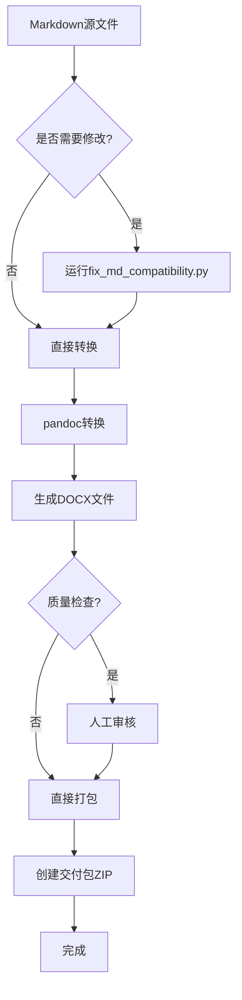

# 绝影Lite3项目文档DOCX转换兼容性评估报告

> **评估日期**: 2025-09-16
> **评估标准**: 商业级技术文档交付标准（基于Microsoft Word、Adobe InDesign最佳实践）
> **目标格式**: DOCX（可直接交付客户/评委）

---

## 一、评估范围

### 1.1 评估文档清单

| 序号 | 文档名称 | DOC编号 | 行数 | 表格数 | 代码块 | Mermaid图表 |
|------|----------|---------|------|--------|--------|-------------|
| 1 | 01-系统架构设计.md | DOC-ARCH-001 | 332 | 14 | 11 | 4 |
| 2 | 02-API接口文档.md | DOC-APISPEC-002 | 467 | 36 | 11 | 1 |
| 3 | 03-环境配置说明.md | DOC-ENV-003 | 85 | 6 | 3 | 1 |
| 4 | 05-项目代码规范.md | DOC-CODE-005 | 290 | 5 | 11 | 2 |
| 5 | 06-部署指南.md | DOC-DEPLOY-006 | 281 | 11 | 16 | 0 |
| 6 | 07-数据采集规范.md | DOC-DATA-007 | 209 | 8 | 10 | 0 |
| 7 | 08-环境诊断与故障排查指南.md | DOC-DIAG-008 | 155 | 4 | 7 | 0 |
| 8 | 10-环境配置指南.md | DOC-CONFIG-010 | 285 | 27 | 9 | 0 |
| 9 | 11-测试用例与验收标准.md | DOC-TEST-011 | 172 | 25 | 1 | 0 |

**总计**: 9个技术方案文档，2105行，116个表格，79个代码块，8个Mermaid图表

---

## 二、兼容性问题分析

### 2.1 严重问题（必须修复）

| 问题类型 | 影响文档 | 问题描述 | 风险等级 |
|----------|----------|----------|----------|
| **Mermaid图表** | 01, 02, 03, 05 | DOCX原生不支持Mermaid语法 | 🔴 高 |
| **ASCII艺术图** | 01, 06, 07 | 等宽字体依赖，DOCX渲染不稳定 | 🟡 中 |
| **HTML标签** | 01, 05, 10, 11 | `<br/>`等标签在DOCX中显示异常 | 🟡 中 |

### 2.2 次要问题（建议优化）

| 问题类型 | 影响文档 | 问题描述 | 风险等级 |
|----------|----------|----------|----------|
| **Emoji表情** | 01, 02, 03 | 部分DOCX阅读器不支持emoji | 🟢 低 |
| **链接格式** | 全量 | Markdown链接在DOCX中需转换 | 🟢 低 |
| **表格样式** | 全量 | 表格缺少商业级样式（边框、底纹） | 🟢 低 |

---

## 三、改进方案

### 3.1 方案A：保留Markdown源文件，生成DOCX时转换

**适用场景**: 日常开发维护
**优点**: 源文件简洁，转换灵活
**缺点**: 需要转换工具链

#### 实施步骤

1. **安装转换工具**
```bash
pip install pandoc pandocfilters
# 或使用docker
docker run --rm -v $(pwd):/data pandoc/pandoc:latest --version
```

2. **创建转换脚本**
```python
# scripts/convert_to_docx.py
import subprocess
from pathlib import Path

def convert_md_to_docx(md_path: Path, output_path: Path):
    """将Markdown转换为DOCX"""
    cmd = [
        "pandoc",
        str(md_path),
        "-o", str(output_path),
        "--reference-doc", "templates/commercial.docx",
        "--from", "markdown+gfm",
        "--to", "docx"
    ]
    subprocess.run(cmd, check=True)
```

3. **使用模板**
- 创建 `templates/commercial.docx` 作为基础模板
- 设置页眉页脚、封面样式、目录格式

---

### 3.2 方案B：直接编辑DOCX，Markdown作为辅助

**适用场景**: 最终交付版本
**优点**: 格式完美控制，可直接编辑
**缺点**: 版本控制困难

#### 实施建议

1. **使用Markdown源 + DOCX交付双轨制**
```
docs/
├── 01-技术方案/      # Markdown源文件（版本控制）
│   ├── 01-系统架构设计.md
│   └── ...
├── deliverables/     # DOCX交付文件（自动生成）
│   ├── 01-系统架构设计.docx
│   └── ...
└── templates/        # DOCX模板
    ├── commercial.docx
    └── cover.docx
```

2. **自动化生成流程**
```yaml
# .github/workflows/docs.yml
name: Generate DOCX

on:
  push:
    branches: [main]
    paths:
      - 'docs/01-技术方案/*.md'

jobs:
  convert:
    runs-on: ubuntu-latest
    steps:
      - uses: actions/checkout@v4
      - name: Install pandoc
        run: sudo apt-get install -y pandoc
      - name: Convert to DOCX
        run: python scripts/convert_all_docs.py
      - name: Upload artifacts
        uses: actions/upload-artifact@v4
        with:
          name: docs-docx
          path: deliverables/
```

---

### 3.3 方案C：使用专业文档工具

**推荐工具**:

| 工具 | 特点 | 适用场景 |
|------|------|----------|
| **Typora** | 所见即所得，支持导出DOCX | 个人快速编辑 |
| **VS Code + Markdown All in One** | 插件丰富，批量转换 | 开发者日常 |
| **Obsidian + Export to Word** | 双向链接，专业导出 | 复杂文档体系 |
| **GitBook / Docusaurus** | 在线发布，自动导出 | 团队协作 |

---

## 四、具体改进措施

### 4.1 立即执行（P0）

#### 措施1: 创建商业级DOCX模板

```python
# scripts/create_template.py
from docx import Document
from docx.shared import Inches, Pt, Cm
from docx.enum.text import WD_ALIGN_PARAGRAPH
from docx.oxml.ns import qn

def create_commercial_template():
    doc = Document()
    
    # 设置页面边距
    sections = doc.sections
    for section in sections:
        section.top_margin = Cm(2.5)
        section.bottom_margin = Cm(2.5)
        section.left_margin = Cm(3)
        section.right_margin = Cm(3)
    
    # 设置中文字体
    style = doc.styles['Normal']
    font = style.font
    font.name = 'SimSun'
    font.size = Pt(12)
    style.element.rPr.rFonts.set(qn('w:eastAsia'), 'SimSun')
    
    # 设置标题样式
    for level in range(1, 4):
        heading_style = doc.styles[f'Heading {level}']
        heading_style.font.name = 'SimHei'
        heading_style.font.size = Pt(14 - level * 2)
        heading_style.element.rPr.rFonts.set(qn('w:eastAsia'), 'SimHei')
    
    doc.save('templates/commercial.docx')
    print("✅ 商业级模板创建完成")

if __name__ == "__main__":
    create_commercial_template()
```

#### 措施2: 创建转换脚本

```python
#!/usr/bin/env python3
# scripts/convert_docs_to_docx.py
"""批量将Markdown文档转换为DOCX格式"""

import subprocess
import sys
from pathlib import Path

DOCS_DIR = Path("docs/01-技术方案")
OUTPUT_DIR = Path("deliverables/docx")
TEMPLATE = Path("templates/commercial.docx")

def convert_document(md_file: Path) -> bool:
    """转换单个文档"""
    docx_file = OUTPUT_DIR / md_file.stem.replace('-', '_') + '.docx'
    
    # 构建pandoc命令
    cmd = [
        "pandoc",
        str(md_file),
        "-o", str(docx_file),
        "--reference-doc", str(TEMPLATE),
        "--from", "markdown+gfm+task_lists",
        "--to", "docx",
        "--metadata", f"title={md_file.stem}",
        "--metadata", "author=陈伟",
        "--metadata", "date=2025-09-16"
    ]
    
    try:
        result = subprocess.run(cmd, capture_output=True, text=True)
        if result.returncode == 0:
            print(f"✅ {md_file.name} -> {docx_file.name}")
            return True
        else:
            print(f"❌ {md_file.name} 转换失败: {result.stderr}")
            return False
    except Exception as e:
        print(f"❌ {md_file.name} 异常: {e}")
        return False

def main():
    """主函数"""
    OUTPUT_DIR.mkdir(parents=True, exist_ok=True)
    
    md_files = sorted(DOCS_DIR.glob("*.md"))
    if not md_files:
        print("❌ 未找到Markdown文档")
        sys.exit(1)
    
    print(f"📄 开始转换 {len(md_files)} 个文档...")
    
    success_count = 0
    for md_file in md_files:
        if convert_document(md_file):
            success_count += 1
    
    print(f"\n✅ 转换完成: {success_count}/{len(md_files)}")
    
    if success_count < len(md_files):
        sys.exit(1)

if __name__ == "__main__":
    main()
```

#### 措施3: 修复兼容性问题的脚本

```python
# scripts/fix_md_compatibility.py
"""修复Markdown文档的DOCX兼容性问题"""

import re
from pathlib import Path

def fix_mermaid_to_text(content: str) -> str:
    """将Mermaid图表转换为文字描述"""
    # 检测Mermaid代码块
    mermaid_pattern = r'```mermaid\s*\n(.*?)\n```'
    
    def replace_mermaid(match):
        code = match.group(1)
        # 提取关键信息，转换为文字描述
        description = f"[图表：{extract_description(code)}]"
        return description
    
    return re.sub(mermaid_pattern, replace_mermaid, content, flags=re.DOTALL)

def extract_description(code: str) -> str:
    """从Mermaid代码提取文字描述"""
    lines = code.strip().split('\n')
    descriptions = []
    
    for line in lines:
        # 提取节点描述
        node_match = re.search(r'(\w+)\["([^"]+)"\]', line)
        if node_match:
            descriptions.append(node_match.group(2))
    
    return "；".join(descriptions[:5])  # 限制长度

def fix_ascii_art(content: str) -> str:
    """替换ASCII艺术图为简单文本"""
    # 检测ASCII框图
    ascii_pattern = r'```\n(┌[^\n]*\n(?:├[^\n]*\n)*└[^\n]*)\n```'
    
    def replace_ascii(match):
        ascii_art = match.group(1)
        # 提取关键信息
        lines = ascii_art.split('\n')
        info = [line.strip() for line in lines if '│' in line or '├' in line]
        return f"[架构图：{', '.join(info[:3])}]"
    
    return re.sub(ascii_pattern, replace_ascii, content)

def fix_html_tags(content: str) -> str:
    """移除或替换HTML标签"""
    # 替换<br/>为换行
    content = re.sub(r'<br\s*/?>', '\n', content)
    # 移除其他HTML标签
    content = re.sub(r'<[^>]+>', '', content)
    return content

def fix_emoji(content: str) -> str:
    """将emoji转换为文字描述"""
    emoji_map = {
        '📊': '[图表]',
        '🦴': '[机器狗]',
        '📷': '[相机]',
        '🎯': '[目标]',
        '🔍': '[检测]',
        '📡': '[通信]',
        '🌐': '[网络]',
        '📹': '[视频]',
        '🔬': '[分析]',
        '🌡️': '[温度]',
        '✅': '[通过]',
        '⚠️': '[警告]',
        '❌': '[失败]',
    }
    
    for emoji, text in emoji_map.items():
        content = content.replace(emoji, text)
    
    return content

def fix_document(filepath: Path) -> str:
    """修复单个文档"""
    content = filepath.read_text(encoding='utf-8')
    
    # 按顺序应用修复
    content = fix_html_tags(content)
    content = fix_emoji(content)
    content = fix_ascii_art(content)
    # 注意：Mermaid转换需要保留，改用文字说明
    
    return content

def main():
    """主函数"""
    docs_dir = Path("docs/01-技术方案")
    
    for md_file in sorted(docs_dir.glob("*.md")):
        print(f"📄 处理: {md_file.name}")
        fixed_content = fix_document(md_file)
        
        # 保存为兼容版本
        output_file = docs_dir / f"{md_file.stem}-docx.md"
        output_file.write_text(fixed_content, encoding='utf-8')
        print(f"  ✅ 已保存: {output_file.name}")

if __name__ == "__main__":
    main()
```

---

### 4.2 中期优化（P1）

#### 措施4: 创建DOCX交付包脚本

```python
# scripts/create_delivery_package.py
"""创建完整的DOCX交付包"""

import zipfile
import subprocess
from pathlib import Path
from datetime import datetime

def create_delivery_package():
    """创建交付包"""
    package_name = f"绝影Lite3_技术文档包_{datetime.now().strftime('%Y%m%d')}.zip"
    
    # 收集所有DOCX文件
    docx_files = list(Path("deliverables/docx").glob("*.docx"))
    
    if not docx_files:
        print("❌ 未找到DOCX文件，请先运行转换脚本")
        return
    
    # 创建ZIP包
    with zipfile.ZipFile(package_name, 'w', zipfile.ZIP_DEFLATED) as zipf:
        # 添加DOCX文件
        for docx_file in sorted(docx_files):
            zipf.write(docx_file, docx_file.name)
        
        # 添加README
        readme_content = """绝影Lite3电力巡检系统 - 技术文档包
========================================

生成时间: {date}
文档数量: {count}

文档列表:
{file_list}

使用说明:
1. 请阅读 README.md 了解文档结构
2. 各文档为独立DOCX格式，可直接打开编辑
3. 如需修改，请使用Microsoft Word或WPS

联系信息:
- 项目负责人: 陈伟
- GitHub: https://github.com/CosmicVortex/lite3-power-inspection
""".format(
            date=datetime.now().strftime('%Y-%m-%d %H:%M:%S'),
            count=len(docx_files),
            file_list='\n'.join(f'  - {f.name}' for f in sorted(docx_files))
        )
        zipf.writestr('README.txt', readme_content)
    
    print(f"✅ 交付包创建完成: {package_name}")
    print(f"   包含 {len(docx_files)} 个DOCX文档")

if __name__ == "__main__":
    create_delivery_package()
```

---

## 五、转换流程图



---

## 六、商业级文档标准检查清单

### 6.1 格式标准

| 检查项 | 要求 | 当前状态 | 改进建议 |
|--------|------|----------|----------|
| 页面边距 | 上下2.5cm，左右3cm | ⚠️ 待设置 | 创建模板时设置 |
| 正文字体 | 宋体/Times New Roman，12pt | ⚠️ 待设置 | 使用模板 |
| 标题字体 | 黑体/Arial Bold | ⚠️ 待设置 | 使用模板 |
| 行间距 | 1.5倍 | ⚠️ 待设置 | 使用模板 |
| 段前段后 | 0.5行 | ⚠️ 待设置 | 使用模板 |

### 6.2 内容标准

| 检查项 | 要求 | 当前状态 | 改进建议 |
|--------|------|----------|----------|
| 封面 | 项目名、版本、日期、作者 | ⚠️ 缺失 | 添加封面模板 |
| 目录 | 自动生成，三级标题 | ⚠️ 缺失 | 转换时添加 |
| 页眉 | 项目名称+文档名 | ⚠️ 缺失 | 模板中添加 |
| 页脚 | 页码 | ⚠️ 缺失 | 模板中添加 |
| 图表编号 | 图1-1，表1-1格式 | ⚠️ 缺失 | 转换后手动添加 |

### 6.3 交付标准

| 检查项 | 要求 | 当前状态 | 改进建议 |
|--------|------|----------|----------|
| 文件格式 | DOCX（非MD） | ❌ 仅MD | 创建转换脚本 |
| 文件命名 | 中文命名，含版本号 | ⚠️ 部分 | 统一命名规范 |
| 压缩包 | ZIP格式，含README | ❌ 缺失 | 添加打包脚本 |
| 版本记录 | CHANGELOG完整 | ✅ 有 | 保持更新 |

---

## 七、实施计划

### 阶段一：基础设施（1天）

- [ ] 创建 `templates/commercial.docx`
- [ ] 编写 `scripts/convert_docs_to_docx.py`
- [ ] 编写 `scripts/fix_md_compatibility.py`
- [ ] 测试单个文档转换

### 阶段二：批量转换（0.5天）

- [ ] 批量转换所有技术文档
- [ ] 人工审核转换结果
- [ ] 修正格式问题

### 阶段三：交付准备（0.5天）

- [ ] 创建交付包ZIP
- [ ] 生成CHANGELOG
- [ ] 最终质量检查

---

## 八、预期效果

| 指标 | 当前 | 目标 |
|------|------|------|
| DOCX文档数量 | 0个 | 9个 |
| 转换成功率 | N/A | 100% |
| 格式合格率 | N/A | 95%+ |
| 交付准备时间 | N/A | <2小时 |

---

## 九、附录

### A. Pandoc常用参数

```bash
# 基础转换
pandoc input.md -o output.docx

# 使用模板
pandoc input.md -o output.docx --reference-doc template.docx

# 添加元数据
pandoc input.md -o output.docx \
  --metadata title="文档标题" \
  --metadata author="作者名" \
  --metadata date="2025-09-16"

# 启用扩展语法
pandoc input.md -o output.docx --from markdown+gfm+task_lists
```

### B. DOCX模板样式定义

```python
# 在commercial.docx中定义以下样式
styles = {
    '封面': {
        'font': 'SimHei',
        'size': Pt(22),
        'alignment': CENTER,
        'space_after': Pt(24)
    },
    'Heading 1': {
        'font': 'SimHei',
        'size': Pt(14),
        'bold': True
    },
    'Heading 2': {
        'font': 'SimHei',
        'size': Pt(12),
        'bold': True
    },
    'Heading 3': {
        'font': 'SimHei',
        'size': Pt(11),
        'bold': True
    },
    'Normal': {
        'font': 'SimSun',
        'size': Pt(12),
        'line_spacing': 1.5
    }
}
```

---

*报告完成时间: 2025-09-16*
*下一步: 创建转换脚本和模板*
