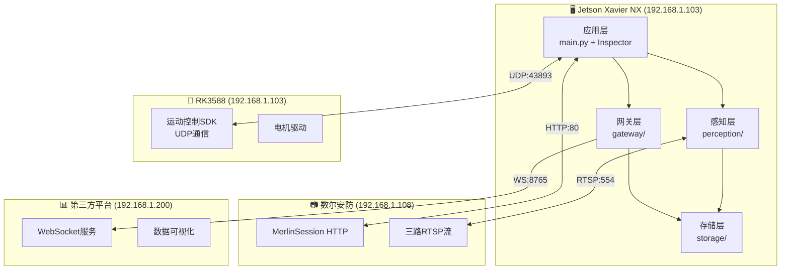
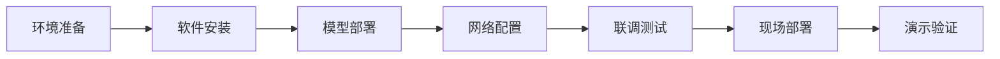

# 项目实施规划书

> **文档编号**: PM-001  
> **版本**: V1.0  
> **编制日期**: 2026-08-19  
> **编制人**: 陈伟

---

## 一、云端环境分析

### 1.1 当前开发环境

| 环境属性 | 当前值 | 说明 |
|----------|--------|------|
| 操作系统 | Ubuntu 22.04 (容器) | Hermes Agent运行环境 |
| Python版本 | 3.13.5 | 当前可用版本 |
| 工作目录 | /opt/data/lite3-power-inspection | 项目根目录 |
| Git环境 | 已配置 | GitHub认证完成 |
| GPU环境 | 无（容器环境） | 依赖远程Jetson设备 |

### 1.2 目标部署环境

| 环境类型 | 部署位置 | 硬件规格 | 软件环境 |
|----------|----------|----------|----------|
| **感知主机** | 绝影Lite3专业版 | Jetson Xavier NX 8GB | Ubuntu 20.04 + JetPack 4.6 |
| **运动主机** | 绝影Lite3专业版 | RK3588 ARM | 官方固件V2.0 |
| **监测平台** | 赛场服务器 | x86_64 | 第三方提供 |

### 1.3 环境差异风险

| 差异项 | 开发环境 | 部署环境 | 风险评估 | 缓解策略 |
|--------|----------|----------|----------|----------|
| Python版本 | 3.13.5 | 3.8+ | ⚠️ 中 | 使用python:3.8-docker镜像开发 |
| CUDA版本 | 无 | 11.4+ | ⚠️ 高 | 准备离线安装包 |
| TensorRT | 无 | 8.x | ⚠️ 高 | 使用官方whl文件 |
| GPU算力 | 无 | 21 TOPS | ⚠️ 高 | 准备CPU推理降级方案 |

---

## 二、环境一致性策略

### 2.1 容器化开发方案

```dockerfile
# Dockerfile.jetson
FROM nvcr.io/nvidia/l4t-tensorrt:r8.6.1-dev

# 基础环境
RUN apt-get update && apt-get install -y \
    python3.8 \
    python3-pip \
    git \
    && rm -rf /var/lib/apt/lists/*

# Python依赖
COPY requirements.txt /app/
RUN pip3 install -r /app/requirements.txt --no-cache-dir

# 项目代码
COPY . /app/lite3-power-inspection
WORKDIR /app/lite3-power-inspection
```

### 2.2 依赖管理

**requirements.txt**：
```text
# 核心框架
numpy>=1.21.0
opencv-python>=4.5.0
torch>=2.0.0
torchvision>=0.15.0

# 推理加速
tensorrt>=8.0.0
onnx>=1.12.0
onnxruntime-gpu>=1.14.0

# 网络通信
websockets>=10.0
requests>=2.28.0
pyyaml>=6.0

# 视频处理
av>=10.0
ffmpeg-python>=0.2.0

# 工具库
tqdm>=4.64.0
loguru>=0.6.0
```

**pip-tools锁定版本**：
```bash
# 生成锁定文件
pip-compile requirements.in -o requirements.txt
pip-sync requirements.txt
```

### 2.3 环境变量标准化

```bash
# .env.example
export PYTHON_VERSION=3.8
export CUDA_VERSION=11.4
export TENSORRT_VERSION=8.6
export ROS_DOMAIN_ID=0  # 如使用ROS2
export LOG_LEVEL=INFO
```

---

## 三、软件架构设计

### 3.1 系统架构图



### 3.2 模块划分

| 层级 | 模块 | 职责 | 输入 | 输出 |
|------|------|------|------|------|
| **应用层** | Inspector | 巡检主控制器 | 航点列表 | 执行结果 |
| | DemoOrchestrator | 演示流程编排 | 演示脚本 | 执行命令 |
| | CheckpointManager | 航点管理 | 配置文件 | 航点队列 |
| **感知层** | CrackDetector | 裂缝检测器 | 可见光图像 | 检测结果 |
| | TempMonitor | 温度监测器 | 热成像帧 | 温度告警 |
| | ModelEngine | 模型推理引擎 | 张量数据 | 推理结果 |
| **网关层** | WebSocketGateway | 数据上报 | 检测结果 | WebSocket消息 |
| | PtzController | 云台控制 | 角度指令 | HTTP请求 |
| | UDPMotionCtrl | 运动控制 | 速度指令 | UDP数据包 |
| **存储层** | SQLiteCache | 本地缓存 | 检测数据 | SQLite记录 |
| | SnapshotMgr | 快照管理 | 告警ID | 图片文件 |

---

## 四、开发任务清单

### 4.1 核心程序模块

#### 4.1.1 应用层模块

| 文件名 | 类名 | 功能描述 | 优先级 |
|--------|------|----------|--------|
| main.py | - | 程序入口，参数解析 | P0 |
| inspector.py | Inspector | 巡检主控制器 | P0 |
| demo_orchestrator.py | DemoOrchestrator | 演示流程编排 | P0 |
| checkpoint_manager.py | CheckpointManager | 航点管理 | P1 |

#### 4.1.2 感知层模块

| 文件名 | 类名 | 功能描述 | 优先级 |
|--------|------|----------|--------|
| yolo_detector.py | YOLODetector | YOLOv8裂缝检测 | P0 |
| unet_segmentor.py | UNetSegmentor | U-Net裂缝分割 | P0 |
| temperature_monitor.py | TemperatureMonitor | 温度监测算法 | P0 |
| tensorrt_engine.py | TensorRTModel | TensorRT推理封装 | P1 |

#### 4.1.3 网关层模块

| 文件名 | 类名 | 功能描述 | 优先级 |
|--------|------|----------|--------|
| websocket_client.py | WebSocketGateway | WebSocket数据上报 | P0 |
| ptz_controller.py | PtzController | 云台控制封装 | P0 |
| udp_controller.py | UDPMotionController | UDP运动控制 | P0 |
| rtsp_client.py | RTSPClient | RTSP流拉取 | P1 |

#### 4.1.4 存储层模块

| 文件名 | 类名 | 功能描述 | 优先级 |
|--------|------|----------|--------|
| sqlite_cache.py | SQLiteCache | 本地数据缓存 | P1 |
| snapshot_manager.py | SnapshotManager | 图片快照管理 | P2 |

### 4.2 配置文件

| 文件名 | 用途 | 优先级 |
|--------|------|--------|
| robot_config.yaml | 机器人参数配置 | P0 |
| inspection_config.yaml | 巡检参数配置 | P0 |
| model_config.yaml | 模型路径配置 | P1 |

### 4.3 模型文件

| 文件名 | 用途 | 来源 |
|--------|------|------|
| yolov8s-crack.trt | YOLO裂缝检测模型 | 需训练导出 |
| unet-crack.onnx | U-Net裂缝分割模型 | 需训练导出 |
| calibrator.cache | TensorRT校准数据 | 训练后生成 |

---

## 五、文档交付清单

### 5.1 技术文档（已完成）

| 编号 | 文档名称 | 状态 | 行数 |
|------|----------|------|------|
| 01 | 系统架构设计.md | ✅ 完成 | 546行 |
| 02 | API接口文档.md | ✅ 完成 | 414行 |
| 03 | 开发环境搭建指南.md | ✅ 完成 | 343行 |
| 04 | 快速开始指南.md | ✅ 完成 | 184行 |
| 05 | 项目代码规范.md | ✅ 完成 | 289行 |
| 07 | 技术文档审查报告.md | ✅ 完成 | 250行 |

### 5.2 项目管理文档（已完成）

| 编号 | 文档名称 | 状态 | 行数 |
|------|----------|------|------|
| 01 | 物料清单.md | ✅ 完成 | 51行 |
| 02 | 团队分工.md | ✅ 完成 | 70行 |

### 5.3 需新增文档

| 编号 | 文档名称 | 用途 | 优先级 |
|------|----------|------|--------|
| 06 | 项目实施规划书 | 本文件 | P0 |
| - | 部署手册.md | 现场部署指导 | P1 |
| - | 测试用例文档.md | 测试验证记录 | P1 |
| - | 故障排查手册.md | 常见问题处理 | P2 |

---

## 六、部署与测试流程

### 6.1 部署流程



#### 6.1.1 环境准备（T-3天）

| 步骤 | 操作 | 验证标准 |
|------|------|----------|
| 1 | 刷写Ubuntu 20.04到Jetson NX | 开机正常，版本正确 |
| 2 | 安装JetPack 4.6 | `jetson_release -v` 显示正确版本 |
| 3 | 配置静态IP 192.168.1.103 | `ping 192.168.1.103` 可达 |
| 4 | 克隆项目仓库 | `git clone` 成功 |

#### 6.1.2 软件安装（T-2天）

| 步骤 | 操作 | 验证命令 |
|------|------|----------|
| 1 | 安装Python 3.8 | `python3 --version` → 3.8.x |
| 2 | 安装CUDA 11.4 | `nvcc --version` → 11.4 |
| 3 | 安装TensorRT 8.6 | `python3 -c "import tensorrt; print(tensorrt.__version__)"` |
| 4 | 安装Python依赖 | `pip3 list \| grep -E "torch|tensorrt|opencv"` |
| 5 | 安装FFmpeg | `ffmpeg -version` |

#### 6.1.3 模型部署（T-1天）

| 步骤 | 操作 | 验证标准 |
|------|------|----------|
| 1 | 拷贝YOLOv8模型 | `ls models/yolov8s-crack.trt` 存在 |
| 2 | 拷贝U-Net模型 | `ls models/unet-crack.onnx` 存在 |
| 3 | 测试模型加载 | `python3 test_model_load.py` 成功 |
| 4 | 测试推理速度 | 单帧推理<50ms |

#### 6.1.4 网络配置（T-1天）

| 设备 | IP配置 | 验证命令 |
|------|--------|----------|
| 感知主机 | 192.168.1.103/24 | `ping 192.168.1.108` |
| 云台相机 | 192.168.1.108 (静态) | `curl http://192.168.1.108/merlin/Login.cgi` |
| 运动主机 | 192.168.1.103 (DHCP) | `nc -zv 192.168.1.103 43893` |
| 监测平台 | 192.168.1.200 | `nc -zv 192.168.1.200 8765` |

### 6.2 测试流程

#### 6.2.1 单元测试

| 测试模块 | 测试用例 | 预期结果 |
|----------|----------|----------|
| PtzController | 登录/心跳/登出 | Session正确管理 |
| UDPMotionController | 心跳/急停 | UDP包发送正确 |
| TemperatureMonitor | 阈值判断 | WARN/CRITICAL正确触发 |
| CrackDetector | 模型加载 | 推理无报错 |

#### 6.2.2 集成测试

| 测试项 | 测试方法 | 验收标准 |
|--------|----------|----------|
| 云台控制联调 | 远程控制云台转动 | 响应时间<200ms |
| RTSP流获取 | 拉取三路视频流 | 无黑屏、无卡顿 |
| WebSocket上报 | 模拟告警上报 | 平台收到数据 |
| 完整巡检流程 | 执行12分钟演示脚本 | 流程完整执行 |

#### 6.2.3 现场测试

| 测试项 | 测试场景 | 验收标准 |
|--------|----------|----------|
| 裂缝检测精度 | 粘贴0.1mm裂缝模板 | 检出率≥90% |
| 温度监测精度 | 加热至45℃/50℃ | 告警触发正确 |
| 演示流程完整性 | 完整12分钟演示 | 无重大故障 |
| 续航能力 | 连续运行1.5小时 | 电量充足 |

---

## 七、时间计划

### 7.1 开发里程碑

| 阶段 | 时间节点 | 里程碑 | 交付物 |
|------|----------|--------|--------|
| M0 | 8月19日 | 环境准备完成 | 开发环境就绪 |
| M1 | 8月22日 | 核心模块开发完成 | src/代码框架 |
| M2 | 8月25日 | 算法模型部署完成 | 模型文件+测试通过 |
| M3 | 8月28日 | 联调测试通过 | 测试报告 |
| M4 | 8月30日 | 现场演示成功 | 演示视频 |

### 7.2 每日任务分解

#### 8月19日（今天）

- [x] 技术文档审查完成
- [x] 项目实施规划书编制
- [ ] 开发环境确认
- [ ] 代码框架搭建

#### 8月20-21日

- [ ] 实现PtzController云台控制模块
- [ ] 实现UDPMotionController运动控制模块
- [ ] 实现WebSocketGateway数据上报模块

#### 8月22-23日

- [ ] 实现TemperatureMonitor温度监测算法
- [ ] 实现YOLODetector裂缝检测模块
- [ ] 实现UNetSegmentor裂缝分割模块

#### 8月24-25日

- [ ] 模型转换与部署
- [ ] 单元测试编写
- [ ] 集成测试

#### 8月26-28日

- [ ] 现场联调
- [ ] 问题修复
- [ ] 性能优化

#### 8月29-30日

- [ ] 最终演示准备
- [ ] 演示脚本调试
- [ ] 正式演示

---

## 八、风险管理

### 8.1 技术风险

| 风险项 | 可能性 | 影响程度 | 应对策略 |
|--------|--------|----------|----------|
| TensorRT版本不兼容 | 中 | 高 | 提前准备多个版本whl文件 |
| YOLO模型精度不足 | 中 | 高 | 准备多套模型备选 |
| RTSP流延迟过大 | 低 | 中 | 使用辅码流降级方案 |
| 网络不稳定 | 中 | 中 | 增加断线重连机制 |

### 8.2 项目风险

| 风险项 | 可能性 | 影响程度 | 应对策略 |
|--------|--------|----------|----------|
| 硬件延迟到货 | 低 | 高 | 提前确认物流，准备替代方案 |
| 团队人员变动 | 低 | 中 | 文档完备，知识共享 |
| 赛场环境差异 | 中 | 中 | 提前踩点，准备适配方案 |

---

## 九、附录

### 9.1 参考资源

| 资源类型 | 名称 | 用途 |
|----------|------|------|
| 官方文档 | 绝影Lite3运动主机通讯接口V1.0.8.pdf | UDP协议参考 |
| 官方文档 | 数尔安防快速操作手册V2.pdf | 云台控制参考 |
| 开源项目 | deeprobotics/joy-ai-kit | 二次开发参考 |
| 示例代码 | soar_gimbal_linux_demo.zip | 云台控制Demo |

### 9.2 联系方式

| 角色 | 姓名 | 职责 |
|------|------|------|
| 项目负责人 | 王荣吉 | 环境+云台 |
| 系统架构 | 李章平 | 环境+云台 |
| 演示协调 | 陈伟 | 演示+软件 |
| 操作执行 | 陈自立 | 操作+算法 |

---

*文档版本: V1.0 | 编制日期: 2026-08-19 | 编制人: 陈伟*
